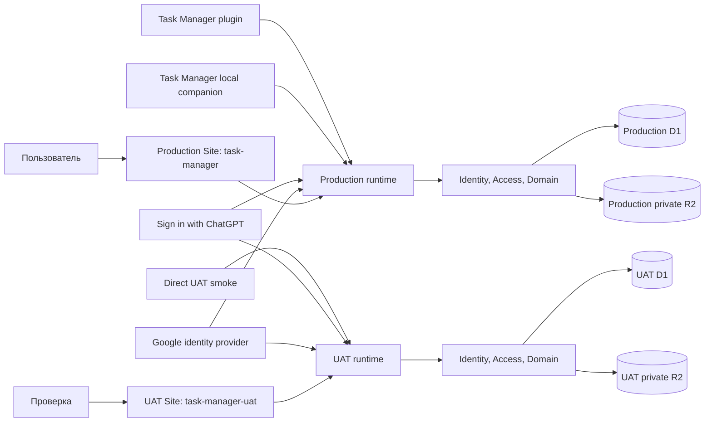

# Начальная архитектура

Статус: `Proposed`

Последнее обновление: 2026-08-31

Архитектура реализована первым вертикальным срезом на TypeScript, React 19,
Vinext/Vite, Sites Worker runtime и D1. Выбор и границы authentication
зафиксированы в
[ADR-0003](decisions/0003-implementation-stack-and-auth-delivery.md). Документ
также содержит целевые модули следующих срезов; их наличие здесь не означает,
что весь MVP уже реализован.

## Архитектурные цели

- одна транзакционная модель данных для list, board и saved views;
- быстрые интерактивные mutations с явным разрешением конфликтов;
- строгие project/release и workflow invariants на сервере;
- server-side tenant isolation и authorization для любого data access;
- две внешние identities вокруг одного внутреннего `User`;
- возможность развивать фильтры и metadata без копирования query-логики по UI;
- progressive-disclosure read model для агентов без загрузки task bodies в
  групповых запросах;
- единая Linear-like interaction и component model для list, board, details,
  filters, selection и contextual actions;
- managed deployment в раздельные production/UAT ChatGPT Sites и durable
  structured storage в независимых D1.

## Контекст

ChatGPT Sites — hosting target для двух изолированных сред, D1 — отдельный
relational binding структурированных данных каждой среды. Приложение использует
Vinext/Vite, prepared D1 queries за repository boundary и Drizzle Kit для
одинаковых versioned SQL migrations. Environment/release boundary принят в
[ADR-0010](decisions/0010-production-and-uat-sites.md). Это соответствует
[официальной документации Sites](https://learn.chatgpt.com/docs/sites).

## Логические модули

| Модуль | Ответственность |
|---|---|
| Tasks | Task lifecycle, archive/delete/restore, workflow, labels, subtasks, relations, rank |
| Comments | ACL-scoped native threads, idempotency, reactions и resolution |
| Attachments | D1 metadata, private R2 objects, sniffing, range delivery, legacy reconciliation и R2-first purge cleanup |
| Projects | Versioned metadata/lifecycle, lead/access guards, archive и deletion shadow subtree |
| Releases | Release lifecycle, recoverable delete, сохранённый состав и project consistency |
| Views | Filter AST, query compilation, grouping, ordering, display config |
| Search | Identifier lookup и text search поверх разрешённого scope |
| Identity | ChatGPT/Google adapters, UserIdentity linking, sessions, current User и versioned Profile/Settings |
| Access | Ownership scope, AccessGrant inheritance, share/revoke decisions |
| Administration | Server allowlist, content-free overview и explicit full-state backup/restore |
| Portability | Owner Project bundles, validation/preview и atomic exact restore |
| Agent API | Compact/detail projections, versioned REST, remote MCP и OAuth/personal credential scopes |
| UI shell | Linear-like navigation, shared controls, keyboard, themes, единый sync coordinator и state |

Модули — границы кода внутри одного приложения, а не отдельные сервисы. Для MVP
предпочтителен modular monolith: независимое развёртывание этих частей пока не
даёт подтверждённой пользы, но увеличивает транзакционную сложность.

## Hosting и runtime boundary

- Default `.openai/hosting.json` связывает repository с UAT Site
  `task-manager-uat`; production binding хранится отдельно в
  `.openai/hosting.production.json`. Оба файла создаются или обновляются только
  после Sites provisioning и содержат binding metadata, а не secrets.
- Каждая среда имеет отдельные D1 и private R2 bucket. Structured records,
  Site-scoped identities, OAuth grants, attachment object keys и test data
  между ними не разделяются. Runtime binding нативных вложений —
  `ATTACHMENTS`; environment scope дополнительно входит в каждый object key.
- Provider credentials и session secrets задаются только в hosted environment
  settings; локально перечисляются лишь имена переменных в `.env.example`.
- `TASK_MANAGER_ADMIN_EMAILS` хранится в hosted environment и разбирается как
  нормализованный comma-separated allowlist. Значение не коммитится в source.
- UAT source push/save/deploy входит в обычную проверенную delivery и не требует
  дополнительного approval. Любая production source push/save/deploy требует
  прямой текущей команды пользователя, явно разрешающей production release.
  Documentation-only изменение этого репозитория не является deployment.
- Обычный Task Manager marketplace plugin использует production `/api/mcp`, а
  его local stdio companion — production Agent REST. Companion выполняет
  `upload_local_file` и `attach_local_file_to_task`, не проксируя JSON-RPC и не
  передавая local path серверу.
- Private UAT остаётся owner-only и обслуживает обычные browser/API/contract
  checks. Обязательный machine ingress и Sites bypass для него удалены из
  release topology. По [ADR-0015](decisions/0015-production-file-first-release-canary.md)
  fresh local-path proof выполняется bounded production canary только после
  прямого production approval. Startup/discovery companion не выполняют
  network/browser/Keychain operations; hosted Codex и public machine edge не
  участвуют.
- Site может быть доступен в интернете как sign-in shell, но application data
  всегда требует authenticated User. Site audience и in-app authorization
  проверяются независимо.
- Sites находится в public beta, зависит от plan/region/workspace settings и на
  старте не предоставляет data residency guarantees. Эти ограничения должны
  быть повторно проверены перед production release.

## Основные потоки

### Вход и identity linking

1. Пользователь выбирает ChatGPT либо Google.
2. Sites ChatGPT flow возвращает trusted email/name headers server runtime;
   Google adapter завершает проверенный OAuth/OIDC flow.
3. Identity module находит `UserIdentity` по `(provider, provider_account_key)`
   либо создаёт новый User и identity.
4. Связать второй provider можно только из authenticated session через flow,
   доказывающий контроль над обеими identities; email match не достаточен.
5. Session содержит internal `User.id`; client-provided user/email/owner claims
   не участвуют в authorization.

### Авторизованный доступ к данным

1. Identity middleware устанавливает current User из server-verified session.
2. Access вычисляет effective role: для Project и его subtree, включая каждую
   Task, — через current Project owner/active Project grant; для global
   SavedView — через собственный owner/active direct grant.
3. Repository применяет predicate внутри SQL/query до pagination, aggregation,
   grouping или full-text search.
4. Mutation дополнительно требует minimum role (`editor` для content,
   `manager`/`owner` для разрешённого member management), inheritance и domain
   invariants в одной транзакции.
5. Unauthorized lookup возвращает ответ, не подтверждающий существование
   чужого resource.
6. Browser UI может передать opaque owner workspace scope. Repository сначала
   применяет тот же ACL predicate, затем дополнительный owner predicate до
   aggregation/order/pagination. Effective owner project child берётся из
   current Project; global SavedView использует собственный owner. Scope не
   является authorization и не участвует в вычислении `accessRole`.
7. UI descriptors строятся только из доступных roots и содержат opaque token,
   display label, kind/current flags без email/internal IDs. Invalid или stale
   membership возвращает current-user fallback. Если UI scope omitted, как в
   Agent API/MCP и существующих внутренних callers, repository сохраняет
   прежний ACL union.

### Share и revoke

1. Grantor находит уже зарегистрированного User по verified email.
2. Access проверяет role actor, допустимый shareable root и ceiling: Owner
   назначает Manager/Editor/Viewer, Manager — только Editor/Viewer.
3. Active grant с выбранной role создаётся или обновляется идемпотентно с
   provenance grantor/timestamp. Verified email обязан разрешаться однозначно.
4. Revoke атомарно закрывает grant. Следующий query/mutation grantee больше не
   включает resource subtree.
5. Project grant наследуется Tasks/Releases/project-scoped SavedViews. Direct
   Task/global SavedView grant поддерживает только Editor/Viewer.
6. Ownership transfer одним batch обновляет Project owner, отзывает grant нового
   owner и создаёт прежнему owner grant Manager.

### Открытие view

1. API загружает `SavedView` только через Access scope и проверяет grant.
2. Views валидирует versioned filter AST и объединяет его со scope и временными
   URL-фильтрами.
3. Один query pipeline сначала применяет authorization predicate, затем
   фильтр, grouping, ordering и pagination.
4. API возвращает records и metadata групп; UI рисует list либо board.

Переключение layout не должно менять query semantics или состав task IDs.

### Синхронизация hydrated workspace

1. Server bootstrap возвращает ACL-scoped snapshot и opaque cursor текущего
   principal.
2. Один UI-shell coordinator раз в 60 секунд запрашивает `/api/sync`, только
   когда вкладка видима и online. Одновременно выполняется не больше одного
   request; `hasMore` вычитывается последовательно.
3. D1 triggers записывают principal-scoped sequence events в той же transaction,
   что Task/Project/Release/SavedView/AccessGrant mutation. Journal не содержит
   пользовательский content.
4. Sync repository coalesces touched IDs и выполняет current ACL projection
   только по IDs текущей bounded page, не по всему bootstrap window. Поэтому
   moved/revoked entity для прежнего audience становится remove, доступная
   старая Task за пределами окна не теряется, а чужой content не попадает в
   response.
5. Core Task/Project/Release/SavedView изменения приходят как compact
   upsert/remove. Изменение назначения Label добавляет bounded authoritative
   label context только затронутых Tasks: определения и `task_labels` заменяют
   локальное состояние этих Tasks без полного catalog snapshot. Relations,
   comments и Activity передают только task-scoped
   invalidation IDs; их content перечитывает отдельный lazy endpoint лишь при
   активном details/Peek/activity consumer.
6. Client применяет patches и invalidations идемпотентно к общему
   `AppSnapshot`, сохраняя загруженный Task detail поверх нового summary.
   Details, list, board, navigation, filters и selection используют уже
   согласованное состояние.
7. ACL event, invalid/ahead/pruned cursor, gap или неизвестный event требует
   полного bootstrap. Hidden/offline вкладка приостанавливает timer и сразу
   синхронизируется после visibility/online; network failures и 45-секундный
   timeout дают bounded backoff до пяти минут. Journal хранится 30 дней и
   очищается throttled maintenance path не чаще раза в сутки.
8. UI coordinator добавляет owner token к bootstrap, task query, catalogs и
   sync. Sync повторно разрешает membership перед projection; revoke или
   ownership transfer, сделавшие token stale, возвращают reset, после которого
   scoped bootstrap атомарно заменяет snapshot и selector безопасным fallback.
   `All accessible` оставляет ACL union, а конкретный owner фильтрует touched
   Task/Project/Release/SavedView по тем же effective-owner правилам.

Контракт и границы решения приняты в
[ADR-0009](decisions/0009-central-workspace-synchronization.md). Optimistic
version conflict остаётся write boundary и не заменяется polling.

### Чтение и task commands через agent API

1. Codex/ChatGPT подключается к `/api/mcp` через OAuth Authorization Code +
   PKCE и получает client identity через advertised DCR. Bounded CIMD path
   остаётся только для явно совместимых clients и не рекламируется native
   auto-discovery, пока dynamic-loopback redirect не может пройти exact match;
   scripts могут использовать переходную personal API credential.
   Оба способа сопоставляются внутреннему User до data query; browser headers
   нельзя синтезировать client-side.
2. Agent query service применяет тот же ownership/ACL predicate до filters,
   counts, ambiguity resolution и cursor pagination.
3. Collection use case строит фиксированный compact projection без description,
   comment bodies, attachment metadata/bodies, internal IDs и user emails.
4. Detail use case по canonical `public_id` загружает одну сущность; Activity,
   unified comment threads и native Attachment metadata
   остаются отдельными lazy вызовами. Только detail добавляет
   bounded attachment count hint.
5. REST возвращает versioned schema и request/as-of metadata. MCP публикует
   task-oriented tools с теми же projections. Любой client переходит от summary
   к detail только через явный отдельный запрос. Анонимный MCP handshake может
   получить capabilities и схемы tools для установки connector, но каждый
`tools/call` требует bearer token до data query.
6. Relation commands разрешают обе Task references через тот же ACL predicate
   их собственных Projects, требуют Editor+ на каждой стороне и вызывают общий
   application command service. `blocks`/`related` могут пересекать Project
   boundary; `duplicate_of` остаётся same-Project. Relation имеет собственную
   version, create имеет idempotency key. `duplicate_of` выполняет relation
   write и Task status transition одной D1 batch, а UI/REST/MCP затем
   перечитывают canonical detail projection.
7. Базовый Task create/update переводит external status/release/Label refs и
   write-only assignee email до общего repository command. Полная замена Labels
   использует отдельную Task-versioned transaction; set-parent/create-subtask и
   relation commands остаются специализированными intentions, чтобы generic
   patch не создавал промежуточно неверное состояние.
8. Plugin-local stdio companion является source ingress, а не вторым data
   plane: он читает один exact host-authorized regular file через stable handle,
   проверяет optional stat/SHA-256 expectations и вызывает канонический REST
   `POST /files`. Full local path не пересекает process boundary. Companion
   получает native-client OAuth grant через DCR/PKCE loopback только при первом
   network operation и держит client metadata/access/refresh token в памяти
   процесса. Discovery не вызывает network/browser/Keychain. После upload второй
   local tool связывает тот же `fileRef` с Task через канонический Agent REST,
   поэтому ACL, quota, idempotency и lifecycle не дублируются в local component.
9. Owner-only Sites gate находится перед Worker и не принимает Task Manager
   OAuth как замену audience policy. Поэтому automated local-file release proof
   не проксируется в private UAT: после отдельного production approval exact
   packaged companion проверяется напрямую против production Agent REST
   bounded canary из ADR-0015.

Реализованный контракт описан в [спецификации agent API](specs/agent-api.md),
а credential/write boundary принят в
[ADR-0006](decisions/0006-standalone-agent-api.md), а OAuth/MCP delivery — в
[ADR-0008](decisions/0008-oauth-mcp-connector.md). Task commands транслируют
external refs во внутренние IDs и вызывают те же domain repository methods с
role checks, release/project validation и optimistic version.

Comment commands сначала разрешают Task тем же ACL predicate, затем работают
только внутри её `task_id`. Collection cursor связан с Task и упорядочен по
`(created_at, id)`; root page подгружает bounded replies. Create использует
уникальный `(task_id, author_user_id, idempotency_key)`, author берётся из token
identity, а edit/delete/resolve проверяют comment version. Agent projection
автора содержит только display name и признак current User.

### Открытие прямой ссылки

1. Server route нормализует catch-all segments ровно через один
   percent-decode/encode cycle, независимо от того, передал runtime decoded или
   encoded params, затем разбирает allowlisted path contract `/workspace`,
   `/issues`, `/views`, `/projects`, `/releases`, project-scoped releases и
   layout `list|board`; неизвестные extra segments отклоняются. `/` является
   legacy entry и перенаправляется на `/workspace`.
2. Repository строит ограниченный ACL-scoped snapshot; для issue route точечно
   загружает адресованную Task по internal/public ID тем же ACL predicate и
   добавляет её в snapshot. Поэтому Task за пределами стартового окна всё равно
   открывается напрямую, а неизвестный и недоступный record имеют одинаковый
   `not found` результат.
3. Внутренний `id` остаётся ключом связей и import idempotency, а отдельный
   immutable `public_id` UUID адресует Task, Project, Release и SavedView.
   Legacy internal-ID route разрешается только внутри ACL snapshot и отвечает
   redirect на канонический публичный path.
4. Route разрешается в UI state `{surface, layout, taskId}`. Issue URL открывает
   details поверх доступного project/release context, но сам остаётся
   каноническим `/issues/{public-id}`.
5. Client-side переходы используют `history.pushState`; для `/issues/{id}`
   history entry дополнительно хранит проверяемый background surface/layout,
   чтобы Back/Forward возвращали исходный board без добавления query parameter.
   При отсутствии или подмене state path разрешается заново. Синтаксис и ACL
   снова проверяются server-side при прямой загрузке или refresh.
6. Metadata независимо шаримой route формируются из уже авторизованного record;
   inherited social image очищается, чтобы приватная entity не получала
   вводящий в заблуждение общий preview.

### Перетаскивание карточки

1. UI оптимистично показывает новое положение и отправляет target group,
   соседние ranks и record version.
2. API переводит target group в изменение доменного поля.
3. Domain проверяет workflow и project/release invariants.
4. Транзакция меняет поле, rank, timestamps и version.
5. При validation/conflict UI восстанавливает server state и показывает
   понятную причину.

### Назначение релиза

1. Release загружается вместе с owner project.
2. Для task без project API назначает project и release одной командой.
3. Для task другого project операция отклоняется либо требует отдельной команды
   `move_to_project_and_release` с подтверждением.
4. Ни один промежуточный commit не нарушает инвариант.

### Перенос Task между Projects

1. UI, Web route, Agent REST и MCP вызывают отдельную move command; generic
   Task patch не меняет Project.
2. Repository до записи проверяет Task version, edit access к Task и обоим
   Projects, active target, explicit Release/Assignee effect и отсутствие
   parent/subtasks. Hierarchy сначала detach/reparent; incident `duplicate_of`
   необходимо unlink, но допустимые `blocks`/`related` сохраняются с прежними
   immutable IDs и versions.
3. Одна D1 batch transaction обновляет monotonic allocator и version target
   Project, переносит Task с новым sequence/identifier, повышает Task version и
   `INSERT OR IGNORE` сохраняет прежний identifier как alias. Guard predicates
   повторно проверяют ACL и invariants внутри transaction; constraint или
   guard failure откатывает allocator вместе с Task.
4. Project и Task triggers записывают compact sync events в той же transaction;
   move также публикует detail invalidation для peers сохранённых relations.
   Прежний audience получает remove после current ACL projection, новый — один
   coalesced Task upsert с согласованными Project и identifier.
5. Same-Project command возвращает текущую Task до allocator. Commit response,
   а не UI preview, задаёт authoritative identifier.

### Иерархия Task

1. UI, Web route, Agent REST и MCP вызывают единый set-parent command с
   current child version и nullable parent reference.
2. Repository проверяет ACL и same-Project заранее, а atomic UPDATE повторяет
   version/edit access, same-Project, active parent и recursive cycle guards.
   Concurrent противоположные reparent не могут обе закоммитить cycle.
3. Успешный reparent повышает child version и создаёт bounded lazy detail
   invalidations для old/new parent; обычный Task trigger доставляет child.
4. Create-subtask batch внутри одной transaction повышает Project allocator,
   вставляет child с новым identifier и parent edge, затем повышает parent
   version. Любой guard/assertion failure откатывает allocator и child вместе.
5. Move command отдельно требует отсутствие parent и direct subtasks; hierarchy
   никогда не используется как ACL bridge между Projects.

### Project lifecycle mutation

1. `PATCH /api/projects/{id}` передаёт current Project version и desired
   metadata delta в один repository command; create использует те же validators
   для status, dates, icon/color и lead.
2. Repository заранее проверяет effective Editor+, code lock, unique active
   owner code, lead membership и terminal open-Task confirmation. Atomic
   UPDATE повторяет version, actor ACL и current lead grant, поэтому revoke
   race становится conflict без partial metadata write.
3. Revoke active lead выполняется в одном D1 batch с grant revoke: очищает
   `lead_user_id`, повышает Project version и создаёт обычный Project sync
   event. Ownership transfer сохраняет lead, поскольку old/new owner остаются
   current Project members.
4. Archived Project не теряет ACL и возвращается в bootstrap/incremental
   Project projection как record с `archived_at`. UI исключает его из sidebar
   и create pickers, но Project index/direct URL сохраняют restore action.
5. Agent API остаётся read-only для Projects: detail проецирует current
   version, lifecycle, icon/color, lead и releases; отдельный remote mutation
   потребует нового документированного OAuth scope.

### Release lifecycle

1. Browser `PATCH /api/releases/{id}` вызывает versioned repository command для
   name/version, Markdown description, status, target date и release notes;
   Project identity и inherited ACL не меняются.
2. Первый переход в `released` считает открытые Tasks и без
   `confirmOpenTasks` отклоняется. Atomic UPDATE повторяет version, current
   Project Editor+ ACL и open-Task predicate, назначает server `released_at` и
   не меняет Task statuses. Reopen/cancel очищает timestamp; metadata edit уже
   выпущенного Release сохраняет его.
3. Любая Task mutation, меняющая membership выпущенного Release, требует
   `confirmReleasedComposition`. Repository проверяет current и target Release;
   Task update и Project move повторяют released-status guard в SQL, поэтому
   concurrent lifecycle transition не создаёт скрытую смену состава. Проверка
   использует сохранённый внутренний ref и продолжает действовать, пока
   recoverably deleted Release скрыт из ordinary Task projection. Rank reorder
   внутри видимой группы `No release` membership не меняет и сохраняет этот ref.
4. Release update trigger публикует compact upsert в общий sync journal; sidebar,
   qualified names, list, filters и открытый overview принимают один
   authoritative record без reload. Agent Project/Release detail остаётся
   read-only и возвращает актуальные lifecycle fields/version.

### Recoverable deletion и purge

1. Task/Project/Release/SavedView delete и restore являются отдельными
   versioned commands, а не значением `archived_at`. Repository повторяет
   current effective Editor+ ACL и version в guarded UPDATE. Delete одной
   server transaction назначает `deleted_at`, server actor и
   `purge_after = deleted_at + 30 days`; restore очищает весь tuple и запрещён
   после cutoff.
2. Ordinary repository reads всегда исключают собственный `deleted_at` и
   records под deleted Project. `Recently deleted` имеет отдельные ACL-scoped
   queries и не переиспользует unscoped search/catalog. Delete создаёт sync
   remove для рабочих projections, restore — upsert; stale cursor по-прежнему
   приводит к безопасному reset.
3. Project delete меняет только root tuple. Subtree скрывается через Project
   predicate, поэтому child с собственным deletion tuple сохраняет его. Restore
   Project очищает только root; отдельно deleted child остаётся вне ordinary
   reads. Permanent Project purge получает counts, owner confirmation и один
   cascade plan. Preview считает archived и отдельно deleted descendants по
   физическим rows. Purge читает distinct subtree object keys и удаляет их из
   R2 bounded chunks; только затем D1 cascade очищает children и Project grants,
   включая legacy direct Task/scoped-View grants.
   Перед recoverable delete `GET /api/projects/{id}/deletion-preview?version=…`
   возвращает Editor+ active Project identity, физические cascade counts и
   отдельно counts ещё видимых Releases/project-scoped SavedViews для точной
   коррекции navigation totals; stale version отклоняется до delete.
4. Release delete не меняет `tasks.release_id`; ordinary Task projection и
   filter executor трактуют deleted Release как неактивную membership. Restore
   снова разрешает тот же ref. Permanent Release purge одной D1 transaction
   очищает ссылки Tasks и удаляет Release. SavedView delete не меняет Tasks;
   permanent purge удаляет только View и direct grants.
   Recoverable preview `GET /api/releases/{id}/deletion-preview?version=…`
   возвращает Editor+ только active Release status и полный stored membership
   count. DELETE released Release требует `confirmReleasedComposition=true` и
   повторяет CAS, поэтому preview не является разрешением после version race.
5. Filter compiler разрешает catalog refs после ACL и active/deletion scope.
   Deleted, purged или недоступный ref остаётся unresolved predicate с no
   matches, а не удаляется из AST; suggestions и errors не возвращают его имя
   или existence detail.
   SavedView update tolerates missing Release id только если exact id уже был в
   stored query и scope остаётся прежним; unknown infrastructure errors не
   превращаются в inert refs. Remove predicate разрешён, но Release purge не
   выполняет rewrite AST.
6. Current Owner может permanent purge после отдельного confirmation. Для
   metadata-only entity финальная D1 transaction идемпотентна. Для Task/Project
   operational `entity_purge_jobs` сначала atomically claims bounded work,
   удаляет все R2 originals и только после их подтверждённого отсутствия
   финализирует D1 cascade. Partial R2 failure сохраняет job для retry и не
   удаляет metadata преждевременно.
7. Maintenance opportunistic: request path не чаще bounded throttle выбирает
   expired rows/jobs небольшими batches. `purge_after` — точный restore cutoff,
   но не SLA физического удаления; delayed run не возвращает restore право.
   Operational jobs и maintenance checkpoints не входят в logical backup.
8. UI не добавляет tombstones в `AppSnapshot`: `Settings → Recently deleted`
   лениво читает `/api/recently-deleted` с type/search-bound keyset cursor и
   refetch после lifecycle sync. Owner перед permanent action получает
   authoritative preview через
   `/api/recently-deleted/{type}/{id}/preview?version=…`; Project counts
   охватывают Tasks/Releases/scoped SavedViews/Comments/Attachments, Release —
   сохраняемые Task memberships. После restore/purge клиент сбрасывает
   независимо загруженные catalog pages и выполняет authoritative bootstrap,
   поэтому рабочие surfaces, sidebar и корзина сходятся к одному состоянию.
9. Task lifecycle сохраняет internal hierarchy edge. Пока parent deleted,
   ordinary child summary маскирует `parent_task_id`; delete/restore отдельно
   публикуют child Task upsert/detail и relation-peer detail invalidations без
   child version bump. Detach/reparent сравнивает stored edge, а restore parent
   никогда не восстанавливает edge поверх последующего user mutation. Task
   purge уже физически отсоединяет оставшихся children и повышает только их
   versions.

## API-принципы

- Commands выражают доменное намерение, когда обычный PATCH может создать
  промежуточное неверное состояние.
- Read API поддерживает keyset cursor pagination по sort value и immutable
  `public_id`; offset не используется для mutable collections.
- Filter AST версионируется и валидируется по allowlist полей/операторов.
- Ошибки различают validation, not found, permission denied и version conflict.
- Timestamps назначает сервер; клиент передаёт local date/timezone только там,
  где это часть семантики.
- Любая endpoint/query abstraction требует current User и не предоставляет
  unscoped repository methods application layer.
- UI snapshot и agent API используют разные response projections и query
  methods, но одинаковые server-side ownership/ACL semantics и domain command
  repositories. `/api/bootstrap` не является versioned внешним контрактом.
- Agent collection endpoints имеют fixed compact representation и cursor
  pagination; task bodies доступны только detail use case.
- Authorization применяется до aggregates и error detail, чтобы исключить
  утечки counts, identifiers и существования records.
- Единственное исключение cross-user aggregation — отдельный admin query,
  который сначала проверяет hosted allowlist и возвращает только User metadata
  и counts без content user-owned records.
- Второе explicit исключение — system backup/restore по ADR-0004. Оно не
  переиспользуется product surfaces: export читает полный logical state, а
  restore работает только через validated staging и atomic replace.

Первый срез использует JSON HTTP route handlers: server render стартует с 40
наиболее недавно изменённых Tasks, после hydration в browser idle-time
догружает расширенное ACL-scoped окно до 2000 Tasks через `/api/bootstrap` и
атомарно объединяет его с уже загруженными detail/новыми версиями записей.
Во время фоновой загрузки UI показывает progress, но остаётся интерактивным.
Если доступных Tasks больше 2000, итоговый snapshot явно возвращает
`taskWindow.truncated=true`, а UI показывает границу вместо молчаливой иллюзии
полного workspace. Команды создания/изменения Task, Project, Release, SavedView
и AccessGrant остаются отдельными route handlers.
Browser routes передают `workspace_scope` как UI-only opaque token в
`/api/bootstrap`, `/api/tasks/query`, `/api/catalog` и `/api/sync`. Сервер
фильтрует snapshot tasks, exact metrics, navigation recents/totals и picker
catalogs непосредственно в SQL после ACL; client-side фильтрация bounded union
не считается достаточной. Выбранный token живёт в user-scoped local storage и
`history.state`, поэтому canonical Project/Release/View/Task public-ID paths не
меняются. Direct route отдельно ACL-разрешает адресованный record и проецирует
его current owner context. Созданный из чужого scope Project всегда получает
current User owner, после чего response переводит UI в current-user scope и на
canonical URL результата.
Server render и `/api/bootstrap` возвращают отдельную bounded
`navigationCollections` projection: по три active recent summaries для
Projects, Releases и SavedViews (`updated_at DESC, id DESC`) вместе с ACL-scoped
total/`hasMore`. Массивы catalog context в том же payload явно помечены
`catalogCoverage=bounded`: они могут дополнительно содержать Project/Release
текущего Task или direct route и не считаются полным каталогом. Direct route
добавляет только адресованный record после повторной ACL-проверки. Полные
каталоги запрашиваются лениво через `/api/catalog` с server-side search и
keyset continuation; picker перед открытием дочитывает все страницы нужного
каталога, а collection surface предлагает явный `Load more`. Release page также
возвращает bounded Project summaries, необходимые для qualified labels и
canonical anchors. Incremental entity change запускает bounded refill только
navigation projection, не перестраивая полный workspace snapshot. Bounded
bootstrap/reset объединяется с уже загруженным catalog context и не доказывает
revoke/delete отсутствующей записи; удаление применяет explicit sync remove,
targeted not-found или snapshot с `catalogCoverage=complete`.
SavedView создаётся через `POST /api/views`, а rename/query/display/scope и
reversible archive/restore — через versioned `PATCH /api/views/{id}`. Separate
delete/restore commands меняют deletion tuple, а owner-only purge требует
отдельного confirmation. Одна
команда сохраняет query и полный Display JSON; D1 update trigger публикует
authoritative upsert в workspace sync. Клиент удаляет архивный View из sidebar
и активного route сразу после mutation либо sync из второй сессии.
Workspace overview `/workspace` повторно использует этот ACL-scoped snapshot и
его compact summary projections для навигационных итогов. Отдельного overview
endpoint с cross-user counts нет: task bodies, labels, relations, native
comments, migration metadata и admin aggregates остаются вне overview и
загружаются только своими authorization-scoped путями по запросу.
`Shared with me` не строится из Task `accessRole <> owner`: он проецирует только
Projects с явным/inherited root access и напрямую расшаренные global
SavedViews; project Tasks, Releases и scoped Views остаются внутри Project и не
дублируются как shared roots.
Task rows в этом snapshot являются summary projection: они содержат поля list,
board, grouping и navigation, но вместо `description` передают явный `null`.
Открытие Task отдельно запрашивает полную запись через `GET /api/tasks/{id}` с
повторной ACL-проверкой; server render прямой task URL добавляет detail только
для выбранной Task. Task surfaces выполняют versioned AST через
authorization-scoped `POST /api/tasks/query`: один SQL compiler используется
для Saved Views, временных URL-фильтров и перевода Agent task query. Compiler
получает только `visible_tasks`, применяет typed operators и возвращает compact
summary + bounded keyset continuation `(updated_at, id)`; description участвует
только в server-side search predicate и не покидает server projection.
Global search использует отдельный authenticated `GET /api/search`: четыре
entity queries сначала материализуют ACL scope, затем сопоставляют Task
identifier/title/description и user-facing имена Project/Release/SavedView.
Каждая группа возвращает не больше 20 compact результатов, opaque offset cursor
и только canonical public URL/context; browser выполняет debounce и никогда не
загружает полный workspace ради overlay. Ошибка одной группы даёт одинаковый
partial-error contract без недоступных counts или identifier hints.
Reference validation читает только запрошенные ACL-scoped catalogs, а не
перестраивает полный snapshot. Migration `0021` добавляет измеренно нужные
reverse Label, project/status/archive, assignee/archive, due/archive и
updated/id indexes; менее частые lifecycle-date predicates остаются внутри
уже ограниченного ACL set без широкого набора speculative indexes.
Authenticated identity lookup для уже зарегистрированного User обновляет
activity/display fields и возвращает User одним D1 `UPDATE … RETURNING`;
стартовые workflow statuses создаются в том же batch, что и новая identity.
Это убирает несколько последовательных D1 round trips с каждой HTML/API
загрузки, не ослабляя server-trusted identity boundary.
Десять независимых ACL-scoped collection reads для workspace snapshot
выполняются одним D1 batch. SQL predicates и отдельные результаты сохраняются,
но критический путь HTML и `/api/bootstrap` больше не платит за десять
последовательных сетевых round trips к D1.
`/api/bootstrap` не включает comment bodies или migration provenance.
Provider-specific external-context route после cutover отсутствует;
historical comments и Activity читаются только через native lazy endpoints.
Content-free admin overview вычисляется только для
прямого открытия `/admin`; обычный snapshot хранит лишь server-derived признак
доступности admin surface.
Согласно [ADR-0013](decisions/0013-stored-file-and-task-attachment.md), binary
ownership разделён на uploader-scoped `stored_files` и ACL-scoped
`attachments` binding. До bind object живёт в `stored-files/` namespace,
ограничен staged quota/TTL и не раскрывается другим пользователям; bind
атомарно применяет single-binding и Task quota guards. Migration `0030`
сохраняет существующие attachment refs и R2 keys без копирования bytes.

Native attachment metadata/body также не входят в bootstrap или compact Task
projection. `/api/tasks/{id}/attachments` лениво читает bounded metadata, а
`.../{attachmentRef}/content` повторяет Task ACL непосредственно перед private
R2 read, поддерживает один bounded Range и всегда возвращает `private,
no-store` + `nosniff`. Object key не выходит за server boundary; non-image
content принудительно скачивается. Для raster list route `variant=thumbnail`
передаёт private R2 stream в binding `IMAGES`, возвращает bounded WebP и не
открывает public URL. Migration `0015` публикует отдельную ID-only
`task_attachments` invalidation: только mounted attachment consumer перечитывает
metadata, не вызывая bootstrap или Task-detail rebase. Контракт принят в
[ADR-0011](decisions/0011-native-attachments-and-r2.md).

Description хранит native raster embed и downloadable file link как versioned
opaque reference `attachment:v1:<public-id>`, но не object key, filename или
content URL. Raster token может завершаться canonical `{width=N}`, где integer
`160..960` кратен `8`; отсутствие suffix — backward-compatible `Auto`. Это
metadata конкретного embed, поэтому binary/Attachment row не меняются. Все
Task-write entrypoints сходятся в repository validator: он
различает image/file presentation, игнорирует literal code, требует ready
Attachment той же Task и добавляет race-safe `EXISTS` predicates в update.
Attachment delete применяет обратный guard по точной current Task
version/description. Renderer отдельно разрешает image block, применяет width
через container-bounded CSS с сохранением aspect ratio и compact inline file
link, лениво читает ACL-scoped metadata и строит private content route уже
после server authorization; stale reference становится placeholder.
Validator и renderer используют один Task Markdown fence scanner для backtick/
tilde fences с 0–3 leading spaces; escaped native syntax остаётся literal в
обоих путях и не создаёт Attachment edge.
Inline code также проходит через общий tokenizer: opener/closer — backtick-runs
одинаковой длины; preceding backslash не отменяет их delimiter-семантику.
Незакрытый inline opener остаётся обычным Markdown text и
не скрывает исполняемый reference от validator. Незакрытый fenced block,
напротив, одинаково в validator и renderer поглощает остаток description как
code, поэтому неоднозначный ввод не расходится между write и read paths.

Agent REST создаёт staged binary через `/api/agent/v1/files`, uploader-only
metadata/delete — через `/files/{fileRef}`, а JSON bind — через
`/tasks/{ref}/attachments`. Тот же Task endpoint сохраняет raw-body
compatibility wrapper upload+bind. После bind Task-bound keyset metadata и
content route повторно разрешают current Task ACL перед R2. Обе projections
исключают internal Task/uploader IDs и object key; только Attachment получает
bearer-protected content URL. MCP `upload_file/get_file/delete_file` и
`attach_file_to_task` используют те же command services, а
`upload_task_attachment` остаётся compatibility wrapper. Native OpenAI file
input скачивается bounded fetch с `credentials=omit`, manual redirect validation
и allowlist OpenAI HTTPS hosts; `file_id` и временный URL не попадают в D1,
R2 identity, Activity или logs. После fetch общий repository снова проверяет
magic, claim, pixels, checksum и upload idempotency; bind отдельно проверяет
effective Editor role, expiry, quotas и single-binding guard.
Codex host может показывать special `file` argument как user-authorized absolute
path и materialize native OpenAI file до MCP call. Это connector-first client
bridge, а не server filesystem contract: Worker видит только file metadata и
temporary OpenAI URL. Local companion остаётся отдельным ingress для exact path,
который текущий host не может передать через native file parameter.

Session-authenticated web authoring использует `/api/files` для create/get/
recoverable delete StoredFile и JSON-вариант
`/api/tasks/{id}/attachments` для bind. Existing Task attachment gallery,
description и Comment composers проходят общий client pipeline stage→bind;
quick composer выполняет stage до создания Task. Для reload/multi-session
recovery browser storage содержит только opaque refs, verified metadata,
optimistic version и operation keys, но не `File`, binary, local path или
content URL. Bind failure не удаляет StoredFile: retry повторяет тот же key,
явный remove применяет recoverable delete, abandoned state ограничен TTL.

Native и historical comment bodies не входят в bootstrap или Task detail. UI
отдельно запрашивает `/api/tasks/{id}/comments`; этот route повторяет Task ACL,
а comment mutations обновляют Task timestamp и производный `comment_count` в
одной D1 batch transaction. Historical source facts защищены D1 trigger от
edit/delete/reparent; reply/reaction/resolve используют тот же ACL и thread
contract, что native discussions.

Executable attachment tokens live native Comment разбираются тем же Markdown
tokenizer, что Task description. Repository до write разрешает только ready
Attachment той же Task, затем одной D1 batch заменяет normalized
`comment_attachment_refs`, пишет Comment/Activity/sync и проверяет guarded
count. Attachment delete сначала использует indexed lookup для безопасной
ошибки, а atomic update повторяет `NOT EXISTS` guard; поэтому concurrent
comment write/delete не оставляет dangling edge. Projections публикуют только
opaque ref и presentation, а reconciliation сравнивает bounded body/index
sets без body, filename, object key или existence detail.
Create/delete с непустым ref set и edit, реально меняющий ref/presentation set,
добавляют `task_attachments` invalidation после Comment/Activity batch
assertion. Обычный body-only edit оставляет attachment cache действительным;
`task_comments` и `task_activity` продолжают приходить из своих triggers.

Browser authoring вынесен в общий root/reply/edit wrapper над существующим XHR
Attachment upload primitive. Он держит per-draft upload state и независимый
stable attachment idempotency key, вставляет opaque image/file token только
после ready response и сохраняет в `localStorage` только body через ключ current
User + Task + optional root thread. Поэтому reload не повышает pending upload до
ready, switch thread отменяет только текущую upload-сессию, а готовый удалённый
из body token оставляет Attachment видимым в Task gallery. Description и
Comment authoring переиспользуют один image-width preview: pointer drag нижнего
handle, keyboard step/presets и touch-safe preset path заменяют только exact
token; `Auto` удаляет suffix и resize не запускает upload.

Browser Comment renderer агрегирует только executable refs из смонтированных
bodies текущей comment page и deterministic chunks максимум по 100 передаёт их
повторяемыми `refs` в `GET /api/tasks/{id}/attachments`, выполняя не более двух
запросов одновременно. Exact-ref branch сначала повторяет Task ACL, возвращает
только найденные ready same-Task metadata и одинаково опускает guessed,
foreign, deleted и недоступные refs. Успешный response authoritative для всех
refs своего chunk; transient failure не помечает их missing, сохраняет уже
известную metadata и успешные chunks, затем допускает один automatic и
явный manual retry при одном active loader. Collapsed threads, скрытая часть
`Show more` и tombstones не монтируют consumer. Cache
хранит metadata, но не body/object key/content URL; `task_attachments`
invalidation перечитывает только видимые refs и не затрагивает comment drafts.
Image/file presentation переиспользует private Task Attachment preview/download
components.

Agent MCP использует тот же upload primitive и Comment repository. Отдельный
`download_task_attachment` не проксирует object bytes через JSON-RPC: после
повторной Task ACL-проверки он возвращает один bearer-protected MCP
`resource_link` на Agent original/thumbnail route. Local filesystem paths,
arbitrary remote URLs и inline base64 не являются transport fallback.

Append-only change history запрашивается независимо через
`/api/tasks/{id}/activity`. Repository сначала разрешает текущую Task ACL, затем
читает descending keyset page `(created_at, id)` и отдельный count. Native
command добавляет ровно один `ActivityEvent` в ту же guarded D1 batch, что
изменение Task/label/hierarchy/relation/comment; assertion row заставляет всю
batch откатиться, если primary write не состоялся. Event UPDATE запрещён
trigger. No-op desired state и idempotent retry возвращаются до insert.
`task_activity` sync event несёт только Task ID и обновляет client-only lazy
cursor открытой Task; event payload не попадает в journal/bootstrap.

Relation mutation добавляет согласованный Activity event для обеих endpoint
Tasks в одной guarded batch. Невидимый peer не попадает в projection caller:
detail, relation filter и lazy Activity сначала применяют ACL обеих сторон, а
sync journal несёт только безопасные invalidation IDs.

Частая команда изменения одной Task возвращает только подтверждённый
`TaskRecord`, и client атомарно заменяет эту запись в текущем snapshot. Это не
запускает заново все workspace queries и не пересылает весь набор Tasks после
каждого property edit. Bulk command также возвращает только подтверждённые
`TaskRecord[]`: ACL-загрузка выбранных IDs выполняется одним set-based query,
а client точечно заменяет записи. Create и sharing commands пока могут
возвращать новый authorization-scoped snapshot.

## Хранение и индексы

В migration baseline уже входят:

[ADR-0012](decisions/0012-project-required-task-identifiers.md) заменяет
optional/standalone Task semantics из ранних решений: каждая Task имеет Project,
а human identifier строится из Project code и sequence.

- D1 migrations для User, UserIdentity, AccessGrant и доменных таблиц;
- schema создаётся и меняется только versioned migrations; request runtime не
  выполняет `CREATE TABLE`, `ALTER TABLE` или compatibility backfill;
- unique index `(provider, provider_account_key)` для identities;
- unique active-grant constraint для resource/grantee;
- owner-prefixed indexes для каждого user-owned query path;
- unique `(owner_user_id, task_code)` среди active Projects, unique
  `(project_id, sequence_number)` для Tasks и атомарный Project allocator для
  `Task.identifier`;
- общий Project-code contract нормализует text ingress в uppercase и проверяет
  длину 1–12, `[A-Z0-9]` на краях и только `[A-Z0-9-]` внутри; те же границы
  повторяют UI, backup validators, OpenAPI projection и D1 insert/update guards;
- `task_identifier_aliases` с нормализованным lookup index для прежних
  identifiers;
- dormant Teams baseline из
  [ADR-0016](decisions/0016-dormant-teams-schema-baseline.md): `teams` со stable
  public ref и owner catalog indexes, `team_memberships` с unique Team–User
  pair, role/status lifecycle и lookup по Team/User, `team_grants` с type-aware
  permission check и active lookup по Team/resource. Request runtime пока не
  импортирует эти таблицы и не включает их в authorization, API, sync или UI;
- индексы по owner/status/archive/deletion, `purge_after`, project/release и
  updated time;
- expression indexes по нормализованным task title/identifier, project
  name/summary и release name для prefix search;
- versioned owner catalog `labels` с partial uniqueness active name и
  composite-key join table `task_labels` для идемпотентных назначений;
- versioned ordered owner catalog `label_groups`, nullable `labels.group_id` и
  trigger-maintained `task_label_group_values(task_id, group_id, label_id)` как
  DB-level exclusivity guard для всех write ingress, включая concurrent/import;
- нормализованная `task_relations` для `blocks`, `related` и `duplicate_of` с
  immutable ID, create-idempotency, optimistic version, semantic indexes и
  partial uniqueness одного `duplicate_of` target на source; type-aware guards
  разрешают межпроектные `blocks`/`related`, но сохраняют same-Project
  `duplicate_of`;
- `comments` с nullable User author для historical rows, source identities,
  immutable historical facts, task/user/self foreign keys, idempotency и
  keyset indexes;
- `comment_migration_outcomes` с одной explicit migrated/exception row на
  source position и raw operator evidence;
- `activity_events` с Task/time keyset index, immutable native/historical actor
  snapshot и unique Linear source position;
- `activity_migration_outcomes` с explicit result/raw evidence каждой
  `stateHistory` row;
- `comment_reactions` с composite primary key и cascade от comment;
- `external_records` для owner-scoped provenance идемпотентного импорта;
- `user_import_sessions` и `user_import_rows` для owner-scoped Project restore
  staging, preview и bounded lifecycle;
- `admin_import_sessions` и `admin_import_rows` для изолированного preflight,
  payload staging и минимального audit metadata полного restore;
- `workspace_sync_sequences` и `workspace_change_events` для per-principal
  cursor, упорядоченного ACL-safe journal и gap recovery;
- `workspace_sync_invalidations` как транзакционная trigger queue для fan-out
  bounded label context и ID-only invalidations остального lazy task context,
  а `workspace_sync_maintenance` — для throttled retention;
- nullable all-or-none deletion tuple у Projects, Releases, Tasks и SavedViews;
  operational `entity_purge_jobs` хранит claim/retry R2-first purge и намеренно
  исключён из system/Project logical backup;
- constraint или transactional validation project/release consistency;
- стратегия fractional/lexicographic ranks с периодической локальной
  нормализацией.

Полнотекстовый индекс, дополнительные assignee/priority/due indexes и foreign
keys для остальных старых таблиц остаются следующими schema slices; comments и
reactions уже используют task/user/self foreign keys.
Owner consistency и project/release invariants в текущем срезе проверяются на
server mutation boundary.

После runtime cutover страницы `/import/linear`, route `/api/import/linear` и
external-context projections отсутствуют в deployed bundle. Versioned planner
сохранён только как offline migration/recovery code с tests: он валидирует
identity/body/time, Project mapping, hierarchy и source topology. Relation
validator разрешает межпроектные `blocks`/`related`, но требует same-Project
для `duplicate_of` и parent/subtask; затем planner создаёт
детерминированные historical Comments/Activity outcomes и не участвует в
обычных HTTP/MCP requests. `external_records` остаётся приватным backup/
reconciliation evidence; product UI, compact sync и Agent API его не читают.
Отдельный admin-only `/api/admin/attachments/migrate` не возвращает public
provider context: `inventory` строит bounded source-position plan, а `apply`
загружает только allowlisted HTTPS candidates без credentials, вручную
проверяет redirects/size, создаёт native Attachment через общий ACL/domain
boundary и фиксирует outcome лишь после D1/R2 read-back. HTML остаётся явной
non-binary mapping, а blocked row запрещает cutover. Source URL никогда не
попадает в operational result/error; raw row сохраняется только в outcome и
project backup schema `12`. Исторические версии Project bundle остаются
отдельным контрактом и не определяют совместимость полного system backup.

### Системный backup и restore

UI вызывает эти операции только из отдельного блока резервного копирования на
server-gated `/admin`; общая полоса действий shell их не содержит. Transport —
resumable `.tmbak` поверх durable jobs, а не немедленный JSON download.

1. `POST /api/admin/export` проверяет server allowlist до cross-user reads и
   создаёт durable job. Одна D1 batch замораживает 24 exact tables в
   `system_backup_rows`; последующие bounded advances копируют полный managed
   R2 inventory в immutable staging и повторно сверяют live D1/R2 с freeze.
   Export advance удерживает одну lease на короткий slice из нескольких
   внутренних шагов, но сохраняет durable cursor после каждого шага. Это
   уменьшает число HTTP round trips без Queue, Cron или отдельного Worker.
   `GET /api/admin/export/current` возвращает последний незавершённый либо
   готовый export текущего администратора в том же Site/environment. Partial
   unique index и atomic claim не допускают двух ordinary `running`/`ready`
   jobs в этом scope. Обычный create переиспользует running/ready, fresh-create
   атомарно истекает ready, а при running возвращает conflict; rollback jobs в
   эту уникальность не входят. Пока `/admin` открыт,
   application-level coordinator вызывает следующие slices; закрытие dialog
   его не останавливает. После закрытия вкладки job остаётся целым и
   возобновляется при следующем открытии, но сам по себе не исполняется.
2. `.tmbak` состоит из header, канонически упорядоченных row/object-chunk frames
   и terminal manifest. Per-part SHA-256 связывает frame identity, ordinal,
   length/count и digest; `rootSha256` связывает package. Отдельный
   `stateSha256` нормализует physical object keys/time/etag и сравнивает exact
   package state после restore. Последующий authenticated request может узко
   согласовать email текущего User и verified email точной provider identity;
   digest package не меняется, а следующий export получает digest нового live
   state. Остальные identity расхождения остаются fail-closed.
3. Import создаётся по header, принимает части отдельными bounded requests и
   финализируется manifest отдельно. Общий reader отвергает duplicate,
   out-of-order, missing, extra, truncated, foreign и legacy package до
   preflight. Rows, parts, objects, cursor и incremental SHA state сохраняются
   в `system_backup_*` ledger и переживают restart.
4. Preview возвращает origin/environment, format/schema/fingerprint,
   `rootSha256`/`stateSha256`, все registry counts, R2 summary, policy summary,
   warnings и validation errors. UI требует literal `RESTORE`.
5. Apply повторно валидирует staged D1/R2, создаёт связанный rollback export,
   ждёт его ready, затем под exclusive lease идемпотентно materializes R2.
   Одна D1 batch выполняет exact replace, post-trigger rebuild/reset/revoke,
   инвалидирует старые import sessions/jobs и фиксирует commit marker вместе с
   полным cleanup ledger прежних managed objects.
6. После commit runner канонически сверяет D1 и range-хеширует R2 bounded
   chunks. Cleanup старых/staged objects выполняется отдельно; ошибка остаётся
   видимой как `cleanup_pending` и безопасно retry. Expired job janitor очищает
   parts и незавершённое storage state bounded-шагами.
7. System schema `15` — единственный current format. Registry является общим
   источником table/column inventory, stable read order, restore order, delete
   order, counts и digest input; schema drift без новой классификации ломает
   contract test. Schemas `2`–`14` отклоняются без upgrade.
8. Exact D1 state включает 24 tables: прежние product/identity/ACL/provenance
   tables плюс `stored_files`, `attachments.stored_file_id` и
   `task_sequences`. `task_label_group_values` rebuild; workspace sync и purge
   coordination reset; API/OAuth capability tables revoke; четыре import
   staging tables excluded. `task_relations` переносится целиком: validator
   допускает разные Projects только для `blocks`/`related`, поэтому полный
   restore сохраняет их byte-for-byte, а `duplicate_of` остаётся same-Project.
9. R2 originals из `stored-files` и `attachments` сохраняются byte-for-byte,
   но получают новые environment keys. Stable logical slots сохраняют identity
   bound/unbound/legacy rows и orphan multiset независимо от physical key;
   lifecycle rows без bytes остаются явными slots без object frame.
   `backup-staging` reset; неизвестный namespace fail-closed.

### Project backup и restore

1. Export repository сначала загружает Project с effective role `owner`, затем
   одной consistent D1 batch читает subtree, internal joins/relations,
   provenance, catalog dependencies и active Project grants. Внешние
   `blocks`/`related` читаются отдельно как boundary descriptors без peer Task.
2. Format layer canonicalizes bundle, считает counts/warnings и SHA-256; Users,
   identities, credentials и unrelated rows не входят.
3. Validate endpoint проверяет owner/site binding, checksum, references,
   collisions, доступность shared catalogs и то, что каждый внешний descriptor
   пересекает boundary ровно одной внутренней Task и имеет policy
   `not_restored`, до записи normalized rows в `user_import_rows`.
4. Preview сравнивает staged и live subtree и отдельно показывает omitted
   external relation count/provenance. Apply повторно проверяет session,
   confirmation, current ownership и обязательное acknowledgement политики
   `not_restored` через `externalRelationsAcknowledged=true`, затем set-based
   SQL одной D1 `batch()` transaction заменяет
   subtree; grants вставляются только при opt-in. Bundle descriptors не создают
   edges. Уже существующие live `blocks`/`related` сохраняются, если обе endpoint
   Tasks существуют (включая recoverably deleted) и внутренняя Task присутствует
   в incoming set; иначе preflight или transaction guard отклоняет apply до
   mutation.
5. Attachment objects выбираются только через Tasks исходного Project. Общий
   25 MB container полностью валидируется до R2 staging; thumbnails не входят и
   пересоздаются по запросу.
6. Current schema `15` сохраняет historical comments, Activity,
   LabelGroup topology, comment/activity/attachment reconciliation outcomes и
   normalized live Comment attachment refs, а также deletion tuple Project,
   Releases, Tasks и scoped SavedViews. Schema `15` дополнительно включает
   checksum-protected `externalTaskRelations` provenance без peer Task/content.
   Project restore сохраняет собственный
   tuple child и не оживляет отдельно deleted record;
   schema `2`–`8` получает deterministic legacy upgrades после проверки
   исходного checksum и до записи staging rows; schema `2`–`13` получает
   all-null deletion tuple, а schema `2`–`14` — пустой external provenance set
   после той же исходной checksum validation.

## Надёжность и проверка

- Domain tests проверяют переходы статусов, timestamps, release consistency,
  parent cycles и relation uniqueness.
- Repository/API integration tests проверяют транзакции, constraints, filters,
  pagination, concurrency conflict и отсутствие cross-user data leakage.
- Identity tests проверяют оба providers, forged headers/claims, explicit
  linking и отсутствие automatic email merge.
- Access tests покрывают role hierarchy/ceiling, viewer mutation denial,
  project inheritance к Task/Release/scoped View, global View intersection,
  revoke и atomic ownership transfer.
- Admin tests покрывают allowlist normalization, отказ обычному User и
  registration/activity aggregates при изменении source counts.
- Backup tests покрывают format/domain validation, identity continuity,
  отсутствие Administration в primary sidebar, preview без live mutation и
  atomic replace/rollback boundary.
- Project portability tests покрывают format/checksum, boundary validation и
  transaction rollback; owner scope дополнительно проверяется repository
  predicates и live smoke.
- Deletion tests покрывают tuple integrity, Editor/Viewer/Owner boundary,
  restore cutoff, project shadow и отдельно deleted child, lossless Release
  membership, released-delete preview/CAS, inert и safely editable stored
  SavedView refs, child/relation invalidations, project grant/reset fanout,
  sync remove/upsert, owner-only confirmation и повторяемый R2-first purge после
  partial multi-object failure.
- UI tests проверяют одинаковую grouping composition list/board,
  selection/bulk actions, keyboard controls, Peek, drag rollback и сохранение
  views; Miniflare/D1 integration tests дополнительно проходят repository ACL,
  routes, OAuth, keyset pagination и конкурентный create.
- Comment tests покрывают identity, Viewer refusal, author/moderator rules,
  idempotent create/reaction, stale versions, one-level replies, tombstones,
  stable pagination, historical no-impersonation/immutability, cutover
  reconciliation, Agent privacy projection и backup invariants.
- Activity tests покрывают one-event atomicity, no-op/retry/conflict/rollback,
  stable pagination, ACL/revoke, immutable actor facts, Linear cutover/import,
  Agent/MCP projection и system/Project backup/restore.
- Workspace sync tests покрывают event ordering/coalescing, idempotent patch и
  invalidation, create/update/delete, ACL fan-out без outsider leak, revoke
  reset, cursor gap, 30-дневный retention, Task за пределами 2000-record window,
  lazy labels/relations/comments/Activity и bounded reconnect backoff.
- Visual regression и accessibility checks следуют
  [спецификации интерфейса](specs/interface.md); сравнение с Linear проверяет
  composition и interaction parity, а не чужие assets.
- End-to-end сценарии следуют разделу приёмки в
  [спецификации MVP](specs/mvp.md#13-проверяемые-сценарии-приёмки).

## Риски

- Универсальный filter builder может стать отдельным продуктом; MVP ограничивает
  UI оператором AND и allowlist полей.
- Manual rank сложен при параллельных перемещениях; version conflict должен быть
  предусмотрен до оптимистичного DnD.
- Одновременная редактируемость released scope ослабляет доверие к истории;
  explicit confirmation защищает от скрытой правки, но полноценный audit log
  состава остаётся отдельной будущей capability.
- Одна забытая unscoped query может раскрыть чужие данные; owner/ACL scope
  должен быть частью repository API, schema indexes и integration tests.
- Admin query намеренно cross-user и поэтому должен оставаться отдельным,
  content-free и server-gated; повторное использование его projection в
  обычных user surfaces увеличит риск утечки email и aggregate activity.
- System backup содержит весь cross-user content и identity metadata. Файл
  следует считать чувствительным, import ограничивать same-origin admin
  operation, а invalid snapshot отклонять до staging/cutover.
- Project bundle остаётся чувствительным пользовательским content. Same-Site
  owner binding и no-store response обязательны; sharing descriptors не должны
  превращаться в implicit grants.
- Opportunistic purge может физически завершиться позже `purge_after`; UI и API
  должны считать cutoff границей restore, а не обещанием точного cleanup time.
  R2 error нельзя маскировать удалением D1 metadata: durable job обязан
  оставаться retryable до подтверждённого отсутствия originals.
- Если agent API не отделить от UI snapshot, рост descriptions/comment history
  создаст большой token и privacy blast radius. Summary/detail boundary должна
  проверяться schema и integration tests, а не только дисциплиной клиента.
- OAuth/token connector добавляет новую identity boundary. Нельзя считать
  Sites browser session переносимой во внешний client или выдавать API
  credential implicit admin access. Advertised DCR, bounded explicit CIMD,
  exact redirect/resource, PKCE, expiry, refresh rotation и revoke должны
  проверяться server-side.
- Ошибка в role ceiling увеличивает blast radius grant; server-side hierarchy,
  provenance и быстрый revoke обязательны.
- Sites contract сегодня даёт ChatGPT identity через email/name headers, а не
  отдельный immutable subject; account linking и provider key требуют
  осторожной миграционной стратегии.
- Google external auth должен быть доказан на реальном Sites runtime до
  заявления о готовом login flow.
- Project progress без effort weighting прост, но может вводить в заблуждение
  на задачах разного размера; UI должен явно показывать метод подсчёта.
- Linear меняет UI независимо от Task Manager. Reference должен быть датирован,
  а изменения не должны автоматически ломать наш contract или расширять scope.
- Слишком буквальное сходство может стереть product identity или привести к
  копированию чужих assets; ADR-0002 требует собственного брендинга и
  документированных отклонений.
- Sites public beta limits и отсутствие data residency могут потребовать
  пересмотра hosting до обработки чувствительных или регулируемых данных.

## Открытые решения следующих срезов

1. Конкретный Google OAuth/OIDC adapter и callback/session contract в Sites.
2. CSRF hardening сверх Sites session boundary, audit event minimum и account
   recovery.
3. UX explicit linking/unlinking providers и смены primary email.
4. Политика immutability released scope и нормализация manual ranks.
5. Server-side idempotency task create, bulk command contract, OAuth/API rate
   limits, retention audit events и критерии перехода на managed IdP перед
   публичным каталогом.
6. После пяти сравнительных прогонов выбрать функциональную реализацию Teams и
   отдельно решить её production lifecycle, sync и portability contract; до
   этого dormant tables остаются исключены из system/Project backup.
