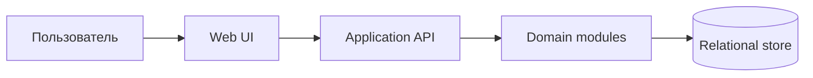

# Начальная архитектура

Статус: `Proposed`

Последнее обновление: 2026-08-13

Архитектура намеренно остаётся логической: пользователь ещё не выбрал язык,
framework, базу данных, hosting и модель аутентификации. До реализации эти
решения должны быть приняты в ADR, а этот документ — обновлён.

## Архитектурные цели

- одна транзакционная модель данных для list, board и saved views;
- быстрые интерактивные mutations с явным разрешением конфликтов;
- строгие project/release и workflow invariants на сервере;
- возможность развивать фильтры и metadata без копирования query-логики по UI;
- простой deployment и эксплуатация для небольшого продукта.

## Контекст

Relational store — обоснованный кандидат из-за ссылочной целостности,
транзакций и сложных фильтров, но конкретная СУБД ещё не выбрана. Web UI также
является предложением, а не принятым ограничением на все будущие клиенты.

## Логические модули

| Модуль | Ответственность |
|---|---|
| Tasks | Task lifecycle, workflow, labels, subtasks, relations, rank |
| Projects | Project metadata, scope и вычисляемый progress |
| Releases | Release lifecycle, состав и project consistency |
| Views | Filter AST, query compilation, grouping, ordering, display config |
| Search | Identifier lookup и text search поверх разрешённого scope |
| Identity | Current actor, ownership и permissions после выбора auth model |

Модули — границы кода внутри одного приложения, а не отдельные сервисы. Для MVP
предпочтителен modular monolith: независимое развёртывание этих частей пока не
даёт подтверждённой пользы, но увеличивает транзакционную сложность.

## Основные потоки

### Открытие view

1. API загружает `SavedView` и проверяет доступ.
2. Views валидирует versioned filter AST и объединяет его со scope и временными
   URL-фильтрами.
3. Один query pipeline применяет фильтр, grouping, ordering и pagination.
4. API возвращает records и metadata групп; UI рисует list либо board.

Переключение layout не должно менять query semantics или состав task IDs.

### Перетаскивание карточки

1. UI оптимистично показывает новое положение и отправляет target group,
   соседние ranks и record version.
2. API переводит target group в изменение доменного поля.
3. Domain проверяет workflow и project/release invariants.
4. Транзакция меняет поле, rank, timestamps и version.
5. При validation/conflict UI восстанавливает server state и показывает
   понятную причину.

### Назначение релиза

1. Release загружается вместе с owner project.
2. Для task без project API назначает project и release одной командой.
3. Для task другого project операция отклоняется либо требует отдельной команды
   `move_to_project_and_release` с подтверждением.
4. Ни один промежуточный commit не нарушает инвариант.

## API-принципы

- Commands выражают доменное намерение, когда обычный PATCH может создать
  промежуточное неверное состояние.
- Read API поддерживает cursor pagination и возвращает стабильный sort key.
- Filter AST версионируется и валидируется по allowlist полей/операторов.
- Ошибки различают validation, not found, permission denied и version conflict.
- Timestamps назначает сервер; клиент передаёт local date/timezone только там,
  где это часть семантики.

Конкретный REST/GraphQL/RPC стиль остаётся открытым.

## Хранение и индексы

Предварительно нужны:

- unique sequence/index для `Task.identifier`;
- индексы по status, project, release, assignee, priority, due/updated dates и
  `archived_at`;
- join indexes для labels и task relations;
- полнотекстовый индекс title/description;
- constraint или transactional validation project/release consistency;
- стратегия fractional/lexicographic ranks с периодической локальной
  нормализацией.

Физическая схема и миграционный инструмент выбираются вместе со стеком.

## Надёжность и проверка

- Domain tests проверяют переходы статусов, timestamps, release consistency,
  parent cycles и relation uniqueness.
- Repository/API integration tests проверяют транзакции, constraints, filters,
  pagination и concurrency conflict.
- UI tests проверяют одинаковый состав list/board, drag rollback и сохранение
  views.
- End-to-end сценарии следуют разделу приёмки в
  [спецификации MVP](specs/mvp.md#11-проверяемые-сценарии-приёмки).

## Риски

- Универсальный filter builder может стать отдельным продуктом; MVP ограничивает
  UI оператором AND и allowlist полей.
- Manual rank сложен при параллельных перемещениях; version conflict должен быть
  предусмотрен до оптимистичного DnD.
- Одновременная редактируемость released scope ослабляет доверие к истории;
  безопасный первый вариант — запрещать её.
- Multi-user permissions существенно меняют query layer; нельзя считать
  `owner_id` полноценной моделью доступа.
- Project progress без effort weighting прост, но может вводить в заблуждение
  на задачах разного размера; UI должен явно показывать метод подсчёта.

## Решения до первой реализации

1. Целевая среда: hosted web, local app или оба варианта.
2. Персональная или многопользовательская identity/permission model.
3. Язык, framework, database и миграционный инструмент.
4. REST, GraphQL либо иной API contract.
5. Нужны ли real-time updates в MVP или достаточно refresh/conflict handling.
6. Политика `started_at` при повторном открытии и immutability released scope.
