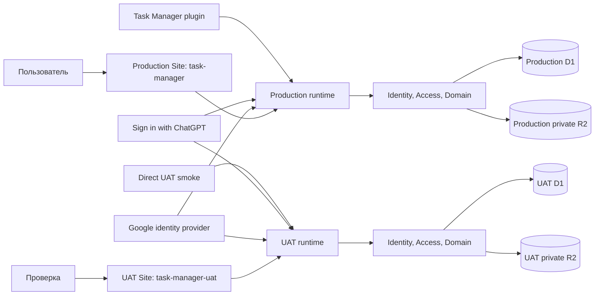

# Начальная архитектура

Статус: `Proposed`

Последнее обновление: 2026-08-17

Архитектура реализована первым вертикальным срезом на TypeScript, React 19,
Vinext/Vite, Sites Worker runtime и D1. Выбор и границы authentication
зафиксированы в
[ADR-0003](decisions/0003-implementation-stack-and-auth-delivery.md). Документ
также содержит целевые модули следующих срезов; их наличие здесь не означает,
что весь MVP уже реализован.

## Архитектурные цели

- одна транзакционная модель данных для list, board и saved views;
- быстрые интерактивные mutations с явным разрешением конфликтов;
- строгие project/release и workflow invariants на сервере;
- server-side tenant isolation и authorization для любого data access;
- две внешние identities вокруг одного внутреннего `User`;
- возможность развивать фильтры и metadata без копирования query-логики по UI;
- progressive-disclosure read model для агентов без загрузки task bodies в
  групповых запросах;
- единая Linear-like interaction и component model для list, board, details,
  filters, selection и contextual actions;
- managed deployment в раздельные production/UAT ChatGPT Sites и durable
  structured storage в независимых D1.

## Контекст

ChatGPT Sites — hosting target для двух изолированных сред, D1 — отдельный
relational binding структурированных данных каждой среды. Приложение использует
Vinext/Vite, prepared D1 queries за repository boundary и Drizzle Kit для
одинаковых versioned SQL migrations. Environment/release boundary принят в
[ADR-0010](decisions/0010-production-and-uat-sites.md). Это соответствует
[официальной документации Sites](https://learn.chatgpt.com/docs/sites).

## Логические модули

| Модуль | Ответственность |
|---|---|
| Tasks | Task lifecycle, workflow, labels, subtasks, relations, rank |
| Comments | ACL-scoped native threads, idempotency, reactions и resolution |
| Attachments | D1 metadata, private R2 objects, sniffing, range delivery и cleanup |
| Projects | Project metadata, scope и вычисляемый progress |
| Releases | Release lifecycle, состав и project consistency |
| Views | Filter AST, query compilation, grouping, ordering, display config |
| Search | Identifier lookup и text search поверх разрешённого scope |
| Identity | ChatGPT/Google adapters, UserIdentity linking, sessions, current User |
| Access | Ownership scope, AccessGrant inheritance, share/revoke decisions |
| Administration | Server allowlist, content-free overview и explicit full-state backup/restore |
| Portability | Owner Project bundles, validation/preview и atomic exact restore |
| Agent API | Compact/detail projections, versioned REST, remote MCP и OAuth/personal credential scopes |
| UI shell | Linear-like navigation, shared controls, keyboard, themes, единый sync coordinator и state |

Модули — границы кода внутри одного приложения, а не отдельные сервисы. Для MVP
предпочтителен modular monolith: независимое развёртывание этих частей пока не
даёт подтверждённой пользы, но увеличивает транзакционную сложность.

## Hosting и runtime boundary

- Default `.openai/hosting.json` связывает repository с UAT Site
  `task-manager-uat`; production binding хранится отдельно в
  `.openai/hosting.production.json`. Оба файла создаются или обновляются только
  после Sites provisioning и содержат binding metadata, а не secrets.
- Каждая среда имеет отдельные D1 и private R2 bucket. Structured records,
  Site-scoped identities, OAuth grants, attachment object keys и test data
  между ними не разделяются. Runtime binding нативных вложений —
  `ATTACHMENTS`; environment scope дополнительно входит в каждый object key.
- Provider credentials и session secrets задаются только в hosted environment
  settings; локально перечисляются лишь имена переменных в `.env.example`.
- `TASK_MANAGER_ADMIN_EMAILS` хранится в hosted environment и разбирается как
  нормализованный comma-separated allowlist. Значение не коммитится в source.
- UAT source push/save/deploy входит в обычную проверенную delivery и не требует
  дополнительного approval. Любая production source push/save/deploy требует
  прямой текущей команды пользователя, явно разрешающей production release.
  Documentation-only изменение этого репозитория не является deployment.
- Task Manager marketplace plugin продолжает использовать production
  `/api/mcp`; UAT не участвует в обычном plugin OAuth/data plane.
- Site может быть доступен в интернете как sign-in shell, но application data
  всегда требует authenticated User. Site audience и in-app authorization
  проверяются независимо.
- Sites находится в public beta, зависит от plan/region/workspace settings и на
  старте не предоставляет data residency guarantees. Эти ограничения должны
  быть повторно проверены перед production release.

## Основные потоки

### Вход и identity linking

1. Пользователь выбирает ChatGPT либо Google.
2. Sites ChatGPT flow возвращает trusted email/name headers server runtime;
   Google adapter завершает проверенный OAuth/OIDC flow.
3. Identity module находит `UserIdentity` по `(provider, provider_account_key)`
   либо создаёт новый User и identity.
4. Связать второй provider можно только из authenticated session через flow,
   доказывающий контроль над обеими identities; email match не достаточен.
5. Session содержит internal `User.id`; client-provided user/email/owner claims
   не участвуют в authorization.

### Авторизованный доступ к данным

1. Identity middleware устанавливает current User из server-verified session.
2. Access вычисляет effective role: для Project и его subtree — через current
   Project owner/active Project grant; для standalone Task/global SavedView —
   через собственный owner/active direct grant.
3. Repository применяет predicate внутри SQL/query до pagination, aggregation,
   grouping или full-text search.
4. Mutation дополнительно требует minimum role (`editor` для content,
   `manager`/`owner` для разрешённого member management), inheritance и domain
   invariants в одной транзакции.
5. Unauthorized lookup возвращает ответ, не подтверждающий существование
   чужого resource.

### Share и revoke

1. Grantor находит уже зарегистрированного User по verified email.
2. Access проверяет role actor, допустимый shareable root и ceiling: Owner
   назначает Manager/Editor/Viewer, Manager — только Editor/Viewer.
3. Active grant с выбранной role создаётся или обновляется идемпотентно с
   provenance grantor/timestamp. Verified email обязан разрешаться однозначно.
4. Revoke атомарно закрывает grant. Следующий query/mutation grantee больше не
   включает resource subtree.
5. Project grant наследуется Tasks/Releases/project-scoped SavedViews. Direct
   Task/global SavedView grant поддерживает только Editor/Viewer.
6. Ownership transfer одним batch обновляет Project owner, отзывает grant нового
   owner и создаёт прежнему owner grant Manager.

### Открытие view

1. API загружает `SavedView` только через Access scope и проверяет grant.
2. Views валидирует versioned filter AST и объединяет его со scope и временными
   URL-фильтрами.
3. Один query pipeline сначала применяет authorization predicate, затем
   фильтр, grouping, ordering и pagination.
4. API возвращает records и metadata групп; UI рисует list либо board.

Переключение layout не должно менять query semantics или состав task IDs.

### Синхронизация hydrated workspace

1. Server bootstrap возвращает ACL-scoped snapshot и opaque cursor текущего
   principal.
2. Один UI-shell coordinator раз в 60 секунд запрашивает `/api/sync`, только
   когда вкладка видима и online. Одновременно выполняется не больше одного
   request; `hasMore` вычитывается последовательно.
3. D1 triggers записывают principal-scoped sequence events в той же transaction,
   что Task/Project/Release/SavedView/AccessGrant mutation. Journal не содержит
   пользовательский content.
4. Sync repository coalesces touched IDs и выполняет current ACL projection
   только по IDs текущей bounded page, не по всему bootstrap window. Поэтому
   moved/revoked entity для прежнего audience становится remove, доступная
   старая Task за пределами окна не теряется, а чужой content не попадает в
   response.
5. Core Task/Project/Release/SavedView изменения приходят как compact
   upsert/remove. Labels, relations, comments и imported external context
   передают только task-scoped invalidation IDs; их content перечитывает
   отдельный lazy endpoint лишь при активном details/Peek/activity consumer.
6. Client применяет patches и invalidations идемпотентно к общему
   `AppSnapshot`, сохраняя загруженный Task detail поверх нового summary.
   Details, list, board, navigation, filters и selection используют уже
   согласованное состояние.
7. ACL event, invalid/ahead/pruned cursor, gap или неизвестный event требует
   полного bootstrap. Hidden/offline вкладка приостанавливает timer и сразу
   синхронизируется после visibility/online; network failures и 45-секундный
   timeout дают bounded backoff до пяти минут. Journal хранится 30 дней и
   очищается throttled maintenance path не чаще раза в сутки.

Контракт и границы решения приняты в
[ADR-0009](decisions/0009-central-workspace-synchronization.md). Optimistic
version conflict остаётся write boundary и не заменяется polling.

### Чтение и task commands через agent API

1. Codex/ChatGPT подключается к `/api/mcp` через OAuth Authorization Code +
   PKCE и получает client identity через CIMD либо DCR; scripts могут
   использовать переходную personal API credential.
   Оба способа сопоставляются внутреннему User до data query; browser headers
   нельзя синтезировать client-side.
2. Agent query service применяет тот же ownership/ACL predicate до filters,
   counts, ambiguity resolution и cursor pagination.
3. Collection use case строит фиксированный compact projection без description,
   comment bodies, attachment metadata/bodies, internal IDs и user emails.
4. Detail use case по canonical `public_id` загружает одну сущность; native
   comment threads, native Attachment metadata и большой imported archive
   остаются разными отдельными paginated вызовами. Только detail добавляет
   bounded attachment count hint.
5. REST возвращает versioned schema и request/as-of metadata. MCP публикует
   task-oriented tools с теми же projections. Любой client переходит от summary
   к detail только через явный отдельный запрос. Анонимный MCP handshake может
   получить capabilities и схемы tools для установки connector, но каждый
`tools/call` требует bearer token до data query.
6. Relation commands разрешают обе Task references через тот же ACL predicate,
   требуют Editor+ на каждой стороне и вызывают общий application command
   service. Relation имеет собственную version; create имеет idempotency key.
   `duplicate_of` выполняет relation write и Task status transition одной D1
   batch, а UI/REST/MCP затем перечитывают canonical detail projection.

Реализованный контракт описан в [спецификации agent API](specs/agent-api.md),
а credential/write boundary принят в
[ADR-0006](decisions/0006-standalone-agent-api.md), а OAuth/MCP delivery — в
[ADR-0008](decisions/0008-oauth-mcp-connector.md). Task commands транслируют
external refs во внутренние IDs и вызывают те же domain repository methods с
role checks, release/project validation и optimistic version.

Comment commands сначала разрешают Task тем же ACL predicate, затем работают
только внутри её `task_id`. Collection cursor связан с Task и упорядочен по
`(created_at, id)`; root page подгружает bounded replies. Create использует
уникальный `(task_id, author_user_id, idempotency_key)`, author берётся из token
identity, а edit/delete/resolve проверяют comment version. Agent projection
автора содержит только display name и признак current User.

### Открытие прямой ссылки

1. Server route нормализует catch-all segments ровно через один
   percent-decode/encode cycle, независимо от того, передал runtime decoded или
   encoded params, затем разбирает allowlisted path contract `/workspace`,
   `/issues`, `/views`, `/projects`, `/releases`, project-scoped releases и
   layout `list|board`; неизвестные extra segments отклоняются. `/` является
   legacy entry и перенаправляется на `/workspace`.
2. Repository строит ограниченный ACL-scoped snapshot; для issue route точечно
   загружает адресованную Task по internal/public ID тем же ACL predicate и
   добавляет её в snapshot. Поэтому Task за пределами стартового окна всё равно
   открывается напрямую, а неизвестный и недоступный record имеют одинаковый
   `not found` результат.
3. Внутренний `id` остаётся ключом связей и import idempotency, а отдельный
   immutable `public_id` UUID адресует Task, Project, Release и SavedView.
   Legacy internal-ID route разрешается только внутри ACL snapshot и отвечает
   redirect на канонический публичный path.
4. Route разрешается в UI state `{surface, layout, taskId}`. Issue URL открывает
   details поверх доступного project/release context, но сам остаётся
   каноническим `/issues/{public-id}`.
5. Client-side переходы используют `history.pushState`; для `/issues/{id}`
   history entry дополнительно хранит проверяемый background surface/layout,
   чтобы Back/Forward возвращали исходный board без добавления query parameter.
   При отсутствии или подмене state path разрешается заново. Синтаксис и ACL
   снова проверяются server-side при прямой загрузке или refresh.
6. Metadata независимо шаримой route формируются из уже авторизованного record;
   inherited social image очищается, чтобы приватная entity не получала
   вводящий в заблуждение общий preview.

### Перетаскивание карточки

1. UI оптимистично показывает новое положение и отправляет target group,
   соседние ranks и record version.
2. API переводит target group в изменение доменного поля.
3. Domain проверяет workflow и project/release invariants.
4. Транзакция меняет поле, rank, timestamps и version.
5. При validation/conflict UI восстанавливает server state и показывает
   понятную причину.

### Назначение релиза

1. Release загружается вместе с owner project.
2. Для task без project API назначает project и release одной командой.
3. Для task другого project операция отклоняется либо требует отдельной команды
   `move_to_project_and_release` с подтверждением.
4. Ни один промежуточный commit не нарушает инвариант.

## API-принципы

- Commands выражают доменное намерение, когда обычный PATCH может создать
  промежуточное неверное состояние.
- Read API поддерживает keyset cursor pagination по sort value и immutable
  `public_id`; offset не используется для mutable collections.
- Filter AST версионируется и валидируется по allowlist полей/операторов.
- Ошибки различают validation, not found, permission denied и version conflict.
- Timestamps назначает сервер; клиент передаёт local date/timezone только там,
  где это часть семантики.
- Любая endpoint/query abstraction требует current User и не предоставляет
  unscoped repository methods application layer.
- UI snapshot и agent API используют разные response projections и query
  methods, но одинаковые server-side ownership/ACL semantics и domain command
  repositories. `/api/bootstrap` не является versioned внешним контрактом.
- Agent collection endpoints имеют fixed compact representation и cursor
  pagination; task bodies доступны только detail use case.
- Authorization применяется до aggregates и error detail, чтобы исключить
  утечки counts, identifiers и существования records.
- Единственное исключение cross-user aggregation — отдельный admin query,
  который сначала проверяет hosted allowlist и возвращает только User metadata
  и counts без content user-owned records.
- Второе explicit исключение — system backup/restore по ADR-0004. Оно не
  переиспользуется product surfaces: export читает полный logical state, а
  restore работает только через validated staging и atomic replace.

Первый срез использует JSON HTTP route handlers: server render стартует с 40
наиболее недавно изменённых Tasks, после hydration в browser idle-time
догружает расширенное ACL-scoped окно до 2000 Tasks через `/api/bootstrap` и
атомарно объединяет его с уже загруженными detail/новыми версиями записей.
Во время фоновой загрузки UI показывает progress, но остаётся интерактивным.
Если доступных Tasks больше 2000, итоговый snapshot явно возвращает
`taskWindow.truncated=true`, а UI показывает границу вместо молчаливой иллюзии
полного workspace. Команды создания/изменения Task, Project, Release, SavedView
и AccessGrant остаются отдельными route handlers.
Workspace overview `/workspace` повторно использует этот ACL-scoped snapshot и
его compact summary projections для навигационных итогов. Отдельного overview
endpoint с cross-user counts нет: task bodies, labels, relations, native
comments, imported external context и admin aggregates остаются вне overview и
загружаются только своими authorization-scoped путями по запросу.
Task rows в этом snapshot являются summary projection: они содержат поля list,
board, grouping и navigation, но вместо `description` передают явный `null`.
Открытие Task отдельно запрашивает полную запись через `GET /api/tasks/{id}` с
повторной ACL-проверкой; server render прямой task URL добавляет detail только
для выбранной Task. Поиск по description также выполняется отдельным
authorization-scoped `GET /api/tasks?search=…`, поэтому отсутствие bodies в
bootstrap не ослабляет search contract и не требует загружать их при обычном
открытии workspace.
Authenticated identity lookup для уже зарегистрированного User обновляет
activity/display fields и возвращает User одним D1 `UPDATE … RETURNING`;
стартовые workflow statuses создаются в том же batch, что и новая identity.
Это убирает несколько последовательных D1 round trips с каждой HTML/API
загрузки, не ослабляя server-trusted identity boundary.
Десять независимых ACL-scoped collection reads для workspace snapshot
выполняются одним D1 batch. SQL predicates и отдельные результаты сохраняются,
но критический путь HTML и `/api/bootstrap` больше не платит за десять
последовательных сетевых round trips к D1.
`/api/bootstrap` не включает тяжёлый импортированный архив комментариев и
attachments: при открытии details одной импортированной Task UI отдельно
запрашивает `/api/tasks/{id}/external-source`, а server сначала повторно
проверяет ACL этой Task. Content-free admin overview вычисляется только для
прямого открытия `/admin`; обычный snapshot хранит лишь server-derived признак
доступности admin surface.
Native attachment metadata/body также не входят в bootstrap или compact Task
projection. `/api/tasks/{id}/attachments` лениво читает bounded metadata, а
`.../{attachmentRef}/content` повторяет Task ACL непосредственно перед private
R2 read, поддерживает один bounded Range и всегда возвращает `private,
no-store` + `nosniff`. Object key не выходит за server boundary; non-image
content принудительно скачивается. Для raster list route `variant=thumbnail`
передаёт private R2 stream в binding `IMAGES`, возвращает bounded WebP и не
открывает public URL. Migration `0015` публикует отдельную ID-only
`task_attachments` invalidation: только mounted attachment consumer перечитывает
metadata, не вызывая bootstrap или Task-detail rebase. Контракт принят в
[ADR-0011](decisions/0011-native-attachments-and-r2.md).

Description хранит native raster embed как versioned opaque reference
`attachment:v1:<public-id>`, но не object key или content URL. Все Task-write
entrypoints сходятся в repository validator: он требует ready image той же Task
и добавляет race-safe `EXISTS` predicates в update. Attachment delete применяет
обратный guard по актуальной description. Renderer распознаёт только отдельный
Markdown image block, лениво читает ACL-scoped metadata и строит private content
route уже после server authorization; stale reference становится placeholder.

Agent REST повторяет эту boundary через `/api/agent/v1/tasks/{ref}/attachments`:
metadata использует Task-bound keyset cursor, upload читает raw body только после
bearer/scope проверки, а content route повторно разрешает Task ACL перед R2.
Projection исключает internal Task/uploader IDs и object key; URL ведёт обратно
на bearer-protected Agent API. MCP использует тот же command service. Его
OpenAI file input скачивается bounded fetch с `credentials=omit`, manual
redirect validation и allowlist OpenAI HTTPS hosts; временный URL не попадает в
D1 или logs. После fetch общий Attachment repository снова проверяет magic,
claim, pixels, checksum, idempotency и effective Editor role.

Native comment bodies также не входят в bootstrap или Task detail. Activity
отдельно запрашивает `/api/tasks/{id}/comments`; этот route повторяет Task ACL,
а comment mutations обновляют Task timestamp и производный `comment_count` в
одной D1 batch transaction.

Частая команда изменения одной Task возвращает только подтверждённый
`TaskRecord`, и client атомарно заменяет эту запись в текущем snapshot. Это не
запускает заново все workspace queries и не пересылает весь набор Tasks после
каждого property edit. Bulk command также возвращает только подтверждённые
`TaskRecord[]`: ACL-загрузка выбранных IDs выполняется одним set-based query,
а client точечно заменяет записи. Create и sharing commands пока могут
возвращать новый authorization-scoped snapshot.

## Хранение и индексы

В migration baseline уже входят:

- D1 migrations для User, UserIdentity, AccessGrant и доменных таблиц;
- schema создаётся и меняется только versioned migrations; request runtime не
  выполняет `CREATE TABLE`, `ALTER TABLE` или compatibility backfill;
- unique index `(provider, provider_account_key)` для identities;
- unique active-grant constraint для resource/grantee;
- owner-prefixed indexes для каждого user-owned query path;
- owner-scoped unique indexes и атомарный `task_sequences` allocator для
  `Task.identifier`;
- индексы по owner/status/archive, project/release и updated time;
- expression indexes по нормализованным task title/identifier, project
  name/summary и release name для prefix search;
- join table для labels;
- нормализованная `task_relations` для `blocks`, `related` и `duplicate_of` с
  immutable ID, create-idempotency, optimistic version, semantic indexes и
  partial uniqueness одного `duplicate_of` target на source;
- `comments` с task/user/self foreign keys, idempotency и keyset indexes;
- `comment_reactions` с composite primary key и cascade от comment;
- `external_records` для owner-scoped provenance идемпотентного импорта;
- `user_import_sessions` и `user_import_rows` для owner-scoped Project restore
  staging, preview и bounded lifecycle;
- `admin_import_sessions` и `admin_import_rows` для изолированного preflight,
  payload staging и минимального audit metadata полного restore;
- `workspace_sync_sequences` и `workspace_change_events` для per-principal
  cursor, упорядоченного ACL-safe journal и gap recovery;
- `workspace_sync_invalidations` как транзакционная trigger queue для fan-out
  ID-only invalidations lazy task context и `workspace_sync_maintenance` для
  throttled retention;
- constraint или transactional validation project/release consistency;
- стратегия fractional/lexicographic ranks с периодической локальной
  нормализацией.

Полнотекстовый индекс, дополнительные assignee/priority/due indexes и foreign
keys для остальных старых таблиц остаются следующими schema slices; comments и
reactions уже используют task/user/self foreign keys.
Owner consistency и project/release invariants в текущем срезе проверяются на
server mutation boundary.

Authenticated endpoint `/api/import/linear` принимает заранее
инвентаризированный JSON snapshot, полностью валидирует ссылки до записи и
выполняет deterministic upsert. Техническая страница `/import/linear` добавляет
к workspace snapshot отдельно собранный archive комментариев. Импорт сохраняет
исходные identifiers, timestamps, archive state, hierarchy, labels, relations,
saved-view query/display и полный provider metadata в `external_records`.

### Системный backup и restore

1. `POST /api/admin/export` проверяет allowlist и одной read-only D1 batch
   transaction получает все live application tables в стабильном порядке.
2. Versioned JSON envelope получает timestamp, per-table counts и SHA-256;
   response не кэшируется и скачивается как attachment.
3. `POST /api/admin/import/validate` ограничивает payload, полностью проверяет
   schema/domain/identity references и atomically сохраняет verified rows в
   staging namespace.
4. UI показывает preview и требует отдельный текущий backup плюс literal
   `RESTORE` confirmation.
5. `POST /api/admin/import` разрешает только создателя staged session и одной
   D1 batch transaction удаляет live rows, вставляет verified staged rows,
   отмечает session applied и очищает payload. Batch failure откатывает весь
   cutover.
6. Schema `3` добавляет Attachment metadata и bounded content-addressed object
   set. Export заменяет environment object key на `sha256:<digest>` и проверяет
   original byte-for-byte. Restore кладёт validated bytes в R2 staging,
   материализует новые keys, выполняет D1 replace и после commit удаляет старые
   и staged objects; failure до commit удаляет только новые objects.
7. Schema `4` переносит `WorkflowStatus.system_role`, `archived_at` и `version`.
   Legacy schema `2`/`3` проверяется по исходному checksum body, затем
   нормализуется для current restore; system restore также синтезирует ровно
   один reserved `Duplicate` на User. Schema `2` без Attachments остаётся
   импортируемой.
8. Schema `5` переносит immutable TaskRelation ID, creator-scoped idempotency
   key, optimistic version и updated timestamp. Legacy schema `2`–`4`
   проверяется по исходному checksum body, затем получает deterministic relation
   metadata до current restore.

### Project backup и restore

1. Export repository сначала загружает Project с effective role `owner`, затем
   одной consistent D1 batch читает subtree, internal joins/relations,
   provenance, catalog dependencies и active Project grants.
2. Format layer canonicalizes bundle, считает counts/warnings и SHA-256; Users,
   identities, credentials и unrelated rows не входят.
3. Validate endpoint проверяет owner/site binding, checksum, references,
   collisions и доступность shared catalogs до записи normalized rows в
   `user_import_rows`.
4. Preview сравнивает staged и live subtree. Apply повторно проверяет session,
   confirmation и current ownership, затем set-based SQL одной D1 `batch()`
   transaction заменяет subtree; grants вставляются только при opt-in.
5. Attachment objects выбираются только через Tasks исходного Project. Общий
   25 MB container полностью валидируется до R2 staging; thumbnails не входят и
   пересоздаются по запросу.
6. Current schema `5` сохраняет relation identity/concurrency metadata;
   schema `2`–`4` получает deterministic metadata после проверки исходного
   checksum и до записи staging rows.

## Надёжность и проверка

- Domain tests проверяют переходы статусов, timestamps, release consistency,
  parent cycles и relation uniqueness.
- Repository/API integration tests проверяют транзакции, constraints, filters,
  pagination, concurrency conflict и отсутствие cross-user data leakage.
- Identity tests проверяют оба providers, forged headers/claims, explicit
  linking и отсутствие automatic email merge.
- Access tests покрывают role hierarchy/ceiling, viewer mutation denial,
  project inheritance к Task/Release/scoped View, global View intersection,
  revoke и atomic ownership transfer.
- Admin tests покрывают allowlist normalization, отказ обычному User и
  registration/activity aggregates при изменении source counts.
- Backup tests покрывают format/domain validation, identity continuity,
  отсутствие Administration в primary sidebar, preview без live mutation и
  atomic replace/rollback boundary.
- Project portability tests покрывают format/checksum, boundary validation и
  transaction rollback; owner scope дополнительно проверяется repository
  predicates и live smoke.
- UI tests проверяют одинаковую grouping composition list/board,
  selection/bulk actions, keyboard controls, Peek, drag rollback и сохранение
  views; Miniflare/D1 integration tests дополнительно проходят repository ACL,
  routes, OAuth, keyset pagination и конкурентный create.
- Comment tests покрывают identity, Viewer refusal, author/moderator rules,
  idempotent create/reaction, stale versions, one-level replies, tombstones,
  stable pagination, Agent privacy projection и backup invariants.
- Workspace sync tests покрывают event ordering/coalescing, idempotent patch и
  invalidation, create/update/delete, ACL fan-out без outsider leak, revoke
  reset, cursor gap, 30-дневный retention, Task за пределами 2000-record window,
  lazy labels/relations/comments/external context и bounded reconnect backoff.
- Visual regression и accessibility checks следуют
  [спецификации интерфейса](specs/interface.md); сравнение с Linear проверяет
  composition и interaction parity, а не чужие assets.
- End-to-end сценарии следуют разделу приёмки в
  [спецификации MVP](specs/mvp.md#13-проверяемые-сценарии-приёмки).

## Риски

- Универсальный filter builder может стать отдельным продуктом; MVP ограничивает
  UI оператором AND и allowlist полей.
- Manual rank сложен при параллельных перемещениях; version conflict должен быть
  предусмотрен до оптимистичного DnD.
- Одновременная редактируемость released scope ослабляет доверие к истории;
  безопасный первый вариант — запрещать её.
- Одна забытая unscoped query может раскрыть чужие данные; owner/ACL scope
  должен быть частью repository API, schema indexes и integration tests.
- Admin query намеренно cross-user и поэтому должен оставаться отдельным,
  content-free и server-gated; повторное использование его projection в
  обычных user surfaces увеличит риск утечки email и aggregate activity.
- System backup содержит весь cross-user content и identity metadata. Файл
  следует считать чувствительным, import ограничивать same-origin admin
  operation, а invalid snapshot отклонять до staging/cutover.
- Project bundle остаётся чувствительным пользовательским content. Same-Site
  owner binding и no-store response обязательны; sharing descriptors не должны
  превращаться в implicit grants.
- Если agent API не отделить от UI snapshot, рост descriptions/imported archive
  создаст большой token и privacy blast radius. Summary/detail boundary должна
  проверяться schema и integration tests, а не только дисциплиной клиента.
- OAuth/token connector добавляет новую identity boundary. Нельзя считать
  Sites browser session переносимой во внешний client или выдавать API
  credential implicit admin access. CIMD/DCR, exact redirect/resource, PKCE,
  expiry, refresh rotation и revoke должны проверяться server-side.
- Ошибка в role ceiling увеличивает blast radius grant; server-side hierarchy,
  provenance и быстрый revoke обязательны.
- Sites contract сегодня даёт ChatGPT identity через email/name headers, а не
  отдельный immutable subject; account linking и provider key требуют
  осторожной миграционной стратегии.
- Google external auth должен быть доказан на реальном Sites runtime до
  заявления о готовом login flow.
- Project progress без effort weighting прост, но может вводить в заблуждение
  на задачах разного размера; UI должен явно показывать метод подсчёта.
- Linear меняет UI независимо от Task Manager. Reference должен быть датирован,
  а изменения не должны автоматически ломать наш contract или расширять scope.
- Слишком буквальное сходство может стереть product identity или привести к
  копированию чужих assets; ADR-0002 требует собственного брендинга и
  документированных отклонений.
- Sites public beta limits и отсутствие data residency могут потребовать
  пересмотра hosting до обработки чувствительных или регулируемых данных.

## Открытые решения следующих срезов

1. Конкретный Google OAuth/OIDC adapter и callback/session contract в Sites.
2. CSRF hardening сверх Sites session boundary, audit event minimum и account
   recovery.
3. UX explicit linking/unlinking providers и смены primary email.
4. Переход фонового расширенного bootstrap к server-filtered cursor pages для
   workspaces больше 2000 Tasks.
5. Политика immutability released scope и нормализация manual ranks.
6. Server-side idempotency task create, bulk command contract, OAuth/API rate
   limits, retention audit events и критерии перехода на managed IdP перед
   публичным каталогом.
