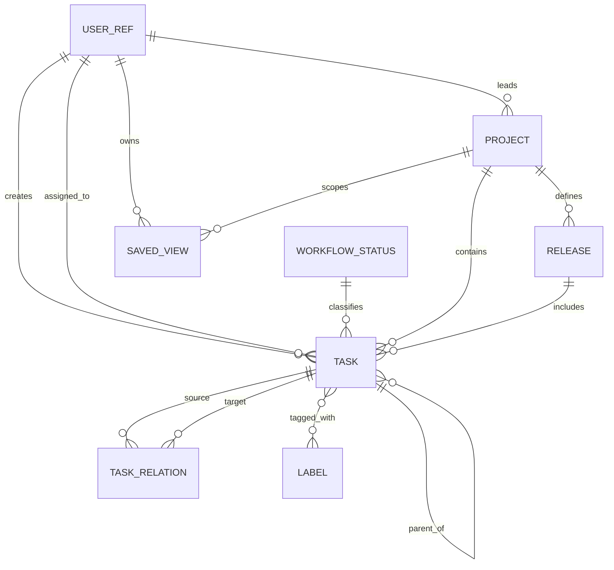

# Доменная модель

Статус: `Proposed`

Последнее обновление: 2026-08-13

Документ фиксирует логическую модель, а не конкретную ORM или SQL-схему.
Имена полей могут адаптироваться к выбранному стеку, но семантика и инварианты
должны сохраняться либо меняться через явное проектное решение.

## Карта сущностей



`UserRef` — минимальная внешняя ссылка для ownership metadata. Полная identity и
permission model остаётся открытым решением.

## Task

| Поле | Тип | Обязательность | Семантика |
|---|---|---:|---|
| `id` | UUID | да | Внутренний immutable ID |
| `identifier` | string | да | Immutable human ID, например `TM-123` |
| `title` | string | да | Непустой заголовок |
| `description` | Markdown/text | нет | Подробный контекст |
| `status_id` | UUID | да | Ссылка на `WorkflowStatus` |
| `priority` | enum | да | `none`, `low`, `medium`, `high`, `urgent` |
| `assignee_id` | UUID | нет | Текущий исполнитель |
| `creator_id` | UUID | да | Создатель |
| `project_id` | UUID | нет | Не более одного проекта |
| `release_id` | UUID | нет | Не более одного совместимого релиза |
| `parent_id` | UUID | нет | Родительская задача |
| `estimate` | integer | нет | Абстрактные points; положительное значение |
| `due_date` | local date | нет | Дата без времени в timezone пользователя |
| `rank` | sortable string | да | Manual order без перенумерации всей колонки |
| `started_at` | instant | нет | Первый/актуальный вход в started; политика уточняется |
| `completed_at` | instant | нет | Соответствует completed category |
| `canceled_at` | instant | нет | Соответствует canceled category |
| `archived_at` | instant | нет | Soft archive |
| `created_at` | instant | да | Серверное время создания |
| `updated_at` | instant | да | Серверное время последнего изменения |
| `version` | integer/token | да | Optimistic concurrency |

Labels задаются связующей таблицей `task_labels(task_id, label_id)`. Relations
и subtasks не кодируются labels.

## WorkflowStatus

| Поле | Семантика |
|---|---|
| `id` | Внутренний ID |
| `name` | Пользовательское название |
| `category` | `backlog`, `unstarted`, `started`, `completed`, `canceled` |
| `color` | UI token/color |
| `position` | Порядок в workflow |
| `is_default` | Статус новых задач |
| `archived_at` | Скрытие без поломки старых задач |

Категория — системный смысл, name — пользовательская формулировка. Удалять
status, на который ссылаются задачи, нельзя без миграции этих задач.

## Project

| Поле | Семантика |
|---|---|
| `id`, `slug` | Внутренняя и URL identity |
| `name` | Обязательное имя |
| `summary`, `description` | Краткий и подробный контекст |
| `status` | `planned`, `active`, `paused`, `completed`, `canceled` |
| `lead_id` | Один ответственный `UserRef`, optional |
| `start_date`, `target_date` | Плановые даты, optional |
| `icon`, `color` | Визуальная identity, optional |
| `archived_at` | Soft archive |
| `created_at`, `updated_at`, `version` | Технические metadata |

Project progress вычисляется запросом по задачам, а не хранится как независимо
редактируемое число.

## Release

| Поле | Семантика |
|---|---|
| `id` | Внутренний ID |
| `project_id` | Обязательный owner project |
| `name` | Обязательное имя/version label |
| `description` | Scope и контекст |
| `status` | `planned`, `active`, `released`, `canceled` |
| `target_date` | Плановая дата, optional |
| `released_at` | Фактический server instant, только для released |
| `release_notes` | Редактируемый Markdown |
| `created_at`, `updated_at`, `version` | Технические metadata |

На уровне MVP `Release` объединяет удобство Linear project milestone и смысл
поставки Linear release. Pipeline, environment, commit SHA и автоматическое
наполнение из CI/CD не моделируются.

## Label

| Поле | Семантика |
|---|---|
| `id`, `name` | Identity и уникальное в active scope имя |
| `color`, `description` | Представление и правило применения |
| `archived_at` | Запрет нового использования с сохранением истории |

Label — гибкая классификация, но не подмена status, priority, project, release
или assignee.

## TaskRelation

| Поле | Семантика |
|---|---|
| `source_task_id` | Исходная задача |
| `target_task_id` | Целевая задача |
| `type` | `blocks`, `related`, `duplicate_of` |
| `created_at`, `creator_id` | Provenance связи |

Для `related` хранится одна канонически упорядоченная пара. `blocked_by`
вычисляется как обратное чтение `blocks` и не является отдельным type.

## SavedView

| Поле | Семантика |
|---|---|
| `id`, `name` | Identity и имя |
| `owner_id` | Создатель/владелец |
| `visibility` | `private` или `shared`; rollout зависит от identity model |
| `scope_type` | `global` или `project` |
| `scope_project_id` | Обязателен для project scope |
| `layout` | `list` или `board` |
| `filter_ast` | Версионированный сериализованный фильтр |
| `group_by` | Поле основной группировки либо `none` |
| `order_by`, `direction` | Сортировка результата |
| `visible_fields` | Упорядоченный набор metadata на item/card |
| `show_empty_groups` | Показывать ли пустые колонки/группы |
| `hidden_groups` | Явно скрытые значения группировки |
| `created_at`, `updated_at`, `version` | Технические metadata |

Пример формы фильтра; MVP UI создаёт только `all`, но версия формата позволяет
позже добавить `any`/`not` без второго способа хранения views:

```json
{
  "version": 1,
  "op": "all",
  "conditions": [
    { "field": "project_id", "operator": "is", "value": "project-uuid" },
    { "field": "priority", "operator": "in", "value": ["high", "urgent"] },
    { "field": "archived_at", "operator": "is_empty" }
  ]
}
```

## Инварианты и атомарные операции

1. `task.release_id IS NULL` либо release существует и
   `release.project_id = task.project_id`.
2. Назначение release задаче без project в одной транзакции назначает и project.
3. Смена project с несовместимым release либо отклоняется, либо в одной
   подтверждённой операции очищает release; промежуточное неверное состояние не
   сохраняется.
4. Terminal timestamps выводятся из status category и обновляются в одной
   транзакции со status.
5. Parent graph ацикличен; self-parent и self-relation запрещены.
6. Архивирование project/release не удаляет задачи. Новое назначение в архивную
   сущность запрещено.
7. SavedView выполняется в permission scope читателя и не расширяет его доступ.
8. Любая mutation проверяет `version`; stale version возвращает conflict, а не
   last-write-wins.

## Намеренно не моделируется

`Team`, `Initiative`, `Cycle`, `Milestone`, `Roadmap`, `Comment`, `Document`,
`Attachment`, `Notification`, `Subscription`, `ReleasePipeline`, `Environment`
и `Integration` не входят в начальную модель.
