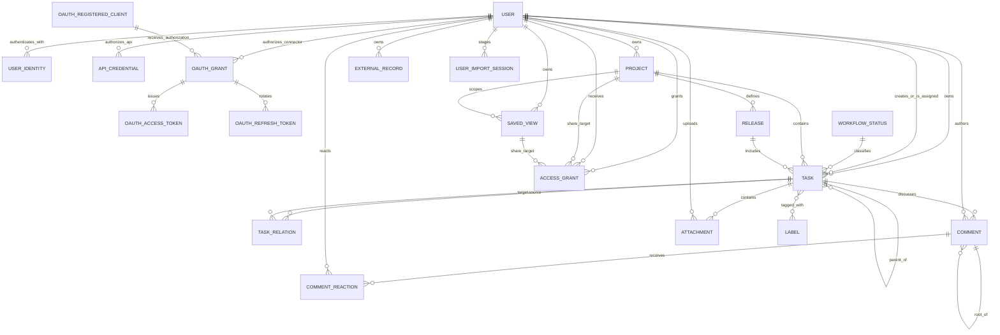

# Доменная модель

Статус: `Proposed`

Последнее обновление: 2026-08-17

Документ фиксирует логическую модель, а не конкретную ORM или SQL-схему.
Имена полей могут адаптироваться к выбранному стеку, но семантика и инварианты
должны сохраняться либо меняться через явное проектное решение.

## Карта сущностей



Связи `ACCESS_GRANT` с share targets полиморфны: одна запись grant указывает
ровно на один `Project` или global `SavedView`.

## User

| Поле | Семантика |
|---|---|
| `id` | Внутренний immutable UUID; основной subject authorization |
| `primary_email` | Verified contact/login email, normalized для поиска sharing |
| `display_name` | Отображаемое имя, optional |
| `timezone`, `locale` | Пользовательские настройки представления |
| `created_at` | Время регистрации внутреннего User |
| `updated_at` | В первом срезе — последний успешный authenticated request и обновление profile projection |
| `disabled_at` | Блокировка входа без удаления данных |

`User` не равен аккаунту ChatGPT или Google. Все owner/assignee/lead/grantee
ссылки указывают на внутренний `User.id`.

## UserIdentity

| Поле | Семантика |
|---|---|
| `id`, `user_id` | Identity record и связанный внутренний User |
| `provider` | `chatgpt` или `google` |
| `provider_account_key` | Проверенный account key, доступный от provider |
| `email`, `email_verified` | Email, подтверждённый provider |
| `display_name` | Последнее доступное имя profile, optional |
| `created_at`, `last_seen_at` | Lifecycle metadata |

Unique constraint: `(provider, provider_account_key)`. Для Google OAuth/OIDC
adapter должен использовать проверенный `sub`, если его предоставляет выбранный
provider contract. Sites `Sign in with ChatGPT` на текущем публичном contract
передаёт `oai-authenticated-user-email` и optional
`oai-authenticated-user-full-name` через trusted server headers; до появления
отдельного immutable subject нормализованный authenticated email служит
`provider_account_key` для `chatgpt`.

Identity linking — отдельная аутентифицированная операция. Совпадающие emails
от разных providers не объединяют Users автоматически.

## API credential

| Поле | Семантика |
|---|---|
| `id`, `owner_user_id` | Internal credential identity и User, от имени которого выполняется API request |
| `name`, `token_prefix` | Пользовательская подпись и безопасный display prefix |
| `token_hash` | SHA-256 полного token; исходный secret после выдачи не хранится |
| `scopes_json` | `api:read` и optional `api:write` |
| `expires_at`, `last_used_at`, `revoked_at`, `created_at` | Credential lifecycle |

API credential не является `UserIdentity`, session, `AccessGrant` или admin
role. Scope разрешает тип API operation, но resource access всё равно
вычисляется по Project/global SavedView grants. Logical backup credential не
переносит; full restore отзывает все tokens.

## OAuth connector grant и tokens

| Сущность | Семантика |
|---|---|
| `OAuthRegisteredClient` | DCR metadata public client: opaque client ID, разрешённые redirect URI, grant/response types, optional name и lifecycle metadata; client secret отсутствует |
| `OAuthAuthorizationRequest` | Короткоживущий consent request: User, CIMD либо зарегистрированный client, redirect, resource, scopes, state и PKCE challenge |
| `OAuthGrant` | Отзываемая связь User ↔ client ↔ MCP resource с approved scopes и lifecycle metadata |
| `OAuthAuthorizationCode` | Одноразовый hashed code, буквально связанный с client, redirect, resource и PKCE challenge |
| `OAuthAccessToken` | Hashed bearer capability с коротким expiry, audience/resource и scopes |
| `OAuthRefreshToken` | Hashed rotating token family с parent/used/revoked lifecycle для reuse detection |

OAuth grant не является `UserIdentity` или `AccessGrant`: он разрешает client
действовать как уже сопоставленный внутренний User, но каждый query/mutation
по-прежнему вычисляет текущий resource ACL. Full restore удаляет grants, codes
и tokens; logical backup их не переносит. DCR-запись сама по себе не является
grant или credential и не даёт доступа к пользовательским данным.

## Application administrator

Application administrator не является отдельной доменной сущностью или ролью
`AccessGrant`. Server boundary сопоставляет нормализованный verified email
current User с hosted allowlist. Content-free overview capability разрешает
operational aggregate query по Users и owner-scoped counts. Отдельная system
backup capability на той же allowlist разрешает полный logical export и
атомарный replace-import, но не меняет predicate обычных repository methods.

Admin projection содержит:

- `User.id`, display name, verified email, registration и last-seen timestamps;
- counts принадлежащих User Tasks, Projects, Releases и SavedViews;
- число Tasks, изменённых за последние 7 дней;
- максимум `updated_at` среди принадлежащих User Tasks, Projects, Releases и
  SavedViews как `last_content_activity_at`.

Projection не включает content полей этих records. Exported backup, напротив,
содержит cross-user content, identities и ACL; это отдельная явная operation,
а не implicit доступ к чужим resources через обычные product surfaces.

## SystemBackup и AdminImportSession

`SystemBackup` — переносимый versioned JSON envelope со всеми product tables.
Он сохраняет внутренние/public IDs, ownership, versions, timestamps, archived
state, joins, relations, revoked grants и external provenance. Hosted secrets,
Sites configuration, schema/migrations и operational staging в него не входят.

`AdminImportSession` — operational metadata preflight/import:

| Поле | Семантика |
|---|---|
| `id` | Непрозрачный import ID |
| `created_by_user_id` | Администратор, загрузивший snapshot |
| `source_exported_at`, `payload_sha256` | Provenance и identity payload |
| `counts_json` | Проверенные counts по каждой application table |
| `status` | `staged`, `applied` или `expired` |
| `created_at`, `applied_at` | Operational timestamps |

Staged rows хранятся отдельно по `(import_id, table_name, ordinal)` и не
участвуют в product queries. После atomic apply payload rows удаляются, а
session metadata остаётся как минимальный audit record.

## ProjectBackup и UserImportSession

`ProjectBackup` — versioned logical envelope ровно одного Project. Он хранит
immutable identity Project, current owner, его subtree, internal joins и
relations, native comments/reactions, dependency snapshots используемых
catalogs, active sharing
descriptors, warnings и SHA-256. Это переносимая страховка владельца, но не
отдельная live entity и не ACL capability.

`UserImportSession` изолирует staged Project restore:

| Поле | Семантика |
|---|---|
| `id`, `created_by_user_id` | Непрозрачный session ID и authenticated User |
| `kind` | `project_backup` |
| `status` | `uploading`, `staged`, `applying`, `applied`, `expired` либо `failed` |
| `source_json` | Origin и public identity исходного Project bundle |
| `preview_json`, `payload_sha256` | Counts/warnings/conflicts и identity staged payload |
| `expires_at`, `created_at`, `applied_at` | Ограниченный lifecycle и audit metadata |

Rows staging хранятся отдельно по `(import_id, row_type, ordinal)` и не
участвуют в product queries. Apply читает только полностью подготовленный
normalized staged plan.

## AccessGrant

| Поле | Семантика |
|---|---|
| `id` | Внутренний ID grant |
| `resource_type` | `project` или `saved_view` |
| `resource_id` | ID share target соответствующего типа |
| `grantor_user_id` | User, создавший или изменивший grant |
| `grantee_user_id` | User, получивший доступ |
| `permission` | Project: `manager`, `editor`, `viewer`; global SavedView: `editor`, `viewer` |
| `created_at`, `revoked_at` | Lifecycle grant |

Один active grant уникален по `(resource_type, resource_id, grantee_user_id)`.
Project Owner имеет implicit highest access и не представлен grant. Grant
самому owner запрещён.

### Семантика share targets

- Project grant распространяется на Project, его Tasks, Releases и SavedViews с
  явным `scope_project_id`.
- Release не является самостоятельным share target.
- Task не является самостоятельным share target и всегда наследует доступ от
  своего Project.
- Прямой SavedView grant разрешён только для global View без
  `scope_project_id`; query возвращает только records, отдельно доступные
  grantee.
- `viewer` читает; `editor` дополнительно изменяет content и archive state;
  `manager` дополнительно управляет только grants `editor`/`viewer`.
- Project Owner управляет grant вплоть до `manager` и атомарно передаёт
  ownership уже добавленному участнику. Target становится Owner, прежний Owner
  — Manager; подтверждение target не требуется.

## WorkspaceSyncSequence и WorkspaceChangeEvent

Это operational records синхронизации UI, а не пользовательские сущности и не
внешний agent API.

| Поле | Семантика |
|---|---|
| `audience_user_id` | Authenticated principal, для которого рассчитан event |
| `last_sequence` | Последний монотонный checkpoint этого principal |
| `sequence` | Порядок event внутри principal scope |
| `entity_type`, `entity_id` | Touched Task, Project, Release, SavedView, `task_detail`, `task_comments`, `task_external_source` либо workspace reset marker |
| `operation` | `upsert`, `remove`, `invalidate` или `reset` |
| `created_at` | Время записи journal event |

Journal не хранит entity content. Audience вычисляется в той же D1 transaction,
что mutation, по current owner/active grants. Для lazy context
`workspace_sync_invalidations` служит краткоживущей trigger queue: fan-out
создаёт ID-only event и удаляет queue row в той же transaction. Read response
строит актуальный ACL-scoped projection только по touched IDs; поэтому старый
event не даёт права прочитать record и не зависит от bounded bootstrap window.
`(audience_user_id, sequence)` уникален.

`workspace_sync_maintenance(key, last_run_at)` координирует throttled pruning:
journal rows старше 30 дней удаляются не чаще раза в сутки. Sequence не
переиспользуется; cursor до retention boundary образует обнаруживаемый gap и
приводит к full bootstrap.

## Task

| Поле | Тип | Обязательность | Семантика |
|---|---|---:|---|
| `id` | string/UUID | да | Внутренний immutable primary key; может сохранять import namespace |
| `public_id` | UUID | да | Стабильная непрозрачная identity публичного URL |
| `owner_user_id` | UUID | да | Владелец и tenant scope записи |
| `identifier` | string | да | Текущий human ID `<project.task_code>-<sequence_number>`, например `TM-123`; меняется только атомарным move |
| `title` | string | да | Непустой заголовок |
| `description` | Markdown/text | нет | Подробный контекст; native raster image использует versioned token `` |
| `status_id` | UUID | да | Ссылка на `WorkflowStatus` |
| `priority` | enum | да | `none`, `low`, `medium`, `high`, `urgent` |
| `assignee_id` | UUID | нет | User с доступом к Task |
| `creator_id` | UUID | да | Фактический создатель, может быть collaborator |
| `project_id` | UUID | да | Ровно один проект |
| `release_id` | UUID | нет | Не более одного совместимого релиза |
| `parent_id` | UUID | нет | Родительская задача |
| `estimate` | integer | нет | Абстрактные points; положительное значение |
| `due_date` | local date | нет | Дата без времени в timezone пользователя |
| `rank` | real | да | Manual order без перенумерации всей колонки |
| `started_at` | instant | нет | Первый/актуальный вход в started; политика уточняется |
| `completed_at` | instant | нет | Соответствует completed category |
| `canceled_at` | instant | нет | Соответствует canceled category |
| `archived_at` | instant | нет | Soft archive |
| `comment_count` | integer | да | Производный count native comments без soft-deleted tombstones |
| `created_at` | instant | да | Серверное время создания |
| `updated_at` | instant | да | Серверное время последнего изменения |
| `version` | integer/token | да | Optimistic concurrency |

Labels задаются связующей таблицей `task_labels(task_id, label_id)`. Relations
и subtasks не кодируются labels. Пара `(project_id, sequence_number)` уникальна;
identifier строится из code Project и этого sequence. Прежние identifiers
хранятся в `task_identifier_aliases` и участвуют в exact lookup. Если один alias
доступен для нескольких Tasks, API возвращает ambiguity и требует `public_id`.
URL и API identity опираются на `public_id`; `id` остаётся ключом внутренних
связей и идемпотентного импорта. Перенос выдаёт identifier целевого Project и
сохраняет прежний как alias. Он не меняет `public_id`, content, comments,
attachments, labels, relations или внутренние relation keys.

`parent_id` — единственный native hierarchy edge. Parent и child обязаны иметь
одинаковый ненулевой `project_id`; relation не расширяет ACL. Versioned
set-parent command повторно проверяет current Project edit grant и отсутствие
self/cycle внутри той же записи. Desired state, уже совпадающий с current
parent, идемпотентен и не повышает version. Create-subtask command в одной D1
transaction резервирует Project sequence, создаёт child с parent edge и
повышает version parent, поэтому stale retry не дублирует Task. Archive/restore
edge не удаляет; Project move разрешён только после detach/reparent прямых
hierarchy edges.

## Attachment

`Attachment` — metadata приватного бинарного объекта одной Task. Он не является
share target и каждый раз наследует текущий effective access Task.

| Поле | Семантика |
|---|---|
| `id`, `public_id` | Immutable internal identity и непрозрачная external reference |
| `task_id`, `uploader_user_id` | Единственная Task и server-verified uploader |
| `original_filename`, `display_name` | Нормализованные имена только для отображения; ни одно не участвует в object key |
| `media_type`, `byte_size`, `checksum_sha256` | Проверенные сервером content metadata |
| `object_key` | Непрозрачный environment-scoped R2 key, не выдаваемый клиенту |
| `kind` | `file` или безопасно декодированное raster `image` |
| `state` | `pending`, `uploading`, `ready`, `failed` или `deleted` |
| `image_width`, `image_height`, `variant_metadata_json` | Bounded image metadata и зарезервированное описание persisted variants; текущий thumbnail генерируется server-side по запросу |
| `idempotency_key` | Уникален по `(task_id, uploader_user_id)` и не допускает retry-дубликат |
| `upload_expires_at`, `failure_code` | Cleanup незавершённого upload и безопасный operational result |
| `version`, `created_at`, `updated_at`, `deleted_at` | Optimistic concurrency и recoverable-delete lifecycle |

Metadata хранится в D1, body — только в приватном R2 bucket текущей среды.
Viewer читает metadata/content, Editor и более сильные project roles могут
загружать, удалять и восстанавливать в grace period. Archive/restore Task не
меняет Attachment. Grant/revoke, перенос Task и ownership transfer немедленно
меняют доступ через повторную Task ACL-проверку. Необратимый Task purge обязан
сначала удалить его R2 objects; cleanup удаляет просроченные `uploading`,
`failed` и `deleted` objects bounded batches.
Изменение Attachment публикует отдельную lazy-инвалидацию Task ID; это не
меняет `Task.version` и не заставляет перечитывать её description/relations.

`attachment:v1:` — versioned reference scheme внутри Task description. В token
допустим только `public_id` готового `kind=image` Attachment той же Task; R2 key
и delivery URL не сохраняются. Repository проверяет этот invariant до
description write и повторяет его в SQL predicate, чтобы concurrent delete не
создал битую ссылку. Delete Attachment симметрично отклоняется, пока актуальная
description содержит его token. Alt обязателен, caption optional; оба остаются
пользовательским Markdown text. Один Attachment может встречаться в description
несколько раз и по-прежнему имеет один lifecycle record.

Logical backup schema `3` переносит Attachment row и original одним bounded
container: row ссылается на `sha256:<digest>`, object set содержит size,
SHA-256 и base64 bytes. Live `object_key`, signed URL и thumbnail не переносятся.
Restore всегда выдаёт новый key текущей среды. Schema `2` допустима только как
legacy no-attachment backup. Schema `4` дополнительно сохраняет workflow
archive/system-role/version metadata; validators schema `2`/`3` нормализуют
legacy statuses и для полного system restore восстанавливают reserved
`Duplicate`. Schema `5` сохраняет immutable ID, idempotency key, version и
updated timestamp TaskRelation; validators schema `2`–`4` детерминированно
синтезируют их для legacy relations. Owner/project active-byte quotas вычисляются по
текущему Project owner, а не историческому `tasks.owner_user_id`.

## Comment и CommentReaction

`Comment` — native discussion record одной Task. Импортированный comment archive
остаётся в `ExternalRecord.metadata_json` и не создаёт строки `Comment`.

| Поле | Семантика |
|---|---|
| `id`, `task_id` | Immutable identity и Task, определяющая ACL/scope |
| `author_user_id` | Server-verified author; client claim не принимается |
| `body` | Непустой нормализованный Markdown-like text до 100 000 characters; у tombstone пустой |
| `source` | В первой версии всегда `native` |
| `parent_comment_id` | `NULL` для root либо ссылка непосредственно на root того же Task |
| `idempotency_key` | Уникален в `(task_id, author_user_id)` и делает create retry-safe |
| `created_at`, `updated_at`, `deleted_at` | Lifecycle и soft-delete metadata |
| `resolved_at`, `resolved_by_user_id` | Состояние root thread и resolver |
| `resolution_comment_id` | Optional root/reply того же thread, фиксирующий resolution |
| `version` | Optimistic concurrency edit/delete/resolve |

`CommentReaction` имеет composite identity
`(comment_id, user_id, emoji)` и `created_at`. API задаёт desired state
`active`, поэтому повторный add/remove идемпотентен. Response агрегирует count и
`reactedByCurrentUser`, но не раскрывает список User/email.

Любой User, видящий Task, читает threads. Comment mutation требует Editor или
выше; edit разрешён только author, delete — author либо Project Owner/Manager.
Удаление оставляет tombstone и сохраняет replies. Reply на reply нормализуется к
root, а создание reply атомарно переоткрывает resolved thread. `Task.comment_count`
атомарно равен числу native rows этой Task с `deleted_at IS NULL`.

### Project task code и sequence

`Project.task_code` — 2–3 заглавные латинские буквы, уникальные среди active
Projects current owner. `Project.task_sequence` — монотонный allocator.
Атомарный `UPDATE ... RETURNING` сверяется с максимальным уже сохранённым
`Task.sequence_number`, поэтому параллельные create и импорт не создают
дубликаты. `code_locked_at` устанавливается при первой Task; после этого code
нельзя изменить. Logical backup schema 6 переносит code, sequence, lock и
identifier aliases.

## WorkflowStatus

| Поле | Семантика |
|---|---|
| `id` | Внутренний ID |
| `owner_user_id` | Владелец каталога workflow |
| `name` | Пользовательское название |
| `category` | `backlog`, `unstarted`, `started`, `completed`, `canceled` |
| `color` | UI token/color |
| `position` | Порядок в workflow |
| `is_default` | Статус новых задач |
| `system_role` | `duplicate` только для одного зарезервированного статуса owner-каталога; иначе `null` |
| `archived_at` | Скрытие без поломки старых задач |
| `version` | Optimistic concurrency version каталожной записи |

Категория — системный смысл, name — пользовательская формулировка. Удалять
status, на который ссылаются задачи или SavedViews, нельзя без миграции на
активный replacement той же категории. Owner управляет только собственным
каталогом; project collaborator может применять его активные записи, но не
изменять их. В каталоге ровно один active default категории `backlog` или
`unstarted` и ровно один active reserved `Duplicate` категории `canceled`.

## Project

| Поле | Семантика |
|---|---|
| `id` | Внутренний immutable primary key |
| `public_id` | Стабильная непрозрачная UUID identity публичного URL |
| `slug` | Читаемый optional alias; не является identity |
| `owner_user_id` | Владелец Project и его subtree |
| `name` | Обязательное имя |
| `task_code` | 2–3 заглавные латинские буквы; уникален среди active Projects current owner |
| `task_sequence` | Монотонный последний выделенный номер Task |
| `code_locked_at` | Момент первого выделения номера; после него code неизменяем |
| `summary`, `description` | Краткий и подробный контекст |
| `status` | `planned`, `active`, `paused`, `completed`, `canceled` |
| `lead_id` | Один ответственный User с доступом, optional |
| `start_date`, `target_date` | Плановые даты, optional |
| `icon`, `color` | Визуальная identity, optional |
| `archived_at` | Soft archive |
| `created_at`, `updated_at`, `version` | Технические metadata |

Project progress вычисляется запросом по задачам, а не хранится как независимо
редактируемое число.

Project mutation требует current `version` и effective role `editor` или выше.
Изменение `task_code` допустимо только при `task_sequence = 0` и
`code_locked_at IS NULL`; unique active-code constraint повторно проверяется в
D1. `lead_user_id` обязан указывать current Owner либо User с active Project
grant на момент атомарного UPDATE. Revoke этого grant очищает lead и повышает
Project version. Terminal status не меняет Tasks, а при наличии open Tasks
требует отдельный confirm flag. `archived_at` — обратимое состояние и не
отменяет ACL; archived Project исключается из create/navigation pickers, но
остаётся доступен в Project index/direct detail для restore.

## Release

| Поле | Семантика |
|---|---|
| `id` | Внутренний immutable primary key Release |
| `public_id` | Стабильная непрозрачная UUID identity публичного URL |
| `project_id` | Обязательный owner project |
| `owner_user_id` | Денормализованный owner, равный owner Project |
| `name` | Обязательное имя/version label |
| `description` | Scope и контекст |
| `status` | `planned`, `active`, `released`, `canceled` |
| `target_date` | Плановая дата, optional |
| `released_at` | Фактический server instant, только для released |
| `release_notes` | Редактируемый Markdown |
| `created_at`, `updated_at`, `version` | Технические metadata |

На уровне MVP `Release` объединяет удобство Linear project milestone и смысл
поставки Linear release. Pipeline, environment, commit SHA и автоматическое
наполнение из CI/CD не моделируются.

## Label

| Поле | Семантика |
|---|---|
| `id`, `name` | Identity и уникальное без учёта регистра active имя в owner catalog |
| `owner_user_id` | Владелец каталога labels |
| `color`, `description` | Представление и правило применения |
| `archived_at` | Запрет нового использования с сохранением истории |
| `version` | Optimistic concurrency catalog mutation |
| `created_at`, `updated_at` | Серверное создание и последнее semantic изменение |

Label — гибкая классификация, но не подмена status, priority, project, release
или assignee. `task_labels` имеет составной ключ `(task_id, label_id)`, поэтому
desired-state add/remove идемпотентны. Назначать можно только active Label того
же owner catalog, что у Task; архивирование сохраняет существующие связи и
разрешает их удалить. Bulk mutation предварительно валидирует весь набор и
применяет одно желаемое состояние атомарно.

## TaskRelation

| Поле | Семантика |
|---|---|
| `id` | Immutable identity relation и canonical Agent reference |
| `source_task_id` | Исходная задача |
| `target_task_id` | Целевая задача |
| `type` | `blocks`, `related`, `duplicate_of` |
| `creator_user_id`, `idempotency_key` | Server-verified creator и retry identity |
| `version` | Независимая optimistic concurrency relation |
| `created_at`, `updated_at` | Provenance и последнее semantic изменение |

Для `related` хранится одна канонически упорядоченная пара. `blocked_by`
вычисляется как обратное чтение `blocks` и не является отдельным type. Обратные
`blocks` одной пары считаются одним logical conflict; source имеет не более
одного `duplicate_of`. Relation допустима только между двумя Project Tasks.
Project и catalog owner могут различаться, но mutation требует Editor+ на обеих
сторонах и не создаёт ACL propagation.

## ExternalRecord

`ExternalRecord` хранит provenance миграции, а не создаёт ещё одну доменную
модель задач.

| Поле | Семантика |
|---|---|
| `owner_user_id` | Tenant scope импортированной записи |
| `target_type`, `target_id` | Внутренняя Task, Project, Release, SavedView, Label или WorkflowStatus |
| `source`, `source_id`, `source_url` | Provider и identity исходной записи |
| `metadata_json` | Полный исходный metadata snapshot для обратимой сверки |
| `imported_at` | Время последнего идемпотентного импорта |

Для Linear snapshot сохраняются, среди прочего, branch name, история статусов,
attachments metadata и комментарии. Импортированные комментарии доступны в
Task details как read-only archive. Они не превращаются в native `Comment`, не
получают edit/reply/reaction controls и не смешиваются с Activity threads;
attachments также остаются import provenance.

## SavedView

| Поле | Семантика |
|---|---|
| `id`, `name` | Внутренний immutable primary key и имя |
| `public_id` | Стабильная непрозрачная UUID identity публичного URL |
| `owner_user_id` | Исходный tenant/catalog и provenance scope |
| `scope_type` | `global` или `project` |
| `scope_project_id` | Обязателен для project scope; является access boundary |
| `layout` | `list` или `board` |
| `filter_ast` | Версионированный сериализованный фильтр |
| `group_by` | Поле основной группировки либо `none` |
| `order_by`, `direction` | Сортировка результата |
| `visible_fields` | Упорядоченный набор metadata на item/card |
| `show_empty_groups` | Показывать ли пустые колонки/группы |
| `hidden_groups` | Явно скрытые значения группировки |
| `created_at`, `updated_at`, `version` | Технические metadata |

Пример формы фильтра; MVP UI создаёт только `all`, но версия формата позволяет
позже добавить `any`/`not` без второго способа хранения views:

```json
{
  "version": 1,
  "op": "all",
  "conditions": [
    { "field": "project_id", "operator": "is", "value": "project-uuid" },
    { "field": "priority", "operator": "in", "value": ["high", "urgent"] },
    { "field": "archived_at", "operator": "is_empty" }
  ]
}
```

## Инварианты и атомарные операции

1. Каждый Project имеет ровно одного current `owner_user_id`; он меняется
   только атомарным ownership transfer. Owner имеет implicit highest access.
2. `owner_user_id` Task/Release/SavedView хранит исходный tenant/catalog и
   provenance scope. Для project child он не является access root: effective
   role вычисляется только через current Project owner/grant.
3. Каждая Task принадлежит ровно одному Project. Task/Release, созданные в
   Project collaborator, наследуют его исходный catalog scope; creator остаётся
   фактическим. Ownership transfer не меняет task identifier или catalog
   references; явный перенос выдаёт identifier целевого Project и сохраняет
   старый как alias.
4. Status, Label, Project, Release и parent обязаны принадлежать тому же catalog
   owner scope, что и Task. Cross-owner hierarchy запрещена. TaskRelation —
   явное исключение: обе стороны обязаны быть Project Tasks, могут относиться к
   разным Projects/owners и не наследуют доступ друг от друга.
   Active Label name уникально в owner catalog без учёта регистра. Только owner
   управляет каталогом, а Task Editor+ назначает active labels; Viewer читает.
5. `task.release_id IS NULL` либо release существует и
   `release.project_id = task.project_id`.
6. Create, import и restore Task без Project отклоняются; для legacy payload
   требуется явное Project mapping.
7. Смена Project выполняется только явной атомарной операцией с актуальной Task
   version и edit access к исходному и active target Project. Она резервирует
   следующий непереиспользуемый target sequence, меняет Project/identifier,
   сохраняет прежний identifier как alias и применяет согласованные
   Release/Assignee changes в одной transaction. Несовместимые Release и
   Assignee требуют явный replacement или `null`; hierarchy, archive, ACL,
   conflict или collision откатывают всю операцию. Same-Project — no-op без
   расхода sequence.
8. Terminal timestamps выводятся из status category и обновляются в одной
   транзакции со status.
9. Parent graph ацикличен; self-parent и self-relation запрещены. Relation
   create/update требует write access на обе стороны; `duplicate_of` атомарно
   назначает source системный `Duplicate`, но remove/change не восстанавливает
   предыдущий status.
10. Архивирование project/release не удаляет задачи. Новое назначение в архивную
   сущность запрещено.
11. Assignee и lead обязаны иметь owner либо granted access к соответствующему
    resource.
12. `(Task.project_id, Task.sequence_number)` уникальна; identifier равен
    `<Project.task_code>-<sequence_number>`. Следующий номер резервируется
    атомарно до вставки Task, а code блокируется после первой Task.
13. SavedView выполняется в permission scope читателя и не расширяет его доступ,
    включая counts, groups и search suggestions. Project-scoped View жёстко
    ограничен `scope_project_id` и наследует Project role; global View не имеет
    `scope_project_id`, даже если его filter содержит Project.
14. Exact lookup учитывает canonical identifier и aliases. Несколько доступных
    alias matches дают ambiguity, а не произвольный результат.
15. Revoke grant немедленно исключает resource из следующего authorized query.
    Viewer не выполняет mutation; Editor меняет content; Manager управляет
    только Editor/Viewer; Project Owner управляет вплоть до Manager.
16. Ownership transfer допускает только active Project grantee, атомарно делает
    его Owner, отзывает его grant и создаёт прежнему Owner grant Manager.
17. Любая mutation проверяет `version`; stale version возвращает conflict, а не
    last-write-wins.
18. Admin aggregate query выполняется только после server-side allowlist check
    и не возвращает содержимое user-owned records. System backup/restore
    проверяет ту же boundary отдельно и не переиспользует unscoped product query.
19. Restore применяет только полностью валидный snapshot, содержащий identity
    текущего администратора. Replace всех live tables атомарен; ошибка оставляет
    предыдущее состояние без частичного удаления или импорта.
20. Project export/restore требует effective role `owner`, совпадение source
    current owner и того же Site. Project subtree replace атомарен; staged rows
    никогда не дают read access к live resources.
21. Comment всегда принадлежит доступной Task; parent/resolution comment
    принадлежит той же Task и одному root thread. Comment graph имеет только два
    уровня, а create identity задаёт server-verified User.
22. Comment create уникален по `(task, author, idempotency_key)`. Edit/delete/
    resolve проверяют version; reaction unique по `(comment, user, emoji)`.
    Comment и Task count/timestamp изменяются атомарно.
23. Attachment всегда принадлежит Task и повторяет её текущий ACL перед metadata
    или object read. Idempotency уникальна для Task/uploader; object key не
    раскрывает filename, delete восстанавливаем до cleanup cutoff.

## Намеренно не моделируется

`Team`, `Initiative`, `Cycle`, `Milestone`, `Roadmap`, `Document`,
`CommentAttachment`, `Mention`, `Notification`, `Subscription`, `ReleasePipeline`, `Environment` и
`Integration` не входят в начальную модель.
