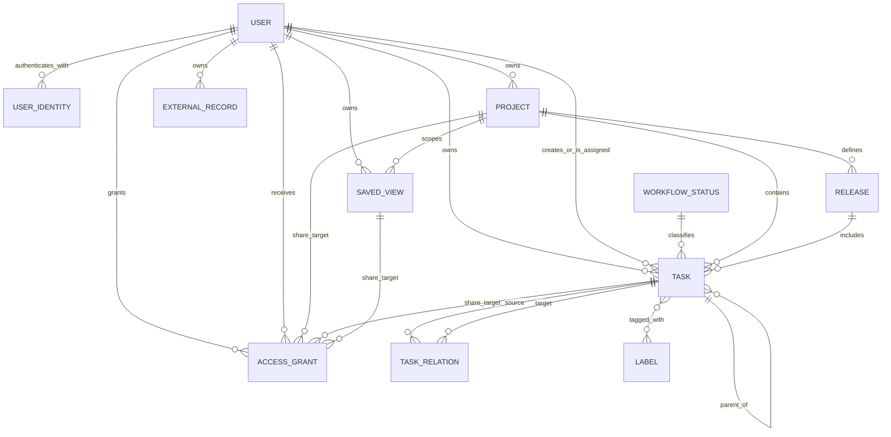

# Доменная модель

Статус: `Proposed`

Последнее обновление: 2026-08-14

Документ фиксирует логическую модель, а не конкретную ORM или SQL-схему.
Имена полей могут адаптироваться к выбранному стеку, но семантика и инварианты
должны сохраняться либо меняться через явное проектное решение.

## Карта сущностей



Связи `ACCESS_GRANT` с share targets полиморфны: одна запись grant указывает
ровно на один `Project`, standalone `Task` или `SavedView`.

## User

| Поле | Семантика |
|---|---|
| `id` | Внутренний immutable UUID; основной subject authorization |
| `primary_email` | Verified contact/login email, normalized для поиска sharing |
| `display_name` | Отображаемое имя, optional |
| `timezone`, `locale` | Пользовательские настройки представления |
| `created_at` | Время регистрации внутреннего User |
| `updated_at` | В первом срезе — последний успешный authenticated request и обновление profile projection |
| `disabled_at` | Блокировка входа без удаления данных |

`User` не равен аккаунту ChatGPT или Google. Все owner/assignee/lead/grantee
ссылки указывают на внутренний `User.id`.

## UserIdentity

| Поле | Семантика |
|---|---|
| `id`, `user_id` | Identity record и связанный внутренний User |
| `provider` | `chatgpt` или `google` |
| `provider_account_key` | Проверенный account key, доступный от provider |
| `email`, `email_verified` | Email, подтверждённый provider |
| `display_name` | Последнее доступное имя profile, optional |
| `created_at`, `last_seen_at` | Lifecycle metadata |

Unique constraint: `(provider, provider_account_key)`. Для Google OAuth/OIDC
adapter должен использовать проверенный `sub`, если его предоставляет выбранный
provider contract. Sites `Sign in with ChatGPT` на текущем публичном contract
передаёт `oai-authenticated-user-email` и optional
`oai-authenticated-user-full-name` через trusted server headers; до появления
отдельного immutable subject нормализованный authenticated email служит
`provider_account_key` для `chatgpt`.

Identity linking — отдельная аутентифицированная операция. Совпадающие emails
от разных providers не объединяют Users автоматически.

## Application administrator

Application administrator не является отдельной доменной сущностью или ролью
`AccessGrant`. Server boundary сопоставляет нормализованный verified email
current User с hosted allowlist. Content-free overview capability разрешает
operational aggregate query по Users и owner-scoped counts. Отдельная system
backup capability на той же allowlist разрешает полный logical export и
атомарный replace-import, но не меняет predicate обычных repository methods.

Admin projection содержит:

- `User.id`, display name, verified email, registration и last-seen timestamps;
- counts принадлежащих User Tasks, Projects, Releases и SavedViews;
- число Tasks, изменённых за последние 7 дней;
- максимум `updated_at` среди принадлежащих User Tasks, Projects, Releases и
  SavedViews как `last_content_activity_at`.

Projection не включает content полей этих records. Exported backup, напротив,
содержит cross-user content, identities и ACL; это отдельная явная operation,
а не implicit доступ к чужим resources через обычные product surfaces.

## SystemBackup и AdminImportSession

`SystemBackup` — переносимый versioned JSON envelope со всеми product tables.
Он сохраняет внутренние/public IDs, ownership, versions, timestamps, archived
state, joins, relations, revoked grants и external provenance. Hosted secrets,
Sites configuration, schema/migrations и operational staging в него не входят.

`AdminImportSession` — operational metadata preflight/import:

| Поле | Семантика |
|---|---|
| `id` | Непрозрачный import ID |
| `created_by_user_id` | Администратор, загрузивший snapshot |
| `source_exported_at`, `payload_sha256` | Provenance и identity payload |
| `counts_json` | Проверенные counts по каждой application table |
| `status` | `staged`, `applied` или `expired` |
| `created_at`, `applied_at` | Operational timestamps |

Staged rows хранятся отдельно по `(import_id, table_name, ordinal)` и не
участвуют в product queries. После atomic apply payload rows удаляются, а
session metadata остаётся как минимальный audit record.

## AccessGrant

| Поле | Семантика |
|---|---|
| `id` | Внутренний ID grant |
| `resource_type` | `project`, `task` или `saved_view` |
| `resource_id` | ID share target соответствующего типа |
| `grantor_user_id` | User, создавший или изменивший grant |
| `grantee_user_id` | User, получивший доступ |
| `permission` | Единственное значение MVP: `full_access` |
| `created_at`, `revoked_at` | Lifecycle grant |

Один active grant уникален по `(resource_type, resource_id, grantee_user_id)`.
Owner имеет implicit full access и не представлен grant. Grant самому owner
запрещён.

### Семантика share targets

- Project grant распространяется на Project, его Tasks и Releases.
- Release не является самостоятельным share target.
- Прямой Task grant разрешён только для standalone Task.
- Standalone Task с active direct grant нельзя добавить в Project до revoke
  этих grants.
- SavedView grant даёт доступ к определению view, но query возвращает только
  records, отдельно доступные grantee.
- `full_access` включает управление grants; owner identity и implicit access не
  могут быть изменены collaborator.

## Task

| Поле | Тип | Обязательность | Семантика |
|---|---|---:|---|
| `id` | string/UUID | да | Внутренний immutable primary key; может сохранять import namespace |
| `public_id` | UUID | да | Стабильная непрозрачная identity публичного URL |
| `owner_user_id` | UUID | да | Владелец и tenant scope записи |
| `identifier` | string | да | Immutable human ID, например `TM-123` |
| `title` | string | да | Непустой заголовок |
| `description` | Markdown/text | нет | Подробный контекст |
| `status_id` | UUID | да | Ссылка на `WorkflowStatus` |
| `priority` | enum | да | `none`, `low`, `medium`, `high`, `urgent` |
| `assignee_id` | UUID | нет | User с доступом к Task |
| `creator_id` | UUID | да | Фактический создатель, может быть collaborator |
| `project_id` | UUID | нет | Не более одного проекта |
| `release_id` | UUID | нет | Не более одного совместимого релиза |
| `parent_id` | UUID | нет | Родительская задача |
| `estimate` | integer | нет | Абстрактные points; положительное значение |
| `due_date` | local date | нет | Дата без времени в timezone пользователя |
| `rank` | sortable string | да | Manual order без перенумерации всей колонки |
| `started_at` | instant | нет | Первый/актуальный вход в started; политика уточняется |
| `completed_at` | instant | нет | Соответствует completed category |
| `canceled_at` | instant | нет | Соответствует canceled category |
| `archived_at` | instant | нет | Soft archive |
| `created_at` | instant | да | Серверное время создания |
| `updated_at` | instant | да | Серверное время последнего изменения |
| `version` | integer/token | да | Optimistic concurrency |

Labels задаются связующей таблицей `task_labels(task_id, label_id)`. Relations
и subtasks не кодируются labels. Identifier уникален в owner scope; URL и API
identity опираются на `public_id`, поскольку у разных owners возможен
одинаковый `TM-123`. `id` остаётся ключом внутренних связей и идемпотентного
импорта; `public_id` не меняется при повторном импорте.

## WorkflowStatus

| Поле | Семантика |
|---|---|
| `id` | Внутренний ID |
| `owner_user_id` | Владелец каталога workflow |
| `name` | Пользовательское название |
| `category` | `backlog`, `unstarted`, `started`, `completed`, `canceled` |
| `color` | UI token/color |
| `position` | Порядок в workflow |
| `is_default` | Статус новых задач |
| `archived_at` | Скрытие без поломки старых задач |

Категория — системный смысл, name — пользовательская формулировка. Удалять
status, на который ссылаются задачи, нельзя без миграции этих задач.

## Project

| Поле | Семантика |
|---|---|
| `id` | Внутренний immutable primary key |
| `public_id` | Стабильная непрозрачная UUID identity публичного URL |
| `slug` | Читаемый optional alias; не является identity |
| `owner_user_id` | Владелец Project и его subtree |
| `name` | Обязательное имя |
| `summary`, `description` | Краткий и подробный контекст |
| `status` | `planned`, `active`, `paused`, `completed`, `canceled` |
| `lead_id` | Один ответственный User с доступом, optional |
| `start_date`, `target_date` | Плановые даты, optional |
| `icon`, `color` | Визуальная identity, optional |
| `archived_at` | Soft archive |
| `created_at`, `updated_at`, `version` | Технические metadata |

Project progress вычисляется запросом по задачам, а не хранится как независимо
редактируемое число.

## Release

| Поле | Семантика |
|---|---|
| `id` | Внутренний immutable primary key Release |
| `public_id` | Стабильная непрозрачная UUID identity публичного URL |
| `project_id` | Обязательный owner project |
| `owner_user_id` | Денормализованный owner, равный owner Project |
| `name` | Обязательное имя/version label |
| `description` | Scope и контекст |
| `status` | `planned`, `active`, `released`, `canceled` |
| `target_date` | Плановая дата, optional |
| `released_at` | Фактический server instant, только для released |
| `release_notes` | Редактируемый Markdown |
| `created_at`, `updated_at`, `version` | Технические metadata |

На уровне MVP `Release` объединяет удобство Linear project milestone и смысл
поставки Linear release. Pipeline, environment, commit SHA и автоматическое
наполнение из CI/CD не моделируются.

## Label

| Поле | Семантика |
|---|---|
| `id`, `name` | Identity и уникальное в active scope имя |
| `owner_user_id` | Владелец каталога labels |
| `color`, `description` | Представление и правило применения |
| `archived_at` | Запрет нового использования с сохранением истории |

Label — гибкая классификация, но не подмена status, priority, project, release
или assignee.

## TaskRelation

| Поле | Семантика |
|---|---|
| `source_task_id` | Исходная задача |
| `target_task_id` | Целевая задача |
| `type` | `blocks`, `related`, `duplicate_of` |
| `created_at`, `creator_id` | Provenance связи |

Для `related` хранится одна канонически упорядоченная пара. `blocked_by`
вычисляется как обратное чтение `blocks` и не является отдельным type.

## ExternalRecord

`ExternalRecord` хранит provenance миграции, а не создаёт ещё одну доменную
модель задач.

| Поле | Семантика |
|---|---|
| `owner_user_id` | Tenant scope импортированной записи |
| `target_type`, `target_id` | Внутренняя Task, Project, Release, SavedView, Label или WorkflowStatus |
| `source`, `source_id`, `source_url` | Provider и identity исходной записи |
| `metadata_json` | Полный исходный metadata snapshot для обратимой сверки |
| `imported_at` | Время последнего идемпотентного импорта |

Для Linear snapshot сохраняются, среди прочего, branch name, история статусов,
attachments metadata и комментарии. Импортированные комментарии доступны в
Task details как read-only archive. Это не означает наличие в MVP отдельного
редактора комментариев или загрузки файлов: данные остаются import provenance
и не участвуют в доменных запросах.

## SavedView

| Поле | Семантика |
|---|---|
| `id`, `name` | Внутренний immutable primary key и имя |
| `public_id` | Стабильная непрозрачная UUID identity публичного URL |
| `owner_user_id` | Создатель/владелец и tenant scope |
| `scope_type` | `global` или `project` |
| `scope_project_id` | Обязателен для project scope |
| `layout` | `list` или `board` |
| `filter_ast` | Версионированный сериализованный фильтр |
| `group_by` | Поле основной группировки либо `none` |
| `order_by`, `direction` | Сортировка результата |
| `visible_fields` | Упорядоченный набор metadata на item/card |
| `show_empty_groups` | Показывать ли пустые колонки/группы |
| `hidden_groups` | Явно скрытые значения группировки |
| `created_at`, `updated_at`, `version` | Технические metadata |

Пример формы фильтра; MVP UI создаёт только `all`, но версия формата позволяет
позже добавить `any`/`not` без второго способа хранения views:

```json
{
  "version": 1,
  "op": "all",
  "conditions": [
    { "field": "project_id", "operator": "is", "value": "project-uuid" },
    { "field": "priority", "operator": "in", "value": ["high", "urgent"] },
    { "field": "archived_at", "operator": "is_empty" }
  ]
}
```

## Инварианты и атомарные операции

1. Каждый user-owned record имеет ровно одного immutable `owner_user_id`.
   Repository/API читает record только в owner scope либо через действующий
   grant и его inheritance rules.
2. Project, его Tasks и Releases имеют одинакового owner. Task, созданная в
   Project collaborator, наследует owner Project; creator остаётся фактическим.
3. Перемещение record между owner scopes не является обычной mutation и не
   входит в MVP.
4. Status, Label, Project, Release, parent и обе стороны TaskRelation обязаны
   принадлежать тому же owner scope, что и Task. Cross-owner hierarchy и
   relations запрещены.
5. `task.release_id IS NULL` либо release существует и
   `release.project_id = task.project_id`.
6. Назначение release задаче без project в одной транзакции назначает и project.
7. Смена project с несовместимым release либо отклоняется, либо в одной
   подтверждённой операции очищает release; промежуточное неверное состояние не
   сохраняется.
8. Terminal timestamps выводятся из status category и обновляются в одной
   транзакции со status.
9. Parent graph ацикличен; self-parent и self-relation запрещены.
10. Архивирование project/release не удаляет задачи. Новое назначение в архивную
   сущность запрещено.
11. Assignee и lead обязаны иметь owner либо granted access к соответствующему
    resource.
12. SavedView выполняется в permission scope читателя и не расширяет его доступ,
    включая counts, groups и search suggestions.
13. Standalone Task с active direct grant нельзя добавить в Project; сначала
    все direct grants должны быть revoked.
14. Revoke grant немедленно исключает resource из следующего authorized query;
    owner implicit access неотзываем.
15. Любая mutation проверяет `version`; stale version возвращает conflict, а не
    last-write-wins.
16. Admin aggregate query выполняется только после server-side allowlist check
    и не возвращает содержимое user-owned records. System backup/restore
    проверяет ту же boundary отдельно и не переиспользует unscoped product query.
17. Restore применяет только полностью валидный snapshot, содержащий identity
    текущего администратора. Replace всех live tables атомарен; ошибка оставляет
    предыдущее состояние без частичного удаления или импорта.

## Намеренно не моделируется

`Team`, `Initiative`, `Cycle`, `Milestone`, `Roadmap`, `Comment`, `Document`,
`Attachment`, `Notification`, `Subscription`, `ReleasePipeline`, `Environment`
и `Integration` не входят в начальную модель.
