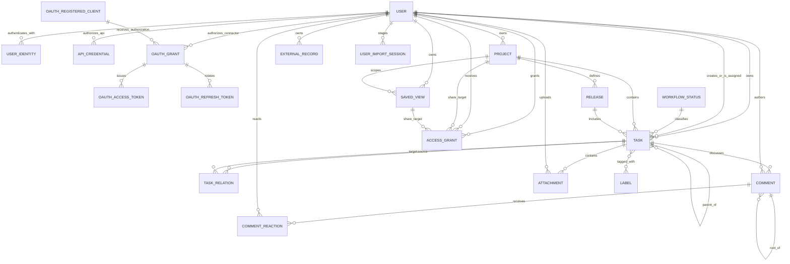

# Доменная модель

Статус: `Proposed`

Последнее обновление: 2026-08-17

Документ фиксирует логическую модель, а не конкретную ORM или SQL-схему.
Имена полей могут адаптироваться к выбранному стеку, но семантика и инварианты
должны сохраняться либо меняться через явное проектное решение.

## Карта сущностей



Связи `ACCESS_GRANT` с share targets полиморфны: одна запись grant указывает
ровно на один `Project` или global `SavedView`.

## User

| Поле | Семантика |
|---|---|
| `id` | Внутренний immutable UUID; основной subject authorization |
| `primary_email` | Verified contact/login email, normalized для поиска sharing |
| `display_name` | Отображаемое имя, optional |
| `timezone`, `locale` | Пользовательские настройки представления |
| `theme` | `system`, `light` или `dark`; User-scoped appearance preference |
| `sidebar_preference` | `expanded` или `collapsed`; default shell state User |
| `version` | Optimistic concurrency Profile/Settings mutations |
| `created_at` | Время регистрации внутреннего User |
| `updated_at` | В первом срезе — последний успешный authenticated request и обновление profile projection |
| `disabled_at` | Блокировка входа без удаления данных |

`User` не равен аккаунту ChatGPT или Google. Все owner/assignee/lead/grantee
ссылки указывают на внутренний `User.id`.

## UserIdentity

| Поле | Семантика |
|---|---|
| `id`, `user_id` | Identity record и связанный внутренний User |
| `provider` | `chatgpt` или `google` |
| `provider_account_key` | Проверенный account key, доступный от provider |
| `email`, `email_verified` | Email, подтверждённый provider |
| `display_name` | Последнее доступное имя profile, optional |
| `created_at`, `last_seen_at` | Lifecycle metadata |

Unique constraint: `(provider, provider_account_key)`. Для Google OAuth/OIDC
adapter должен использовать проверенный `sub`, если его предоставляет выбранный
provider contract. Sites `Sign in with ChatGPT` на текущем публичном contract
передаёт `oai-authenticated-user-email` и optional
`oai-authenticated-user-full-name` через trusted server headers; до появления
отдельного immutable subject нормализованный authenticated email служит
`provider_account_key` для `chatgpt`.

Identity linking — отдельная аутентифицированная операция. Совпадающие emails
от разных providers не объединяют Users автоматически.

## API credential

| Поле | Семантика |
|---|---|
| `id`, `owner_user_id` | Internal credential identity и User, от имени которого выполняется API request |
| `name`, `token_prefix` | Пользовательская подпись и безопасный display prefix |
| `token_hash` | SHA-256 полного token; исходный secret после выдачи не хранится |
| `scopes_json` | `api:read` и optional `api:write` |
| `expires_at`, `last_used_at`, `revoked_at`, `created_at` | Credential lifecycle |

API credential не является `UserIdentity`, session, `AccessGrant` или admin
role. Scope разрешает тип API operation, но resource access всё равно
вычисляется по Project/global SavedView grants. Logical backup credential не
переносит; full restore отзывает все tokens.

## OAuth connector grant и tokens

| Сущность | Семантика |
|---|---|
| `OAuthRegisteredClient` | DCR metadata public client: opaque client ID, разрешённые redirect URI, grant/response types, optional name и lifecycle metadata; client secret отсутствует |
| `OAuthAuthorizationRequest` | Короткоживущий consent request: User, CIMD либо зарегистрированный client, redirect, resource, scopes, state и PKCE challenge |
| `OAuthGrant` | Отзываемая связь User ↔ client ↔ MCP resource с approved scopes и lifecycle metadata |
| `OAuthAuthorizationCode` | Одноразовый hashed code, буквально связанный с client, redirect, resource и PKCE challenge |
| `OAuthAccessToken` | Hashed bearer capability с коротким expiry, audience/resource и scopes |
| `OAuthRefreshToken` | Hashed rotating token family с parent/used/revoked lifecycle для reuse detection |

OAuth grant не является `UserIdentity` или `AccessGrant`: он разрешает client
действовать как уже сопоставленный внутренний User, но каждый query/mutation
по-прежнему вычисляет текущий resource ACL. Full restore удаляет grants, codes
и tokens; logical backup их не переносит. DCR-запись сама по себе не является
grant или credential и не даёт доступа к пользовательским данным.

## Application administrator

Application administrator не является отдельной доменной сущностью или ролью
`AccessGrant`. Server boundary сопоставляет нормализованный verified email
current User с hosted allowlist. Content-free overview capability разрешает
operational aggregate query по Users и owner-scoped counts. Отдельная system
backup capability на той же allowlist разрешает полный logical export и
атомарный replace-import, но не меняет predicate обычных repository methods.

Admin projection содержит:

- `User.id`, display name, verified email, registration и last-seen timestamps;
- counts принадлежащих User Tasks, Projects, Releases и SavedViews;
- число Tasks, изменённых за последние 7 дней;
- максимум `updated_at` среди принадлежащих User Tasks, Projects, Releases и
  SavedViews как `last_content_activity_at`.

Projection не включает content полей этих records. Exported backup, напротив,
содержит cross-user content, identities и ACL; это отдельная явная operation,
а не implicit доступ к чужим resources через обычные product surfaces.

## SystemBackup и AdminImportSession

`SystemBackup` schema `15` — единственный принимаемый текущий формат полного
снимка всех пользователей. Его registry исчерпывающе классифицирует все D1
tables/columns: 24 exact tables сохраняют внутренние/public IDs, ownership,
versions, timestamps, `stored_files`, `attachments.stored_file_id`,
`task_sequences`, deletion state, joins, relations, grants и provenance;
`task_label_group_values` перестраивается; sync/purge state сбрасывается;
API/OAuth capabilities отзываются; import staging исключается. Старые schemas
`2`–`14` не обновляются и отклоняются до staging.

R2 originals live namespaces `stored-files` и `attachments` сохраняются
byte-for-byte, но environment-scoped keys создаются заново. `backup-staging`
не переносится, а неизвестный namespace отклоняет snapshot. Hosted secrets,
Sites configuration, schema/migrations, deployment/audience/analytics и
browser-local state не входят в формат.

`AdminImportSession` — operational metadata preflight/import:

| Поле | Семантика |
|---|---|
| `id` | Непрозрачный import ID |
| `created_by_user_id` | Администратор, загрузивший snapshot |
| `source_exported_at`, `payload_sha256` | Provenance и identity payload |
| `counts_json` | Проверенные counts по каждой application table |
| `status` | `staged`, `applied` или `expired` |
| `created_at`, `applied_at` | Operational timestamps |

Staged rows хранятся отдельно по `(import_id, table_name, ordinal)` и не
участвуют в product queries. После atomic apply payload rows удаляются, а
session metadata остаётся как минимальный audit record.

## ProjectBackup и UserImportSession

`ProjectBackup` — versioned logical envelope ровно одного Project. Он хранит
immutable identity Project, current owner, его subtree, internal joins и
relations, native/historical comments, reconciliation outcomes/reactions,
dependency snapshots используемых
catalogs, active sharing
descriptors, deletion tuple каждого included record, warnings и SHA-256. Это переносимая страховка владельца, но не
отдельная live entity и не ACL capability.

`UserImportSession` изолирует staged Project restore:

| Поле | Семантика |
|---|---|
| `id`, `created_by_user_id` | Непрозрачный session ID и authenticated User |
| `kind` | `project_backup` |
| `status` | `uploading`, `staged`, `applying`, `applied`, `expired` либо `failed` |
| `source_json` | Origin и public identity исходного Project bundle |
| `preview_json`, `payload_sha256` | Counts/warnings/conflicts и identity staged payload |
| `expires_at`, `created_at`, `applied_at` | Ограниченный lifecycle и audit metadata |

Rows staging хранятся отдельно по `(import_id, row_type, ordinal)` и не
участвуют в product queries. Apply читает только полностью подготовленный
normalized staged plan.

## AccessGrant

| Поле | Семантика |
|---|---|
| `id` | Внутренний ID grant |
| `resource_type` | `project` или `saved_view` |
| `resource_id` | ID share target соответствующего типа |
| `grantor_user_id` | User, создавший или изменивший grant |
| `grantee_user_id` | User, получивший доступ |
| `permission` | Project: `manager`, `editor`, `viewer`; global SavedView: `editor`, `viewer` |
| `created_at`, `revoked_at` | Lifecycle grant |

Один active grant уникален по `(resource_type, resource_id, grantee_user_id)`.
Project Owner имеет implicit highest access и не представлен grant. Grant
самому owner запрещён.

### Семантика share targets

- Project grant распространяется на Project, его Tasks, Releases и SavedViews с
  явным `scope_project_id`.
- Release не является самостоятельным share target.
- Task не является самостоятельным share target и всегда наследует доступ от
  своего Project.
- Прямой SavedView grant разрешён только для global View без
  `scope_project_id`; query возвращает только records, отдельно доступные
  grantee.
- `viewer` читает; `editor` дополнительно изменяет content и archive state;
  `manager` дополнительно управляет только grants `editor`/`viewer`.
- Project Owner управляет grant вплоть до `manager` и атомарно передаёт
  ownership уже добавленному участнику. Target становится Owner, прежний Owner
  — Manager; подтверждение target не требуется.

## WorkspaceSyncSequence и WorkspaceChangeEvent

Это operational records синхронизации UI, а не пользовательские сущности и не
внешний agent API.

| Поле | Семантика |
|---|---|
| `audience_user_id` | Authenticated principal, для которого рассчитан event |
| `last_sequence` | Последний монотонный checkpoint этого principal |
| `sequence` | Порядок event внутри principal scope |
| `entity_type`, `entity_id` | Touched Task, Project, Release, SavedView, `task_detail`, `task_comments`, `task_activity`, `task_external_source` либо workspace reset marker |
| `operation` | `upsert`, `remove`, `invalidate` или `reset` |
| `created_at` | Время записи journal event |

Journal не хранит entity content. Audience вычисляется в той же D1 transaction,
что mutation, по current owner/active grants. Для lazy context
`workspace_sync_invalidations` служит краткоживущей trigger queue: fan-out
создаёт ID-only event и удаляет queue row в той же transaction. Read response
строит актуальный ACL-scoped projection только по touched IDs; поэтому старый
event не даёт права прочитать record и не зависит от bounded bootstrap window.
`(audience_user_id, sequence)` уникален.

`workspace_sync_maintenance(key, last_run_at)` координирует throttled pruning:
journal rows старше 30 дней удаляются не чаще раза в сутки. Sequence не
переиспользуется; cursor до retention boundary образует обнаруживаемый gap и
приводит к full bootstrap.

## Owner workspace scope (UI projection)

Owner workspace scope не хранится в D1 и не добавляет `Workspace` entity,
grant, migration или tenant boundary. Это transient browser/server read model,
который принимает только opaque token и возвращает compact descriptors:
`token`, `kind`, user-facing `label`, `current`. Descriptor не содержит email,
internal User ID или reversible owner claim.

Effective owner для этой проекции определяется так:

- `Project` — его current `owner_user_id`;
- `Task`, `Release` и project-scoped `SavedView` — current owner связанного
  Project, независимо от исторического child `owner_user_id`;
- global `SavedView` — собственный `owner_user_id`.

Набор options строится только из current User и владельцев уже доступных
Project/global SavedView roots; `All accessible` обозначает прежний ACL union.
Repository сначала материализует ownership/active-grant ACL, затем применяет
scope как дополнительный equality predicate до count/order/page. Неизвестный,
подменённый или переставший быть доступным owner token fail-closed выбирает
current User и помечает fallback. Scope не участвует в `accessRole`: Viewer,
Editor, Manager и Owner controls продолжают выводиться только из effective
resource role. Omitted scope у Agent API и внутренних non-UI callers сохраняет
ACL union и не меняет их семантику.

## Recoverable deletion

Task, Project, Release и SavedView используют один tuple:

| Поле | Семантика |
|---|---|
| `deleted_at` | Server instant recoverable delete; `NULL` для не-deleted record |
| `deleted_by_user_id` | Server-verified User, выполнивший delete; заполнен только вместе с `deleted_at` |
| `purge_after` | `deleted_at + 30 days`; после этого cutoff restore запрещён |

Tuple либо целиком `NULL`, либо содержит три валидных значения, причём
`purge_after > deleted_at`. Archive хранится отдельным `archived_at`, не
запускает retention и не считается delete. Обычные ACL-scoped repository reads
добавляют `deleted_at IS NULL`; `Recently deleted` использует отдельную
ACL-scoped проекцию и не расширяет role. Editor+ может delete/restore, current
Owner — permanent purge после отдельного confirmation.

Project deletion — shadow subtree, а не массовое переписывание children:
deleted Project делает его Tasks, Releases и scoped SavedViews невидимыми в
обычных reads, даже когда их собственный tuple пуст. Restore очищает только
Project tuple; собственный non-null tuple child сохраняется, поэтому отдельно
deleted child не оживает. Release deletion сохраняет `Task.release_id` для
lossless restore; permanent Release purge сначала очищает эти ссылки.
SavedView deletion не меняет Tasks, query/display или scope. Deleted/purged/
недоступный immutable ref внутри filter AST не отбрасывается: executor трактует
его как unresolved условие без совпадений, чтобы query не расширился и не
раскрыл existence metadata.

Task deletion также не переписывает hierarchy: active child хранит прежний
`parent_task_id`, но ordinary projection временно возвращает `null`. Delete и
restore публикуют child summary/detail и relation-peer detail invalidations без
повышения version child. Если child был detach/reparent, пока parent deleted,
restore parent не откатывает это самостоятельное изменение. Только permanent
Task purge окончательно очищает оставшиеся child links с versioned Task upsert;
монотонный Project sequence при этом не уменьшается и identifier не переиспользуется.

Permanent Project preview считает все физически хранимые Tasks, Releases,
scoped SavedViews, Comments и Attachments, включая archived и отдельно deleted
descendants. Project purge удаляет distinct R2 keys bounded chunks до D1
cascade, затем очищает subtree grants, включая legacy direct Task/scoped-View
grants. Ошибка R2 сохраняет tombstone и retry job; повторный запуск безопасно
продолжает после уже удалённых objects.

Active Project deletion preview доступен effective Editor+ и возвращает две
группы точных counts: весь физический cascade и `activeNavigation` только для
ещё представленных в navigation totals Releases и project-scoped SavedViews.
Archived и отдельно deleted descendants входят только в физический impact.

После cutoff bounded opportunistic maintenance может физически удалить row
позже; точный wall-clock purge не гарантируется. Для Task/Project с native
Attachments operational retry job сначала удаляет R2 originals и только затем
финализирует D1 metadata cascade. Этот job — runtime coordination state, не
product entity и не часть logical backup.

## Task

| Поле | Тип | Обязательность | Семантика |
|---|---|---:|---|
| `id` | string/UUID | да | Внутренний immutable primary key; может сохранять import namespace |
| `public_id` | UUID | да | Стабильная непрозрачная identity публичного URL |
| `owner_user_id` | UUID | да | Владелец и tenant scope записи |
| `identifier` | string | да | Текущий human ID `<project.task_code>-<sequence_number>`, например `TM-123`; меняется только атомарным move |
| `title` | string | да | Непустой заголовок |
| `description` | Markdown/text | нет | Подробный контекст; native raster image использует `{width=480}`, ready Attachment — `[label](attachment:v1:<public-ref>)` |
| `status_id` | UUID | да | Ссылка на `WorkflowStatus` |
| `priority` | enum | да | `none`, `low`, `medium`, `high`, `urgent` |
| `assignee_id` | UUID | нет | User с доступом к Task |
| `creator_id` | UUID | да | Фактический создатель, может быть collaborator |
| `project_id` | UUID | да | Ровно один проект |
| `release_id` | UUID | нет | Не более одного совместимого релиза |
| `parent_id` | UUID | нет | Родительская задача |
| `estimate` | integer | нет | Абстрактные points; положительное значение |
| `due_date` | local date | нет | Дата без времени в timezone пользователя |
| `rank` | real | да | Manual order без перенумерации всей колонки |
| `started_at` | instant | нет | Первый/актуальный вход в started; политика уточняется |
| `completed_at` | instant | нет | Соответствует completed category |
| `canceled_at` | instant | нет | Соответствует canceled category |
| `archived_at` | instant | нет | Soft archive |
| `deleted_at`, `deleted_by_user_id`, `purge_after` | tuple | нет | Recoverable delete, actor и 30-day cutoff; только all-null либо all-set |
| `comment_count` | integer | да | Производный count unified native/historical comments без soft-deleted tombstones |
| `created_at` | instant | да | Серверное время создания |
| `updated_at` | instant | да | Серверное время последнего изменения |
| `version` | integer/token | да | Optimistic concurrency |

Labels задаются связующей таблицей `task_labels(task_id, label_id)`. Relations
и subtasks не кодируются labels. Пара `(project_id, sequence_number)` уникальна;
identifier строится из code Project и этого sequence. Прежние identifiers
хранятся в `task_identifier_aliases` и участвуют в exact lookup. Если один alias
доступен для нескольких Tasks, API возвращает ambiguity и требует `public_id`.
URL и API identity опираются на `public_id`; `id` остаётся ключом внутренних
связей и идемпотентного импорта. Перенос выдаёт identifier целевого Project и
сохраняет прежний как alias. Он не меняет `public_id`, content, comments,
attachments, labels, relations или внутренние relation keys.

`parent_id` — единственный native hierarchy edge. Parent и child обязаны иметь
одинаковый ненулевой `project_id`; relation не расширяет ACL. Versioned
set-parent command повторно проверяет current Project edit grant и отсутствие
self/cycle внутри той же записи. Desired state, уже совпадающий с current
parent, идемпотентен и не повышает version. Create-subtask command в одной D1
transaction резервирует Project sequence, создаёт child с parent edge и
повышает version parent, поэтому stale retry не дублирует Task. Archive/restore
edge не удаляет; Project move разрешён только после detach/reparent прямых
hierarchy edges.

## StoredFile и TaskAttachment

`StoredFile` — immutable metadata и private R2 object до или после привязки.
Unbound row доступен только uploader, имеет opaque `public_id` (`fileRef`),
upload/ready expiry и staged quota. `TaskAttachment` — отдельная ACL-scoped
привязка к одной Task. Внешний `attachmentRef` и body refs остаются identity
таблицы `attachments`; `stored_file_id` связывает её с canonical binary row.
V1 допускает не более одной привязки StoredFile.

| Поле | Семантика |
|---|---|
| `id`, `public_id` | Immutable internal identity и непрозрачная external reference |
| `stored_file_id`, `task_id`, `uploader_user_id` | Canonical binary, единственная v1 Task и server-verified uploader |
| `original_filename`, `display_name` | Нормализованные имена только для отображения; ни одно не участвует в object key |
| `media_type`, `byte_size`, `checksum_sha256` | Проверенные сервером content metadata |
| `object_key` | Непрозрачный environment-scoped R2 key, не выдаваемый клиенту |
| `kind` | `file` или безопасно декодированное raster `image` |
| `state` | `pending`, `uploading`, `ready`, `failed` или `deleted` |
| `image_width`, `image_height`, `variant_metadata_json` | Bounded image metadata и зарезервированное описание persisted variants; текущий thumbnail генерируется server-side по запросу |
| `idempotency_key` | Уникален по `(task_id, uploader_user_id)` и не допускает retry-дубликат |
| `upload_expires_at`, `failure_code` | Cleanup незавершённого upload и безопасный operational result |
| `version`, `created_at`, `updated_at`, `deleted_at` | Optimistic concurrency и recoverable-delete lifecycle |

StoredFile metadata хранится в D1, body — только в приватном R2 bucket текущей
среды. До bind действует uploader-only ACL; bind повторно проверяет Editor+,
expiry и Task/owner/Project quotas. После bind current Task ACL становится
единственным data access boundary.
Viewer читает metadata/content, Editor и более сильные project roles могут
загружать, удалять и восстанавливать в grace period. Archive/restore Task не
меняет Attachment. Grant/revoke, перенос Task и ownership transfer немедленно
меняют доступ через повторную Task ACL-проверку. Необратимый Task purge обязан
сначала удалить его R2 objects; cleanup удаляет просроченные `uploading`,
`failed` и `deleted` objects bounded batches.
Изменение Attachment публикует отдельную lazy-инвалидацию Task ID; это не
меняет `Task.version` и не заставляет перечитывать её description/relations.

`attachment:v1:` — versioned reference scheme внутри Task description. Image
token допускает только `public_id` готового `kind=image` Attachment той же Task;
обычная Markdown link допускает ready `file` или `image`. R2 key, filename и
delivery URL не сохраняются. Repository разбирает только исполняемый Markdown,
проверяет invariant до write и повторяет его в SQL predicate, чтобы concurrent
delete не создал битую ссылку. Delete симметрично сверяет точную current Task
version/description и отклоняется, пока актуальный image token или file link
ссылается на Attachment. Literal inline/fenced code reference не создаёт edge.
Inline code определяется общим для validator и renderer scanner по паре
backtick-runs одинаковой длины; backtick-run другой длины внутри span остаётся
literal content. Для обратной совместимости preceding backslash не меняет
роль backtick-run как delimiter. Незакрытый inline delimiter не открывает code span, поэтому
следующий native token остаётся исполняемым и проходит обычную проверку. Fence
с backticks или tildes и 0–3 leading spaces закрывается только тем же marker с
длиной не меньше opening marker и без trailing info; незакрытый fence
детерминированно трактует остаток description как code и так же рендерится.
Alt/label обязательны и bounded, caption optional; это пользовательский
Markdown text. Image suffix `{width=N}` optional и canonical только для integer
`160..960` с шагом `8`; отсутствие suffix означает responsive `Auto`. Width —
presentation metadata одного embed, не `Attachment.image_width`: effective
width ограничена контейнером, aspect ratio сохраняется. Один Attachment может
встречаться несколько раз с разными widths и по-прежнему имеет один lifecycle
record.

История schemas `2`–`14` ниже относится к Project bundle; system restore эти
версии больше не принимает. Project backup schema `3` переносит Attachment row и original одним bounded
container: row ссылается на `sha256:<digest>`, object set содержит size,
SHA-256 и base64 bytes. Live `object_key`, signed URL и thumbnail не переносятся.
Restore всегда выдаёт новый key текущей среды. Schema `2` допустима только как
legacy no-attachment backup. Schema `4` дополнительно сохраняет workflow
archive/system-role/version metadata; validators schema `2`/`3` нормализуют
legacy statuses и для полного system restore восстанавливают reserved
`Duplicate`. Schema `5` сохраняет immutable ID, idempotency key, version и
updated timestamp TaskRelation; validators schema `2`–`4` детерминированно
синтезируют их для legacy relations. Owner/project active-byte quotas вычисляются по
текущему Project owner, а не историческому `tasks.owner_user_id`.
Logical backup schema `9` переносит unified historical comments и
`comment_migration_outcomes`; validators schema `2`–`8` трактуют прежние
comments как native и добавляют пустой reconciliation set.
Schema `10` добавляет `activity_events` и `activity_migration_outcomes`;
validators schema `2`–`9` нормализуют их как пустые, не синтезируя историю из
текущего состояния Task.
Schema `11` добавляет `attachment_migration_outcomes`; schema `2`–`10` после
проверки исходного checksum получает пустой набор, не объявляя legacy links
перенесёнными.
System-only versioned `theme`, `sidebar_preference` и User `version` теперь
входят в exact schema `15`. Project schema `14` добавляет deletion tuple
Projects, Releases, Tasks и SavedViews; его legacy upgrade policy остаётся
отдельной от current-only system format.

### CommentAttachmentRef

`CommentAttachmentRef` — нормализованный bounded edge из live native Comment в
ready Attachment той же Task. Composite identity `(comment_id, attachment_id)`
не дублирует повторное появление одного token в body; `task_id` денормализован
для ACL-scoped lifecycle/delete guard и проверяется вместе с обеими сторонами.
Row содержит только opaque identities и `created_at`, не filename, body,
object key или delivery URL.

Create/edit Comment разбирает executable Markdown общим tokenizer с Task
description, включая bounded image width metadata, проверяет file/image
semantics и атомарно заменяет exact edge set
вместе с Comment, Activity и sync mutation. Soft-delete Comment удаляет edges,
но не Attachment binary. Attachment delete допускается только при отсутствии
description edge и `CommentAttachmentRef`; guarded predicates закрывают гонку
с конкурентным comment create/edit. Logical backup schema `13` сохраняет и
проверяет body/index equality; schema `2`–`12` нормализуется с пустым index.

### AttachmentMigrationOutcome

Каждая позиция `metadata_json.attachments` task-scoped `ExternalRecord`
получает стабильный outcome по `(source_record_id, source_index)`. `migrated`
ссылается на готовый native Attachment той же Task; `non_binary_mapped`
сохраняет явно признанную HTTPS-ссылку, но не выдаёт её за binary;
`skipped` фиксирует объяснимый duplicate, а `blocked` оставляет cutover gate
закрытым. `raw_json` и mapped URL остаются только в migration/backup слое;
публичные Task/UI/Agent contracts их не возвращают.

Повторный прогон проверяет native row, R2 size и SHA-256 перед результатом
`already_migrated`. Исходный `ExternalRecord` не удаляется автоматически:
cleanup требует отдельного backup и явной authority для durable data.

## Comment и CommentReaction

`Comment` — единая discussion/history record одной Task. Native comments и
импортированная история читаются одной pagination и образуют общие threads.

| Поле | Семантика |
|---|---|
| `id`, `task_id` | Immutable identity и Task, определяющая ACL/scope |
| `author_user_id` | Server-verified author native comment; для historical всегда `NULL`, чтобы не impersonate User |
| `body` | Непустой Markdown-like text; native tombstone может быть пустым, historical body immutable |
| `source` | `native` или `linear` |
| `source_record_id`, `source_comment_id` | Historical provenance и уникальная source identity; для native `NULL` |
| `source_parent_comment_id` | Исходный parent ID до нормализации nested reply |
| `historical_author_name` | Immutable display snapshot исходного автора, не User identity |
| `historical_created_at`, `historical_updated_at` | Immutable timestamps исходной системы |
| `historical_quoted_text` | Optional immutable quote исходного comment |
| `parent_comment_id` | `NULL` для root либо ссылка непосредственно на root того же Task |
| `idempotency_key` | Для native уникален в `(task_id, author_user_id)`; historical identity задаёт `(task_id, source, source_comment_id)` |
| `created_at`, `updated_at`, `deleted_at` | Lifecycle и soft-delete metadata |
| `resolved_at`, `resolved_by_user_id` | Состояние root thread и resolver |
| `resolution_comment_id` | Optional root/reply того же thread, фиксирующий resolution |
| `version` | Optimistic concurrency edit/delete/resolve |

`CommentReaction` имеет composite identity
`(comment_id, user_id, emoji)` и `created_at`. API задаёт desired state
`active`, поэтому повторный add/remove идемпотентен. Response агрегирует count и
`reactedByCurrentUser`, но не раскрывает список User/email.

Любой User, видящий Task, читает threads. Comment mutation требует Editor или
выше; edit native comment разрешён только author, delete — author либо Project
Owner/Manager. Historical body, source/author/time/quote facts, topology и
delete state неизменяемы, но Editor+ может reply/react/resolve. Reply на reply
нормализуется к root, а создание reply атомарно переоткрывает resolved thread.
`Task.comment_count` атомарно равен числу всех rows Task с
`deleted_at IS NULL`.

`CommentMigrationOutcome` хранит reconciliation каждой source row:

| Поле | Семантика |
|---|---|
| `task_id`, `source_record_id`, `source_index` | Task, provenance record и стабильная позиция source row |
| `source_comment_id` | Optional provider identity, если её удалось прочитать |
| `outcome` | `migrated` либо `exception` |
| `reason` | Machine-readable exception или migration warning |
| `comment_id` | Historical Comment для `migrated`; `NULL` для exception |
| `raw_json`, `reconciled_at` | Точная source row для operator reconciliation и время результата |

Outcome не публикует raw body в Task/Agent provenance projection. UI и Agent
получают только migrated/exception counts; raw row доступна через защищённый
backup или operator D1 procedure.

## ActivityEvent и ActivityMigrationOutcome

`ActivityEvent` — append-only пользовательская история одной Task. Она не
заменяет operational sync journal и не даёт actor дополнительных permissions.

| Поле | Семантика |
|---|---|
| `id`, `task_id` | Immutable event identity и Task, определяющая ACL и cascade lifecycle |
| `schema_version` | Версия structured payload; текущая — `1` |
| `event_type` | Stable domain type: create/update/status/move/label/hierarchy/relation/archive/comment и совместимые расширения |
| `actor_kind` | `user`, `historical` либо `system` |
| `actor_user_id`, `actor_name` | Server-verified User + display snapshot для native; historical/system не получают User identity |
| `payload_json` | Bounded structured before/after facts без raw migration archive |
| `source` | `native` либо `linear` |
| `source_record_id`, `source_event_id`, `source_index` | Deterministic historical provenance; для native всегда `NULL` |
| `created_at` | Server timestamp native mutation либо исходный Linear timestamp |

Native event вставляется в одной D1 batch/transaction с guarded mutation.
No-op, stale version, idempotent retry и rollback не оставляют event. UPDATE
запрещён trigger; DELETE допустим только как cascade Task lifecycle или exact
restore. `(source_record_id, source_index)` уникален для historical events.
Project move создаёт один event с old/new Project и identifier; массовый
Project-code backfill events не создаёт.

`ActivityMigrationOutcome` хранит одну reconciliation row на позицию Linear
`stateHistory`:

| Поле | Семантика |
|---|---|
| `task_id`, `source_record_id`, `source_index` | Task, provenance и source position; `-1` обозначает invalid collection |
| `source_event_id` | Optional Linear event identity |
| `outcome`, `reason` | `migrated`/`exception` и machine-readable warning/error |
| `activity_event_id` | Event для migrated; `NULL` для exception |
| `raw_json`, `reconciled_at` | Точная evidence row и время reconciliation |

Activity читается по `(created_at, id)` отдельной descending keyset pagination,
maximum 50. Task ACL применяется до count/page; sync передаёт только
`task_activity` invalidation. Retention совпадает с lifetime Task. System и
Project logical backup schema `10` впервые сохраняет обе таблицы; current schema
`11` сохраняет их вместе с attachment outcomes. Row/package limits
отклоняют слишком большой export целиком без silent truncation.

### Project task code и sequence

`Project.task_code` — 1–12 символов, уникальных среди active Projects current
owner: заглавные латинские буквы, цифры и внутренние дефисы с буквенно-цифровыми
краями. Все текстовые write ingress используют одну trim/uppercase normalization
и одну validation grammar; backup хранит уже каноническое значение.
`Project.task_sequence` — монотонный allocator.
Атомарный `UPDATE ... RETURNING` сверяется с максимальным уже сохранённым
`Task.sequence_number`, поэтому параллельные create и импорт не создают
дубликаты. `code_locked_at` устанавливается при первой Task; после этого code
нельзя изменить. Logical backup schema 6 переносит code, sequence, lock и
identifier aliases.

## WorkflowStatus

| Поле | Семантика |
|---|---|
| `id` | Внутренний ID |
| `owner_user_id` | Владелец каталога workflow |
| `name` | Пользовательское название |
| `category` | `backlog`, `unstarted`, `started`, `completed`, `canceled` |
| `color` | UI token/color |
| `position` | Порядок в workflow |
| `is_default` | Статус новых задач |
| `system_role` | `duplicate` только для одного зарезервированного статуса owner-каталога; иначе `null` |
| `archived_at` | Скрытие без поломки старых задач |
| `version` | Optimistic concurrency version каталожной записи |

Категория — системный смысл, name — пользовательская формулировка. Удалять
status, на который ссылаются задачи или SavedViews, нельзя без миграции на
активный replacement той же категории. Owner управляет только собственным
каталогом; project collaborator может применять его активные записи, но не
изменять их. В каталоге ровно один active default категории `backlog` или
`unstarted` и ровно один active reserved `Duplicate` категории `canceled`.

## Project

| Поле | Семантика |
|---|---|
| `id` | Внутренний immutable primary key |
| `public_id` | Стабильная непрозрачная UUID identity публичного URL |
| `slug` | Читаемый optional alias; не является identity |
| `owner_user_id` | Владелец Project и его subtree |
| `name` | Обязательное имя |
| `task_code` | 1–12 символов `[A-Z0-9-]`, дефис только внутри; уникален среди active Projects current owner |
| `task_sequence` | Монотонный последний выделенный номер Task |
| `code_locked_at` | Момент первого выделения номера; после него code неизменяем |
| `summary`, `description` | Краткий и подробный контекст |
| `status` | `planned`, `active`, `paused`, `completed`, `canceled` |
| `lead_id` | Один ответственный User с доступом, optional |
| `start_date`, `target_date` | Плановые даты, optional |
| `icon`, `color` | Визуальная identity, optional |
| `archived_at` | Soft archive |
| `deleted_at`, `deleted_by_user_id`, `purge_after` | Recoverable delete tuple; Project является shadow root subtree |
| `created_at`, `updated_at`, `version` | Технические metadata |

Project progress вычисляется запросом по задачам, а не хранится как независимо
редактируемое число.

Project mutation требует current `version` и effective role `editor` или выше.
Изменение `task_code` допустимо только при `task_sequence = 0` и
`code_locked_at IS NULL`; unique active-code constraint повторно проверяется в
D1. `lead_user_id` обязан указывать current Owner либо User с active Project
grant на момент атомарного UPDATE. Revoke этого grant очищает lead и повышает
Project version. Terminal status не меняет Tasks, а при наличии open Tasks
требует отдельный confirm flag. `archived_at` — обратимое состояние и не
отменяет ACL; archived Project исключается из create/navigation pickers, но
остаётся доступен в Project index/direct detail для restore.
`deleted_at` исключает Project и весь subtree из ordinary reads. Child tuple
при shadow delete не меняется; Project restore не очищает собственный
`deleted_at` child. Permanent purge каскадирует subtree только после counts,
owner confirmation и R2-first cleanup.

## Release

| Поле | Семантика |
|---|---|
| `id` | Внутренний immutable primary key Release |
| `public_id` | Стабильная непрозрачная UUID identity публичного URL |
| `project_id` | Обязательный owner project |
| `owner_user_id` | Денормализованный owner, равный owner Project |
| `name` | Обязательное имя/version label |
| `description` | Scope и контекст |
| `status` | `planned`, `active`, `released`, `canceled` |
| `target_date` | Плановая дата, optional |
| `released_at` | Фактический server instant, только для released |
| `release_notes` | Редактируемый Markdown |
| `deleted_at`, `deleted_by_user_id`, `purge_after` | Recoverable delete tuple; Task membership сохраняется до purge |
| `created_at`, `updated_at`, `version` | Технические metadata |

На уровне MVP `Release` объединяет удобство Linear project milestone и смысл
поставки Linear release. Pipeline, environment, commit SHA и автоматическое
наполнение из CI/CD не моделируются.

Release mutation требует current `version` и effective Project role `editor`
или выше. Первый переход в `released` атомарно назначает server `released_at`;
последующие metadata edits сохраняют timestamp, а reopen/cancel очищает его.
При открытых Tasks terminal transition требует `confirmOpenTasks`. Изменение
`release_id` Task, затрагивающее выпущенный Release, требует отдельный
`confirmReleasedComposition`; Project/Release compatibility и current status
повторно проверяются server-side, а Task status автоматически не меняется.
Recoverable Release delete не очищает `Task.release_id`; ordinary projections
трактуют membership как недоступную, пока Release deleted. Restore возвращает
её, permanent purge очищает links атомарно до удаления Release.
Изменение или очистка такой скрытой membership всё ещё проверяет сохранённый
Release status и для `released` требует `confirmReleasedComposition`; обычная
перестановка rank внутри видимой `No release` группы сохраняет внутренний ref.
Перед recoverable delete UI читает ACL-scoped authoritative status и полный
stored membership count. Для current status `released` DELETE требует
`confirmReleasedComposition=true`; preview и DELETE используют одну optimistic
version, поэтому concurrent metadata/status change даёт conflict до mutation.

## LabelGroup

| Поле | Семантика |
|---|---|
| `id`, `name` | Immutable identity и уникальное без учёта регистра active имя |
| `owner_user_id` | Владелец каталога; Labels группы обязаны иметь того же owner |
| `description`, `position` | Правило применения и стабильный owner-defined порядок |
| `archived_at`, `version` | Reversible archive и optimistic concurrency |
| `created_at`, `updated_at` | Серверные metadata |

`LabelGroup` задаёт взаимоисключающее измерение. `task_label_group_values`
материализует DB guard с ключом `(task_id, group_id)` и синхронизируется SQL
triggers с `task_labels`: у Task физически не может быть двух Labels одной
группы, включая concurrent REST, Agent, import и restore writes.

## Label

| Поле | Семантика |
|---|---|
| `id`, `name` | Identity и уникальное без учёта регистра active имя в owner catalog |
| `owner_user_id` | Владелец каталога labels |
| `group_id` | Optional immutable-reference membership в owner LabelGroup |
| `color`, `description` | Представление и правило применения |
| `archived_at` | Запрет нового использования с сохранением истории |
| `version` | Optimistic concurrency catalog mutation |
| `created_at`, `updated_at` | Серверное создание и последнее semantic изменение |

Label — гибкая классификация, но не подмена status, priority, project, release
или assignee. `task_labels` имеет составной ключ `(task_id, label_id)`, поэтому
desired-state add/remove идемпотентны. Назначать можно только active Label того
же owner catalog, что у Task; архивирование сохраняет существующие связи и
разрешает их удалить. Bulk mutation предварительно валидирует весь набор и
применяет одно желаемое состояние атомарно. Для grouped Label set/clear — одна
явная atomic command с одним Activity event; ungrouped Labels остаются
независимым multi-select.

## TaskRelation

| Поле | Семантика |
|---|---|
| `id` | Immutable identity relation и canonical Agent reference |
| `source_task_id` | Исходная задача |
| `target_task_id` | Целевая задача |
| `type` | `blocks`, `related`, `duplicate_of` |
| `creator_user_id`, `idempotency_key` | Server-verified creator и retry identity |
| `version` | Независимая optimistic concurrency relation |
| `created_at`, `updated_at` | Provenance и последнее semantic изменение |

Для `related` хранится одна канонически упорядоченная пара. `blocked_by`
вычисляется как обратное чтение `blocks` и не является отдельным type. Обратные
`blocks` одной пары считаются одним logical conflict; source имеет не более
одного `duplicate_of`. Relation допустима только между двумя разными Tasks
одного Project; mutation требует Editor+ на обеих сторонах. Недоступный peer
fail-closed как `not_found` до проверки relation semantics.

## ExternalRecord

`ExternalRecord` — непубличное migration evidence, а не доменная модель и не
источник runtime Task context.

| Поле | Семантика |
|---|---|
| `owner_user_id` | Tenant scope импортированной записи |
| `target_type`, `target_id` | Внутренняя Task, Project, Release, SavedView, Label или WorkflowStatus |
| `source`, `source_id`, `source_url` | Provider и identity исходной записи |
| `metadata_json` | Полный исходный metadata snapshot для обратимой сверки |
| `imported_at` | Время последнего идемпотентного импорта |

В legacy snapshot могут сохраняться branch name, история статусов, attachments
metadata и исходный comments payload. Полезные records мигрируются в native
Attachment, historical `Comment` и `ActivityEvent`, а outcomes — в отдельные
reconciliation tables. Ни Task UI, ни product API, ни Agent API не возвращают
`ExternalRecord`, source URL или branch metadata; raw metadata сохраняется
только для backup/reconciliation до отдельно разрешённого cleanup. В публичных
Comment/Activity representations внутренний `source='linear'` нормализуется в
provider-neutral `source='historical'`, а source record/comment/event IDs и
source positions не выдаются.

## SavedView

| Поле | Семантика |
|---|---|
| `id`, `name` | Внутренний immutable primary key и имя |
| `public_id` | Стабильная непрозрачная UUID identity публичного URL |
| `owner_user_id` | Исходный tenant/catalog и provenance scope |
| `scope_type` | `global` или `project` |
| `scope_project_id` | Обязателен для project scope; является access boundary |
| `layout` | `list` или `board` |
| `filter_ast` | Версионированный сериализованный фильтр |
| `group_by` | Поле основной группировки либо `none` |
| `order_by`, `direction` | Сортировка результата |
| `visible_fields` | Упорядоченный набор metadata на item/card |
| `show_empty_groups` | Показывать ли пустые колонки/группы |
| `hidden_groups` | Явно скрытые значения группировки |
| `archived_at` | Nullable timestamp обратимого исключения из navigation/direct route |
| `deleted_at`, `deleted_by_user_id`, `purge_after` | Recoverable delete tuple без изменения Tasks/query/display |
| `created_at`, `updated_at`, `version` | Технические metadata |

Пример формы фильтра; MVP UI создаёт только `all`, но версия формата позволяет
позже добавить `any`/`not` без второго способа хранения views:

```json
{
  "version": 1,
  "op": "all",
  "conditions": [
    { "field": "project", "operator": "is", "value": "project-uuid" },
    { "field": "priority", "operator": "in", "value": ["high", "urgent"] },
    { "field": "archived", "operator": "is", "value": false }
  ]
}
```

Версия `1` допускает только root `op: "all"`; тем самым MVP не хранит второй
flat query contract, а оставляет явную границу для будущих `any`/nested groups.
Условие имеет точную комбинацию `field`/`operator`/typed `value`; relative
операторы без аргумента не сохраняют `value`. Legacy flat JSON повышается до
этой формы при чтении/следующей записи.

Create/rename/query/display/scope/archive/restore проходят через один
ACL-scoped SavedView repository contract. Update атомарно проверяет effective
Editor-or-higher role и optimistic `version`; смена access scope дополнительно
требует Owner и write access к целевому Project. Project-scoped query не может
ссылаться на другой Project или его Release.
Delete/restore используют тот же write-role и optimistic contract, но не
смешиваются с archive. Permanent purge owner-only удаляет только View/direct
grants; Tasks, base query semantics и temporary URL layer не материализуются.

## Инварианты и атомарные операции

1. Каждый Project имеет ровно одного current `owner_user_id`; он меняется
   только атомарным ownership transfer. Owner имеет implicit highest access.
2. `owner_user_id` Task/Release/SavedView хранит исходный tenant/catalog и
   provenance scope. Для project child он не является access root: effective
   role вычисляется только через current Project owner/grant.
3. Каждая Task принадлежит ровно одному Project. Task/Release, созданные в
   Project collaborator, наследуют его исходный catalog scope; creator остаётся
   фактическим. Ownership transfer не меняет task identifier или catalog
   references; явный перенос выдаёт identifier целевого Project и сохраняет
   старый как alias.
4. Status, Label, Project, Release и parent обязаны принадлежать тому же catalog
   owner scope, что и Task. Cross-owner hierarchy запрещена. Обе стороны
   TaskRelation обязаны быть разными Tasks одного Project.
   Active Label name уникально в owner catalog без учёта регистра. Только owner
   управляет каталогом, а Task Editor+ назначает active labels; Viewer читает.
5. `task.release_id IS NULL` либо release существует и
   `release.project_id = task.project_id`.
6. Create, import и restore Task без Project отклоняются; для legacy payload
   требуется явное Project mapping.
7. Смена Project выполняется только явной атомарной операцией с актуальной Task
   version и edit access к исходному и active target Project. Она резервирует
   следующий непереиспользуемый target sequence, меняет Project/identifier,
   сохраняет прежний identifier как alias и применяет согласованные
   Release/Assignee changes в одной transaction. Несовместимые Release и
   Assignee требуют явный replacement или `null`; hierarchy и relations должны
   быть явно отсоединены до переноса. Archive, ACL, conflict или collision
   откатывают всю операцию. Same-Project — no-op без расхода sequence.
8. Terminal timestamps выводятся из status category и обновляются в одной
   транзакции со status.
9. Parent graph ацикличен; self-parent и self-relation запрещены. Relation
   create/update требует один Project и write access на обе стороны;
   `duplicate_of` атомарно назначает source системный `Duplicate`, но
   remove/change не восстанавливает предыдущий status.
10. Архивирование project/release не удаляет задачи. Новое назначение в архивную
   сущность запрещено.
11. Assignee и lead обязаны иметь owner либо granted access к соответствующему
    resource.
12. `(Task.project_id, Task.sequence_number)` уникальна; identifier равен
    `<Project.task_code>-<sequence_number>`. Следующий номер резервируется
    атомарно до вставки Task, а code блокируется после первой Task.
13. SavedView выполняется в permission scope читателя и не расширяет его доступ,
    включая counts, groups и search suggestions. Project-scoped View жёстко
    ограничен `scope_project_id` и наследует Project role; global View не имеет
    `scope_project_id`, даже если его filter содержит Project.
14. Exact lookup учитывает canonical identifier и aliases. Несколько доступных
    alias matches дают ambiguity, а не произвольный результат.
15. Revoke grant немедленно исключает resource из следующего authorized query.
    Viewer не выполняет mutation; Editor меняет content; Manager управляет
    только Editor/Viewer; Project Owner управляет вплоть до Manager.
16. Ownership transfer допускает только active Project grantee, атомарно делает
    его Owner, отзывает его grant и создаёт прежнему Owner grant Manager.
17. Любая mutation проверяет `version`; stale version возвращает conflict, а не
    last-write-wins.
18. Admin aggregate query выполняется только после server-side allowlist check
    и не возвращает содержимое user-owned records. System backup/restore
    проверяет ту же boundary отдельно и не переиспользует unscoped product query.
19. Restore применяет только полностью валидный snapshot, содержащий identity
    текущего администратора. Replace всех live tables атомарен; ошибка оставляет
    предыдущее состояние без частичного удаления или импорта.
20. Project export/restore требует effective role `owner`, совпадение source
    current owner и того же Site. Project subtree replace атомарен; staged rows
    никогда не дают read access к live resources.
21. Comment всегда принадлежит доступной Task; parent/resolution comment
    принадлежит той же Task и одному root thread. Comment graph имеет только два
    уровня, а create identity задаёт server-verified User.
22. Comment create уникален по `(task, author, idempotency_key)`. Edit/delete/
    resolve проверяют version; reaction unique по `(comment, user, emoji)`.
    Comment и Task count/timestamp изменяются атомарно.
23. Attachment всегда принадлежит Task и повторяет её текущий ACL перед metadata
    или object read. Idempotency уникальна для Task/uploader; object key не
    раскрывает filename, delete восстанавливаем до cleanup cutoff.
24. ActivityEvent принадлежит ровно одной Task, immutable после insert и
    создаётся атомарно с successful mutation. Historical actor snapshot не
    является User; retry, conflict и rollback не создают event.
25. CommentAttachmentRef соединяет только live native Comment и ready
    Attachment той же Task. Comment write, index replacement, Activity/sync и
    delete guard атомарны; edge не даёт отдельного доступа к Comment или binary.
26. Deletion tuple Task/Project/Release/SavedView только all-null либо all-set;
    actor существует, timestamps валидны, `purge_after > deleted_at`. Restore
    после cutoff запрещён независимо от задержки maintenance.
27. Deleted Project shadow исключает subtree из ordinary reads, но не меняет
    tuple children. Project restore очищает только root tuple; отдельно deleted
    child сохраняется. Project purge owner-only каскадирует subtree после
    preview и R2-first cleanup.
28. Release delete сохраняет Task membership; restore её возвращает, а purge
    атомарно очищает links. SavedView delete/purge никогда не удаляет Tasks.
29. Deleted/purged/недоступный filter ref не раскрывает identity и не удаляется
    из AST: unresolved condition возвращает no matches, а не расширенный query.
    При update SavedView missing Release ref разрешён только когда тот же ref
    уже присутствовал в stored query и scope не меняется: View можно rename или
    удалить predicate, но нельзя добавить новый missing ref или перенести его в
    другой scope. Purge Release никогда не переписывает SavedView AST.
30. System backup schema `15` сохраняет deletion tuple четырёх entity types и
    отклоняет schemas `2`–`14`; Project schema `14` сохраняет собственную
    compatibility policy. Operational purge jobs не входят в backup/restore.

## Намеренно не моделируется

`Team`, `Initiative`, `Cycle`, `Milestone`, `Roadmap`, `Document`,
`Mention`, `Notification`, `Subscription`, `ReleasePipeline`, `Environment` и
`Integration` не входят в начальную модель.
