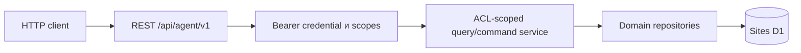

# API для агентов

Статус: `Implemented`

Последнее обновление: 2026-08-14

## 1. Назначение и граница

Task Manager предоставляет самостоятельный versioned HTTP API, через который
обычный HTTPS client может без Web UI:

- получить карту доступной работы и каталог workflow statuses;
- найти проекты и готовящиеся релизы;
- получить задачи проекта или релиза в компактной форме;
- загрузить полный контекст одной выбранной задачи;
- создать задачу и изменить status, project, release, priority, срок и archive.

API не является обёрткой над `/api/bootstrap`: list queries не загружают и не
возвращают описания всех задач. UI и внешний API используют одну D1-модель и
одинаковые owner/ACL-инварианты, но разные response projections.

Administration, system backup/restore, sharing, ownership transfer, настройка
workflow и управление credentials во внешний API не входят. Это control-plane,
а не task-oriented operations. Специализированные клиенты поверх API также не
входят в текущий scope.

Решение о transport, credential boundary и write scope зафиксировано в
[ADR-0006](../decisions/0006-standalone-agent-api.md).

## 2. Архитектура и progressive disclosure



- Collections возвращают фиксированные summaries.
- `TaskSummary` не содержит `description`, imported comments, attachment
  URLs, relation bodies, internal IDs или user email.
- `ProjectSummary` не содержит description; `ReleaseSummary` не содержит ни
  description, ни release notes.
- Полный `TaskDetail` читается только отдельным запросом.
- Большой imported archive читается отдельным paginated endpoint.
- `fields=*` и `include=description` не поддерживаются и отклоняются.

## 3. Authentication и credentials

Data plane принимает только:

```http
Authorization: Bearer tm_pat_...
```

Sites browser cookie и `oai-authenticated-user-*` headers не являются API
authentication. После получения token все `/api/agent/v1` operations работают
независимо от Web UI и browser session.

Personal token:

- создаётся самим authenticated User и показывается только один раз;
- хранится в D1 только как SHA-256 hash и безопасный prefix;
- имеет `api:read` и, при явном запросе, `api:write`;
- по умолчанию действует 90 дней, допустимый срок — 1–365 дней;
- повторно применяет owner/ACL scope на каждом request;
- revoke прекращает следующий request;
- не наследует application-admin capability.

Browser-authenticated control plane, не входящий во внешний OpenAPI contract:

| Method и path | Назначение |
|---|---|
| `GET /api/settings/api-credentials` | Metadata личных credentials без token/hash |
| `POST /api/settings/api-credentials` | Выдать token: `name`, `scopes`, `expiresInDays` |
| `DELETE /api/settings/api-credentials/{id}` | Отозвать личный token |

Logical backup не переносит credentials. Full restore атомарно отзывает все
tokens, чтобы authentication capability не пережила замену identity/data state.

## 4. References

- Task, Project и Release используют immutable database `public_id` как
  `ref`.
- Task также возвращает `identifier` (`TM-123`). Его можно использовать для
  detail/update lookup. Несколько доступных совпадений дают
  `ambiguous_reference` с безопасным списком кандидатов.
- WorkflowStatus и Label не раскрывают internal IDs. Их `sts_...` и
  `lbl_...` refs детерминированно выводятся через SHA-256.
- User IDs и email не публикуются. Assignee содержит только `displayName` и
  `isCurrentUser`.

## 5. REST v1

Базовый prefix: `/api/agent/v1`. OpenAPI 3.1 доступен через
`GET /api/agent/v1/openapi.json` без доступа к пользовательским данным.

| Method и path | Scope | Результат |
|---|---|---|
| `GET /workspace` | `api:read` | Counts, capabilities и status catalog |
| `GET /projects` | `api:read` | Paginated `ProjectSummary[]` |
| `GET /projects/{ref}` | `api:read` | `ProjectDetail` и compact releases |
| `GET /releases` | `api:read` | Paginated `ReleaseSummary[]` |
| `GET /releases/{ref}` | `api:read` | `ReleaseDetail` с release notes |
| `GET /tasks` | `api:read` | Paginated `TaskSummary[]` |
| `POST /tasks` | `api:write` | Создать Task и вернуть `TaskDetail` |
| `GET /tasks/{ref}` | `api:read` | Один `TaskDetail` |
| `PATCH /tasks/{ref}` | `api:write` | Изменить Task с optimistic version |
| `GET /tasks/{ref}/external-context` | `api:read` | Imported context |

Project/Release endpoints read-only: они нужны для ориентации и task scope.
SavedViews не входят в v1; task query принимает явные filters и не зависит от
UI display configuration.

### 5.1 Pagination и envelope

Collections имеют default `limit=50`, maximum `200` и opaque `cursor`.
External context имеет maximum `100`. Cursor связан с filters, sort и limit;
cursor другого query отклоняется.

```json
{
  "data": [],
  "page": { "nextCursor": null, "hasMore": false },
  "meta": {
    "apiVersion": "1",
    "asOf": "2026-08-14T16:00:00.000Z",
    "requestId": "req_..."
  }
}
```

Data responses используют `Cache-Control: private, no-store` и
`X-Request-Id`.

### 5.2 Filters

`GET /tasks` поддерживает:

- `project_ref`, `release_ref`;
- повторяемые или comma-separated `status_category` и `priority`;
- `assignee=me|unassigned`, `archived=true|false`;
- bounded `search` по identifier/title;
- `order=manual|updated|created|priority|due|title`;
- `direction=asc|desc`.

`GET /projects` поддерживает `search`, `archived`. `GET /releases` —
`project_ref`, повторяемый `status`, `search`. Неизвестные parameters
отклоняются.

## 6. Representations

`TaskSummary` содержит `ref`, `identifier`, `title`, status, priority,
compact project/release/assignee/labels, dueDate, updatedAt, version и
`contextHints`. Summary сообщает о наличии detail context, но не передаёт body.

`TaskDetail` добавляет description, estimate, rank, lifecycle timestamps,
access role/canEdit, расширенный project/release context, parent, subtasks,
relations и provenance counts. Comment bodies и attachment URLs остаются в
`/external-context`.

`ProjectSummary` возвращает name, summary, status, dates, task counts,
progress, release count, updatedAt и version. Detail добавляет description и
compact releases. `ReleaseSummary` возвращает project, name, status, dates,
task counts, progress, updatedAt и version; detail добавляет description и
release notes. Задачи release читаются через
`GET /tasks?release_ref=...`.

## 7. Task commands

`POST /tasks` принимает `title`, `description`, `statusRef`, `priority`,
`projectRef`, `releaseRef`, `estimate`, `dueDate`. Обязателен только
`title`. При release без project сервер выводит project из release.
Несовместимые project/release и status другого owner scope отклоняются до записи.

`PATCH /tasks/{ref}` требует актуальный `version` и принимает `title`,
`description`, `statusRef`, `priority`, `projectRef`, `releaseRef`,
`estimate`, `dueDate`, `rank`, `archived`.

```json
{
  "version": 7,
  "statusRef": "sts_...",
  "archived": false
}
```

Repository атомарно обновляет `startedAt`, `completedAt` и `canceledAt` из
системной категории status. Устаревшая version даёт
`409 version_conflict`; Viewer — `403 forbidden`. Response содержит новый
`TaskDetail`, а не workspace snapshot.

Hierarchy, relations, labels, assignee другого User и bulk mutation пока
read-only через API. Task create ещё не имеет server-side idempotency record,
поэтому client не должен слепо повторять POST после неизвестного network outcome.

## 8. Errors и authorization

Error envelope:

```json
{
  "error": {
    "code": "version_conflict",
    "message": "Task was changed in another session",
    "requestId": "req_..."
  }
}
```

Codes: `unauthenticated`, `insufficient_scope`, `invalid_argument`,
`not_found`, `ambiguous_reference`, `forbidden`, `version_conflict`,
`internal_error`. Неизвестный и недоступный resource дают одинаковый
`not_found`.

Authorization invariants:

1. Credential сопоставляется внутреннему User до data query.
2. ACL применяется до filters, pagination, counts, ambiguity и relations.
3. Project roles распространяются на Tasks/Releases как в UI; standalone Task
   использует owner/direct grant.
4. `api:write` разрешает только task commands и не отменяет resource role.
5. API не вызывает admin, backup/restore, sharing, ownership transfer или
   credential management.
6. Token, hash, internal IDs, emails и response bodies не логируются.

## 9. Версионирование и проверка

- REST major version находится в path; breaking changes создают `/v2`.
- Additive optional fields допустимы в v1, удаление/переименование — нет.
- Runtime OpenAPI document является внешним transport contract.
- UI `/api/bootstrap` остаётся внутренним.

Обязательные сценарии:

1. Read/write token выполняет `workspace → create → compact search → detail →
   status update` без Sites headers.
2. Marker из description отсутствует в list и появляется только в detail.
3. Status transition меняет timestamps/version; stale version даёт `409`.
4. Read-only и revoked/expired token получают соответственно `403` и `401`.
5. Owner/Editor/Viewer и post-revoke access совпадают с UI.
6. Project/release filters не раскрывают недоступный resource.
7. Full restore отзывает credentials, не включая token/hash в backup.

Hosted smoke и rate-limit policy остаются release work, а не заявляются
проверенными локальной реализацией.
