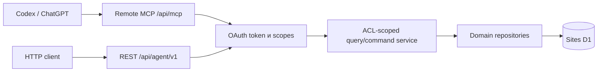

# API для агентов

Статус: `Implemented`

Последнее обновление: 2026-08-18

## 1. Назначение и граница

Task Manager предоставляет самостоятельный versioned data plane, через который
обычный HTTPS client или native MCP connector может без Web UI:

- получить карту доступной работы и каталог workflow statuses;
- найти проекты и готовящиеся релизы;
- получить задачи проекта или релиза в компактной форме;
- загрузить полный контекст одной выбранной задачи;
- создать задачу и изменить status, project, release, priority, срок и archive;
- читать native comment threads, добавлять/reply/edit/delete comments, менять
  reaction и resolve/reopen state.
- отдельно перечислять, загружать, скачивать и удалять private native Task
  attachments; raster ref можно затем вставить в description через обычный
  versioned `update_task`.

API не является обёрткой над `/api/bootstrap`: list queries не загружают и не
возвращают описания всех задач. UI и внешний API используют одну D1-модель и
одинаковые owner/ACL-инварианты, но разные response projections.

Administration, system backup/restore, sharing, ownership transfer, настройка
workflow и управление credentials во внешний API не входят. Это control-plane,
а не task-oriented operations. В текущий scope входит один официальный Task
Manager plugin/skill для Codex и ChatGPT.

REST/write boundary зафиксирован в
[ADR-0006](../decisions/0006-standalone-agent-api.md), OAuth/MCP delivery — в
[ADR-0008](../decisions/0008-oauth-mcp-connector.md).

## 2. Архитектура и progressive disclosure



- Collections возвращают фиксированные summaries.
- `TaskSummary` не содержит `description`, native/imported comment bodies,
  attachment URLs, relation bodies, internal IDs или user email.
- `ProjectSummary` не содержит description; `ReleaseSummary` не содержит ни
  description, ни release notes.
- Полный `TaskDetail` читается только отдельным запросом.
- Native comments, native attachment metadata и большой imported archive
  читаются разными отдельными paginated endpoints; binary body возвращает
  только отдельный bearer-protected content endpoint.
- `fields=*` и `include=description` не поддерживаются и отклоняются.

## 3. Authentication, OAuth и credentials

Основной connector flow:

1. Client читает Protected Resource Metadata для `https://<site>/api/mcp` и
   Authorization Server Metadata на том же site origin.
2. Client либо использует HTTPS Client ID Metadata Document (CIMD), либо
   регистрирует public client через `POST /oauth/register`; затем генерирует
   PKCE S256 и передаёт `resource=https://<site>/api/mcp`.
3. `/oauth/authorize` использует Sites `Sign in with ChatGPT`, показывает
   consent и выдаёт одноразовый authorization code.
4. `/oauth/token` проверяет client ID, redirect, resource и verifier, затем
   возвращает непрозрачные access/refresh tokens.
5. MCP принимает `Authorization: Bearer tm_oat_...`, повторно проверяет expiry,
   revoke, resource audience и scopes до создания tool context.

Sites browser cookie и `oai-authenticated-user-*` headers не являются API
authentication от client. Они доверяются только authorization endpoint на
server boundary и сопоставляют OAuth grant тому же внутреннему User, что UI.

OAuth lifecycle:

- authorization request — 10 минут, code — 5 минут, access token — 15 минут;
- refresh token — до 30 дней с rotation; reuse старого refresh token отзывает
  всю token family и grant;
- поддерживаются scopes `api:read` и `api:write`; write автоматически включает
  read;
- token/code/refresh secrets сохраняются только как SHA-256 hashes;
- client secret, implicit flow и password grant не поддерживаются;
- consent page разрешает form navigation только на собственный origin и точный
  origin зарегистрированного `redirect_uri`, после POST используется `303`;
- CIMD origin разрешается server allowlist; dynamic registration принимает
  только public clients без client secret и redirect на разрешённый HTTPS
  origin либо loopback HTTP URI native client;
- redirect должен совпасть буквально; несколько одинаковых значений
  `resource` принимаются как одно, а конфликтующие значения отклоняются.

Authorization Server Metadata публикует `registration_endpoint`. Codex Desktop
может автоматически зарегистрировать свой локальный OAuth client во время
первого Connect/Login; пользователю не требуется создавать или переносить
`client_id` вручную.

Personal token `tm_pat_...` сохранён для scripts, local smoke и REST clients:

- создаётся authenticated User и показывается только один раз;
- хранится как SHA-256 hash и безопасный prefix;
- по умолчанию действует 90 дней, допустимый срок — 1–365 дней;
- повторно применяет owner/ACL scope и не наследует admin capability.

Browser-authenticated control plane, не входящий во внешний OpenAPI contract:

| Method и path | Назначение |
|---|---|
| `GET /api/settings/api-credentials` | Metadata личных credentials без token/hash |
| `POST /api/settings/api-credentials` | Выдать token: `name`, `scopes`, `expiresInDays` |
| `DELETE /api/settings/api-credentials/{id}` | Отозвать личный token |
| `GET /api/settings/oauth-connections` | Активные OAuth grants без secrets |
| `DELETE /api/settings/oauth-connections/{id}` | Отозвать grant и его tokens |

Публичный protocol endpoint `POST /oauth/register` не использует browser
session: он выдаёт только opaque `client_id` для проверенного public-client
metadata и не предоставляет доступ к данным до отдельного consent пользователя.

Logical backup не переносит credentials, OAuth grants, codes или tokens. Full
restore атомарно отзывает все authentication capabilities, чтобы они не
пережили замену identity/data state.

## 4. References

- Task, Project и Release используют immutable database `public_id` как
  `ref`.
- Task также возвращает `identifier` (`TM-123`). Его можно использовать для
  detail/update lookup. Несколько доступных совпадений дают
  `ambiguous_reference` с безопасным списком кандидатов.
- WorkflowStatus и Label не раскрывают internal IDs. Их `sts_...` и
  `lbl_...` refs детерминированно выводятся через SHA-256.
- User IDs и email не публикуются. Assignee содержит только `displayName` и
  `isCurrentUser`.
- Comment `ref` является immutable internal identity, безопасной только внутри
  уже ACL-разрешённой Task. Author содержит `displayName` и `isCurrentUser` без
  User ID/email.

## 5. REST v1

Базовый prefix: `/api/agent/v1`. OpenAPI 3.1 доступен через
`GET /api/agent/v1/openapi.json` без доступа к пользовательским данным.

| Method и path | Scope | Результат |
|---|---|---|
| `GET /workspace` | `api:read` | Counts, capabilities и status catalog |
| `GET /projects` | `api:read` | Paginated `ProjectSummary[]` |
| `GET /projects/{ref}` | `api:read` | `ProjectDetail` и compact releases |
| `GET /releases` | `api:read` | Paginated `ReleaseSummary[]` |
| `GET /releases/{ref}` | `api:read` | `ReleaseDetail` с release notes |
| `GET /tasks` | `api:read` | Paginated `TaskSummary[]` |
| `POST /tasks` | `api:write` | Создать Task и вернуть `TaskDetail` |
| `GET /tasks/{ref}` | `api:read` | Один `TaskDetail` |
| `PATCH /tasks/{ref}` | `api:write` | Изменить Task с optimistic version |
| `GET /tasks/{ref}/attachments` | `api:read` | Paginated native Attachment metadata |
| `POST /tasks/{ref}/attachments` | `api:write` | Bounded binary upload с idempotency key |
| `GET /tasks/{ref}/attachments/{attachmentRef}` | `api:read` | Metadata и private content links |
| `PATCH /tasks/{ref}/attachments/{attachmentRef}` | `api:write` | Restore с optimistic version |
| `DELETE /tasks/{ref}/attachments/{attachmentRef}` | `api:write` | Recoverable delete с optimistic version |
| `GET /tasks/{ref}/attachments/{attachmentRef}/content` | `api:read` | Original/thumbnail; original поддерживает Range |
| `GET /tasks/{ref}/external-context` | `api:read` | Imported context |
| `GET /tasks/{ref}/comments` | `api:read` | Paginated native root threads с bounded replies |
| `POST /tasks/{ref}/comments` | `api:write` | Создать root/reply с idempotency key |
| `GET /tasks/{ref}/comments/{commentRef}` | `api:read` | Один полный native thread |
| `PATCH /tasks/{ref}/comments/{commentRef}` | `api:write` | Изменить собственный comment с version |
| `DELETE /tasks/{ref}/comments/{commentRef}` | `api:write` | Создать tombstone с version |
| `PUT /tasks/{ref}/comments/{commentRef}/reactions` | `api:write` | Задать desired reaction state |
| `PUT /tasks/{ref}/comments/{commentRef}/resolution` | `api:write` | Resolve/reopen root с version |

Project/Release endpoints read-only: они нужны для ориентации и task scope.
SavedViews не входят в v1; task query принимает явные filters и не зависит от
UI display configuration.

### 5.1 Remote MCP connector

Endpoint: `/api/mcp` (Streamable HTTP; stateless compatibility для актуальных
protocol revisions).

| Tool | Scope | Назначение |
|---|---|---|
| `get_workspace` | `api:read` | User, capabilities, counts и status catalog |
| `list_projects`, `get_project` | `api:read` | Найти Project, releases и допустимые statuses |
| `list_releases`, `get_release` | `api:read` | Найти Release и его task scope |
| `list_tasks` | `api:read` | Все доступные Tasks или filters Project/Release/status/priority/assignee/search |
| `get_task` | `api:read` | Полный контекст выбранной Task и актуальная version |
| `get_task_external_context` | `api:read` | Отдельный paginated imported archive |
| `create_task` | `api:write` | Создать Task по canonical refs |
| `update_task` | `api:write` | Изменить Task с optimistic version |
| `list_task_attachments`, `get_task_attachment` | `api:read` | Читать bounded native metadata и private content links |
| `upload_task_attachment` | `api:write` | Принять native OpenAI file input и идемпотентно сохранить binary |
| `delete_task_attachment` | `api:write` | Recoverable delete с optimistic version |
| `list_task_comments`, `get_task_thread` | `api:read` | Читать native threads отдельно от Task detail |
| `add_task_comment`, `reply_to_task_comment` | `api:write` | Создать root/reply идемпотентно |
| `edit_task_comment`, `delete_task_comment` | `api:write` | Изменить собственный comment или создать разрешённый tombstone |
| `set_comment_reaction` | `api:write` | Задать reaction `active=true|false` |
| `resolve_task_thread` | `api:write` | Resolve/reopen root thread |

`tools/list` сохраняет канонические имена без namespace. Codex app runtime
может отправлять вызов как `task_manager.<tool>`; transport boundary снимает
только этот известный prefix перед MCP dispatch.

Рекомендуемый agent flow: `get_workspace` → разрешить Project/Release через
list/get → вызвать compact `list_tasks` → выбрать candidate → `get_task` → при
явном намерении пользователя create/update. Если пользователь просит «все» и
`hasMore=true`, agent продолжает с `nextCursor`; иначе не загружает страницы
без необходимости.

Каждый tool публикует read/write annotations и OAuth security metadata. При
недостаточном scope write tool возвращает `mcp/www_authenticate`, чтобы client
мог повторно запустить Connect flow с `api:write`.

Для регистрации нового connector без bearer token доступны только безопасные
MCP discovery methods: `initialize`, `notifications/initialized`, `ping` и
`tools/list`. Они раскрывают protocol capabilities и схемы task-oriented tools,
но не пользовательские данные. Любой `tools/call` проходит bearer verification,
scope check и owner/ACL scope до обращения к repository.

### 5.2 Pagination и envelope

Collections имеют default `limit=50`, maximum `200` и opaque `cursor`.
External context и native attachments имеют maximum `100`; native comment
roots — maximum `50` и до 100 replies на root. Cursor связан с Task, filters,
sort и limit;
cursor другого query отклоняется. Collections используют keyset position из
стабильного sort value и immutable `public_id`, поэтому вставка или удаление
строки на уже прочитанной странице не сдвигает следующую страницу. Offset
остаётся только внутри immutable imported external context.

```json
{
  "data": [],
  "page": { "nextCursor": null, "hasMore": false },
  "meta": {
    "apiVersion": "1",
    "asOf": "2026-08-14T16:00:00.000Z",
    "requestId": "req_..."
  }
}
```

Data responses используют `Cache-Control: private, no-store` и
`X-Request-Id`.

### 5.3 Filters

`GET /tasks` поддерживает:

- `project_ref`, `release_ref`;
- повторяемые или comma-separated `status_category` и `priority`;
- `assignee=me|unassigned`, `archived=true|false`;
- bounded prefix `search` по identifier/title без full-scan contains;
- `order=manual|updated|created|priority|due|title`;
- `direction=asc|desc`.

`GET /projects` поддерживает prefix `search` по name/summary и `archived`.
`GET /releases` — `project_ref`, повторяемый `status`, prefix `search` по
name. Неизвестные parameters отклоняются.

## 6. Representations

`TaskSummary` содержит `ref`, `identifier`, `title`, status, priority,
compact project/release/assignee/labels, dueDate, updatedAt, version и
`contextHints`. Summary сообщает о наличии detail context, но не передаёт body.

`TaskDetail` добавляет description, estimate, rank, lifecycle timestamps,
access role/canEdit, расширенный project/release context, parent, subtasks,
relations и provenance counts. Native `commentCount` и `attachmentCount`
присутствуют только как context hints; bodies/metadata читаются через
`/comments` и `/attachments`. Imported comment bodies и attachment URLs
остаются в `/external-context`. Detail также возвращает `availableStatuses`,
валидные для изменения именно этой Task.

`ProjectSummary` возвращает name, summary, status, dates, task counts,
progress, release count, updatedAt и version. Detail добавляет description и
compact releases. `ReleaseSummary` возвращает project, name, status, dates,
task counts, progress, updatedAt и version; detail добавляет description и
release notes. Project/Release detail возвращают `workflowStatuses`, валидные
для создания Task в этом scope. Задачи release читаются через
`GET /tasks?release_ref=...`.

## 7. Task commands

`POST /tasks` принимает `title`, `description`, `statusRef`, `priority`,
`projectRef`, `releaseRef`, `estimate`, `dueDate`. Обязателен только
`title`. При release без project сервер выводит project из release.
Несовместимые project/release и status другого owner scope отклоняются до записи.

`PATCH /tasks/{ref}` требует актуальный `version` и принимает `title`,
`description`, `statusRef`, `priority`, `projectRef`, `releaseRef`,
`estimate`, `dueDate`, `rank`, `archived`.

`description` может содержать native raster reference только в формате
``. Сначала image должен
стать готовым Attachment этой же Task через Agent REST upload или MCP
`upload_task_attachment`; затем ref вставляется обычным versioned Task update.
Общий repository path для REST, MCP и UI отклоняет malformed, cross-Task,
non-image, deleted или неготовый reference; ошибка не подтверждает существование
недоступного resource. Task create с native reference отклоняется, потому что
Attachment ещё не может принадлежать создаваемой Task.

```json
{
  "version": 7,
  "statusRef": "sts_...",
  "archived": false
}
```

Repository атомарно обновляет `startedAt`, `completedAt` и `canceledAt` из
системной категории status. Устаревшая version даёт
`409 version_conflict`; Viewer — `403 forbidden`. Response содержит новый
`TaskDetail`, а не workspace snapshot.

Hierarchy, relations, labels, assignee другого User и bulk mutation пока
read-only через API. Task create ещё не имеет server-side idempotency record,
поэтому client не должен слепо повторять POST после неизвестного network outcome.

### 7.1 Comment commands

`POST /tasks/{ref}/comments` принимает `body`, обязательный `idempotencyKey` и
optional `parentCommentRef`. Author берётся из bearer identity; неизвестные
поля, включая client-provided author, отклоняются. Reply на reply сохраняется
как reply root thread, новый reply переоткрывает resolved root.

Edit/delete/resolve требуют актуальный comment `version`. Edit разрешён только
author; delete — author либо Owner/Manager соответствующего Project и оставляет
tombstone. Любой comment write требует `api:write` и effective Editor или выше;
Viewer сохраняет read access. Reaction PUT принимает `emoji` и desired boolean
`active`; composite uniqueness делает retry безопасным.

Body нормализует line endings, отбрасывает внешний whitespace, запрещает empty,
unsupported control characters и размер больше 100 000 characters. Он остаётся
Markdown-like text: transport не принимает raw rendered HTML. Reactions
возвращаются как aggregate count + `reactedByCurrentUser`, без списка Users.

### 7.2 Native attachment commands

`POST /tasks/{ref}/attachments` принимает raw binary body. Обязательны
`Idempotency-Key`, percent-encoded `X-Attachment-Filename` и фактический
`Content-Type`; сервер всё равно проверяет magic bytes, размер, raster
dimensions и SHA-256. Response не содержит internal Task/uploader IDs, R2 key,
public или долговечный signed URL. Original/thumbnail URLs указывают только на
Agent API и требуют тот же bearer token при каждом чтении.

`GET /tasks/{ref}/attachments` использует стабильную keyset pagination по
`createdAt/ref`. `include_deleted=true` доступен только Editor и выше. Delete
требует `X-Attachment-Version`, остаётся recoverable в grace period и
отклоняется, пока description использует image ref; REST `PATCH` с
`{"version": n, "deleted": false}` выполняет restore.

MCP `upload_task_attachment` следует актуальному OpenAI file-input contract:
верхнеуровневое поле `file` объявлено в `_meta["openai/fileParams"]`, содержит
обязательные `download_url`/`file_id` и optional `mime_type`/`file_name`.
Временный URL не сохраняется и не логируется. Worker принимает только HTTPS URL
на OpenAI/OpenAIusercontent host, не передаёт credentials, вручную проверяет
каждый redirect и ограничивает как declared, так и фактически прочитанный body.
После server fetch действуют те же content inspection, idempotency и Task ACL,
что для REST/UI upload. Contract основан на официальном
[OpenAI plugin reference](https://developers.openai.com/plugins/reference).

## 8. Errors и authorization

Error envelope:

```json
{
  "error": {
    "code": "version_conflict",
    "message": "Task was changed in another session",
    "requestId": "req_..."
  }
}
```

Codes: `unauthenticated`, `insufficient_scope`, `invalid_argument`,
`not_found`, `ambiguous_reference`, `forbidden`, `version_conflict`,
`internal_error`. Неизвестный и недоступный resource дают одинаковый
`not_found`.

Authorization invariants:

1. OAuth grant или personal credential сопоставляется внутреннему User до data query.
2. ACL применяется до filters, pagination, counts, ambiguity и relations.
3. Project roles распространяются на Tasks/Releases как в UI; standalone Task
   использует owner/direct grant.
4. `api:write` разрешает только task commands и не отменяет resource role.
5. API не вызывает admin, backup/restore, sharing, ownership transfer или
   credential management.
6. Token, hash, internal IDs, emails и response bodies не логируются.
7. Comment lookup всегда начинается с ACL-разрешения parent Task; comment ref
   сам по себе не подтверждает существование thread.

## 9. Версионирование и проверка

- REST major version находится в path; breaking changes создают `/v2`.
- Additive optional fields допустимы в v1, удаление/переименование — нет.
- Runtime OpenAPI document является внешним transport contract.
- UI `/api/bootstrap` остаётся внутренним.

Обязательные сценарии:

1. Codex Desktop получает зарегистрированный Task Manager app connector из
   plugin `.app.json`; OAuth Connect через выбранный connector builder DCR
   (`/oauth/register`) выполняет
   `workspace → create → compact search → detail → status update` без Sites
   headers. Raw MCP clients также могут использовать DCR или разрешённый CIMD.
2. Marker из description отсутствует в list и появляется только в detail.
3. Status transition меняет timestamps/version; stale version даёт `409`.
4. Read-only и revoked/expired token получают соответственно `403` и `401`;
   refresh rotation не допускает reuse.
5. Owner/Editor/Viewer и post-revoke access совпадают с UI.
6. Project/release filters не раскрывают недоступный resource.
7. Full restore отзывает personal/OAuth capabilities, не включая secrets или
   hashes в backup.
8. MCP `tools/list` показывает только task-oriented surface; `list_tasks`
   фильтрует по Project и Release, сохраняет compact/detail boundary и cursor.
9. Новый connector получает `initialize` и `tools/list` без bearer token, но
   анонимный `tools/call` получает `401` и не выполняет repository query.
10. Native comment create retry не дублирует row; Viewer читает, но не пишет;
    reply открывает resolved thread; stale edit/delete/resolve получает conflict;
    Agent author projection не содержит ID/email. Imported archive остаётся
    отдельным read-only endpoint.
11. Agent REST upload/list/get/range/delete повторяет Task ACL, не публикует
    internal IDs/R2 keys и сохраняет стабильную attachment pagination. MCP
    `tools/list` объявляет четыре attachment tools, а upload schema содержит
    `_meta["openai/fileParams"]`; invalid/private redirect, oversized body,
    MIME mismatch и stale version отклоняются до небезопасной mutation.

Hosted smoke и rate-limit policy остаются release work, а не заявляются
проверенными локальной реализацией.
